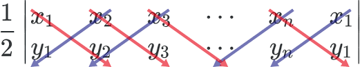
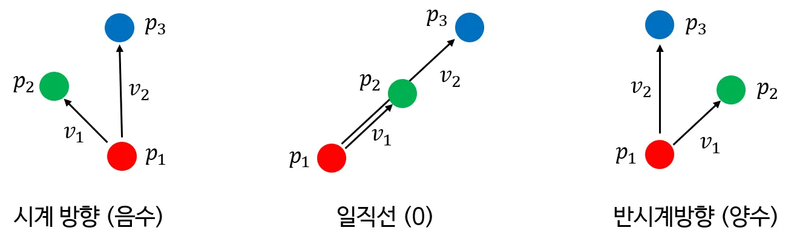
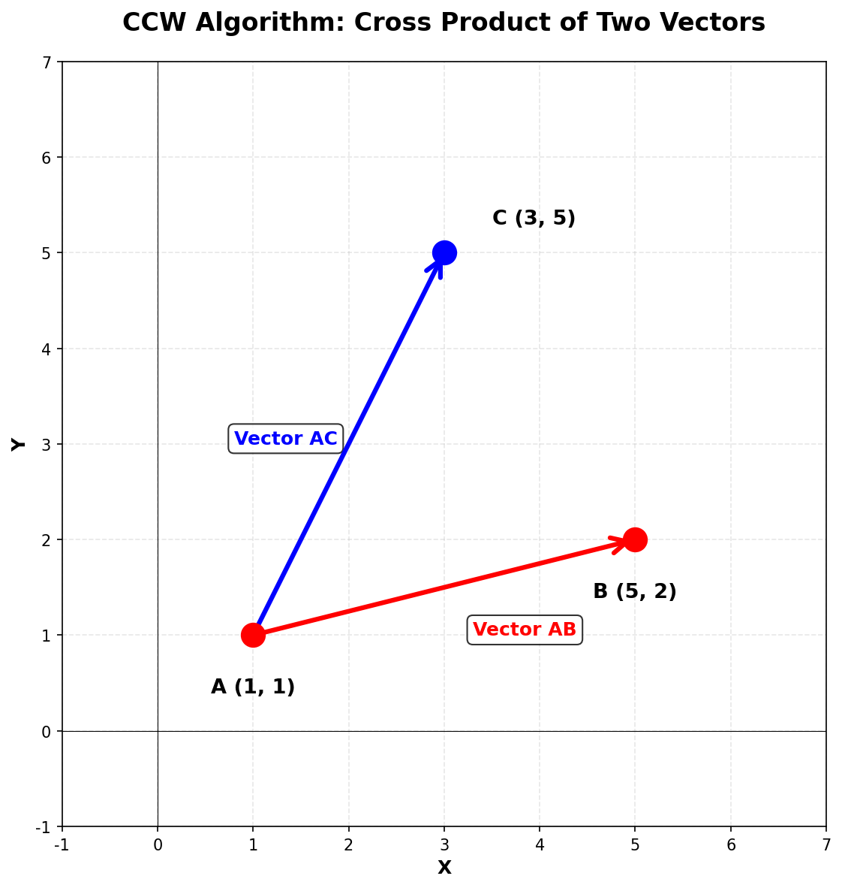
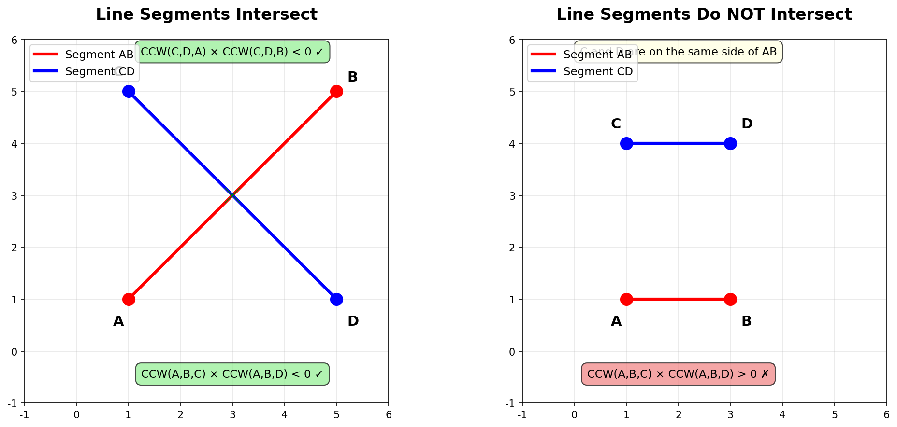
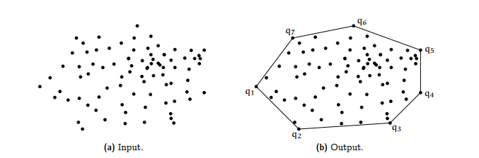

# CCW (Counter-Clockwise) 알고리즘

---

계산 기하학에서 세 점의 위치 관계를 판단하는 기본 알고리즘에 대한 내용이다

## 정의

**세 점이 이루는 회전 방향을 판단하는 알고리즘**

- 점 A, B, C가 주어졌을 때, A→B→C 순서로 회전하는 방향을 판단
- 반시계 방향(CCW), 시계 방향(CW), 일직선(Collinear)으로 분류
- 벡터의 외적(Cross Product)을 이용한 간단하고 빠른 알고리즘
- (cf) 신발끈 공식
    - |빨강의 합 - 보라의 합| = 외적
    - 외적 X 0.5 = n각형의 넓이



## 왜 CCW인가?

**기하학 문제의 기본 빌딩 블록**

- 선분 교차 판정의 핵심 요소
- 볼록 껍질(Convex Hull) 알고리즘의 기초
- 다각형 내부 점 판정에 활용
- O(1) 시간 복잡도로 매우 빠름

**직관적인 판단**

- 복잡한 기하학 문제를 "방향 판단"으로 단순화
- 좌표계 회전이나 각도 계산 없이 판단 가능

## 작동 원리

### 외적(Cross Product) 이용

**두 벡터의 외적 값으로 회전 방향 판단**



### 결과 해석

- **외적 > 0**: 반시계 방향 (CCW) 🔄
- **외적 < 0**: 시계 방향 (CW) 🔃
- **외적 = 0**: 일직선 상에 위치 (Collinear)
- 벡터 AB = (x₂-x₁, y₂-y₁) = (4,1)
- 벡터 AC = (x₃-x₁, y₃-y₁) = (2,4)
- 외적 값 = (x₂-x₁) × (y₃-y₁) - (y₂-y₁) × (x₃-x₁) → 14 > 0



## 구현

### 기본 구현 (Java)

```java
class Point {
    long x, y;

    public Point(long x, long y) {
        this.x = x;
        this.y = y;
    }
}

class CCW {
    // CCW 판단 함수
    // 반환값: 양수(CCW), 음수(CW), 0(일직선)
    public static long ccw(Point A, Point B, Point C) {
        return (B.x - A.x) * (C.y - A.y) - (B.y - A.y) * (C.x - A.x);
    }

    // 방향을 명확하게 분류하는 함수
    public static int getDirection(Point A, Point B, Point C) {
        long result = ccw(A, B, C);
        if (result > 0) return 1;      // 반시계 방향
        else if (result < 0) return -1; // 시계 방향
        else return 0;                  // 일직선
    }
}

```

### 선분 교차 판정 예시



```java
class LineIntersection {
    // 두 선분 AB와 CD의 교차 여부 판단
    public static boolean isIntersect(Point A, Point B, Point C, Point D) {
        long ab_c = CCW.ccw(A, B, C);
        long ab_d = CCW.ccw(A, B, D);
        long cd_a = CCW.ccw(C, D, A);
        long cd_b = CCW.ccw(C, D, B);

        // 두 선분이 교차하려면:
        // 1. C와 D가 선분 AB의 양쪽에 있어야 함
        // 2. A와 B가 선분 CD의 양쪽에 있어야 함
        if (ab_c * ab_d < 0 && cd_a * cd_b < 0) {
            return true;
        }

        // 일직선 상에서 겹치는 경우 처리 (필요시)
        // ...

        return false;
    }
}

```

### 사용 예제

```java
public class Main {
    public static void main(String[] args) {
        Point A = new Point(0, 0);
        Point B = new Point(4, 4);
        Point C = new Point(2, 6);

        int direction = CCW.getDirection(A, B, C);

        if (direction > 0) {
            System.out.println("반시계 방향 (CCW)");
        } else if (direction < 0) {
            System.out.println("시계 방향 (CW)");
        } else {
            System.out.println("일직선 (Collinear)");
        }

        // 선분 교차 판정 예시
        Point D = new Point(0, 4);
        Point E = new Point(4, 0);

        if (LineIntersection.isIntersect(A, B, D, E)) {
            System.out.println("두 선분이 교차합니다");
        }
    }
}

```

## 어디에 사용될까?

### 알고리즘 문제

- **선분 교차 판정**: 두 선분이 만나는지 확인
- **볼록 껍질(Convex Hull)**: Graham Scan, Jarvis March
- **다각형 내부 점 판정**: 점이 다각형 안에 있는지 확인
- **가장 가까운 점 쌍 찾기**: Divide and Conquer 기법

### 실전 활용

- **게임 개발**: 캐릭터 시야 판정, 충돌 감지
- **GIS(지리정보시스템)**: 지도 영역 판단, 경로 탐색
- **컴퓨터 그래픽스**: 다각형 렌더링, 가시성 판단
- **로보틱스**: 경로 계획, 장애물 회피

## 주의사항

### 오버플로우 주의

**좌표값이 클 때 곱셈 오버플로우 발생 가능**

```java
// int 대신 long 사용 권장
long result = (long)(B.x - A.x) * (C.y - A.y)
            - (long)(B.y - A.y) * (C.x - A.x);

```

### 부동소수점 오차

**실수 좌표를 사용할 때 주의**

```java
// double 사용시 epsilon 비교 필요
final double EPS = 1e-9;
if (Math.abs(result) < EPS) {
    // 일직선으로 간주
}

```

### 일직선 케이스 처리

- 문제에 따라 일직선 상황을 별도로 처리해야 할 수 있음
- 선분 교차 문제에서는 끝점이 겹치는 경우 등 고려 필요

---

### 응용문제

[https://www.acmicpc.net/problem/17387](https://www.acmicpc.net/problem/17387)

[https://www.acmicpc.net/problem/6439](https://www.acmicpc.net/problem/6439)

---
### 추가질문
- Q1.) 볼록껍질 알고리즘이 뭘까?
    - A1.) 점들로 이뤄진 그래프에서 가장 바깥점들을 잇는 경로를 찾는 알고리즘이다.
    