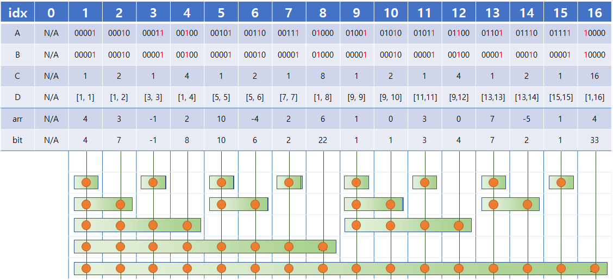
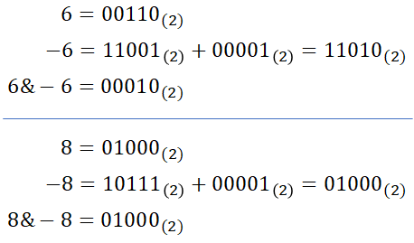
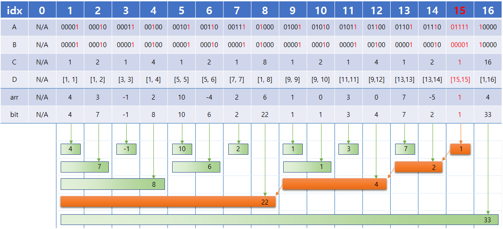
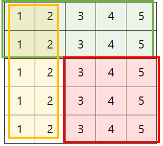

# Fenwick Tree (펜윅 트리)

---

# 펜윅 트리란?

> 데이터 압축에서 효율성 향상을 위해 Fenwick이 개발한 자료구조
> 주로 누적합 데이터를 효율적으로 저장하기 위함
> Fenwick Tree 혹은 Binary Indexed Tree 라고 불린다

세그먼트 트리보다 더 적은 메모리와 간단한 코드로 구현 가능하다.

### 구간합

일반적인 DP를 사용한 누적합 자료구조에서 구간합 조회는 O(1), 특정 값 변경은 O(N)의 시간복잡도를 가진다.
펜윅 트리를 사용한 누적합 자료구조에서 구간합 조회와 특정 값 변경 모두 O(logN)의 시간복잡도를 가진다.
즉, 처음에만 데이터가 주어지고 이후 값이 변경되지 않는다면 누적합 알고리즘을 쓰는게 효율적이고, 중간에 값이 변경되어야 한다면 펜윅 트리를 쓰는게 효율적이다.

### 한계

- 일반적으로 구간합을 계산하는 용도 이외에는 사용이 어려움.
- 구간합 이외의 대부분의 구간 쿼리에 대해 세그먼트 트리의 활용성이 더 높다.

### 데이터 저장 방식


펜윅 트리의 기본 아이디어는 정수를 2의 거듭제곱의 합으로 나타낼 수 있다는 점이다.
컴퓨터는 2진법을 사용하고 있고 이를 사용해서 정수를 나타내고 있다.

### 특정 값 변경



O(logN)에 값 변경을 어떻게 할 수 있을까?
위 그림에서 특정 값을 변경하면 해당 값과 연관된 구간 블럭을 모두 변경하면 된다.
일반적인 누적합에서는 1번 인덱스를 수정하면 N번 인덱스까지 모두 업데이트를 해야했다.
하지만 펜윅 트리에서는 1번 인덱스와 연관된 구간정보는 (1, 2, 4, 8, 16)번 인덱스만 가지고 있다.
이를 비트로 표현하면 00001 -> 00010 -> 00100 -> 01000 -> 10000 이 된다.
마찬가지로 11번 인덱스를 변경하게 된다면 01011 -> 01100 -> 10000 이 된다.

이를 보면 **수정이 필요한 인덱스는 현재 인덱스 맨 오른쪽 '1'에 +1을 해준 것과 같다**는 규칙을 볼 수 있다. 당연히 idx가 N을 넘어갈때까지 진행해주면 된다.

그렇다면 어떠한 정수를 2진수로 봤을 때 가장 오른쪽 '1' 비트만 남긴 값을 계산하는 비트연산을 알아야 한다.

예를 들어 위 그림처럼 숫자 6의 가장 오른쪽 비트 '1'만 가진 값을 찾는 법을 보자.
이는 정수 X에 대해 (X&-X) 연산을 하면 된다. 음수와 & 연산을 하면 값을 수할 수 있다.
이를 정수 X에 더해주면 다음 변경이 필요한 인덱스를 찾을 수 있다.
이걸 코드로 나타내면 아래와 같다.

```java
    private void update(int ith, long val) {
        long diff = val - arr[ith];
        arr[ith] = val;

        while (ith <= n) {
            bit[ith] += diff;
            ith += ith&-ith;
        }
    }
```

### 구간합 조회


구간합 조회는 위 그림처럼 원하는 구간 정보를 담고있는 값을 모두 합하면 된다.
위의 예시처럼 처음부터 15번까지의 구간합을 알고싶다면 15, 14, 12, 8번 값을 모두 더하면 O(logN)에 구할 수 있다.

마찬가지로 이 또한 규칙이 존재한다.
각각을 2진수로 변환해보면 01111 -> 01110 -> 01100 -> 01000 이 된다.
이건 **매번 맨 오른쪽 '1'에 -1을 해준 것과 같다**는 것을 알 수 있다. 이걸 남은 값이 0이 되기 전까지 계속 해주면 된다.

이걸 코드로 나타내면 아래와 같다.

```java
    int getPrefixSum(int ith) {
        int answer = 0;
        while (ith > 0) {
            answer += bit[ith];
            ith -= ith&-ith;
        }
        return answer;
    }
```

이 코드는 해당 ith 인덱스까지의 누적합을 나타낸 것이므로 구간합 계산을 위해 아래의 코드를 사용한다.

```java
    int query(int A, int B) {
        return getPrefixSum(B) - getPrefixSum(A-1);
    }
```

### 2차원으로 응용


2차원에서 펜윅트리를 응용할 수 있다.
위 그림에서 빨간 구간의 합을 구하고자할 때 아래 코드를 사용할 수 있다.

```java
    // 값 변경
    void update(int r, int c, int diff) {
        while (r <= N) {
            int cc = c;
            while (cc <= N) {
                bit[r][cc] += diff;
                cc += cc&-cc;
            }
            r += r&-r;
        }
    }

    // 누적합
    int getPrefixSum(int r, int c) {
        int sum = 0;
        while (r > 0) {
            int cc = c;
            while (cc > 0) {
                sum += bit[r][cc];
                cc -= cc&-cc;
            }
            r -= r&-r;
        }
        return sum;
    }

    // 구간 합
    int query(int x1, int y1, int x2, int y2) {
      return getPrefixSum(x2, y2) - getPrefixSum(x2, y1-1) - getPrefixSum(x1-1,y2) + getPrefixSum(x1-1, y1-1);
  }
```

### 구간 업데이트, 특정 값 획득 응용

이전 펜윅트리와 다르게 구간을 업데이트하고, 특정 값 조회가 필요한 상황에서 사용할 수 있다.
펜윅트리는 생각하지 말고 다른 배열 F[i] = arr[i] - arr[i-1]를 하나 정의한다.
만약 4 ~ 10까지 값을 +6 한다고 했을 때 F[5]를 구하고자 하면, 4번과 5번 인덱스 모두 값이 +6 되었기 때문에 서로간 차이가 없으므로 그냥 F[5]는 유지된다.
변화는 F[4]와 F[11]만 생긴다. F[4]는 6증가 했을 것이고, F[11]은 6 감소 했을 것이다.

즉, arr의 [A, B] 구간의 값을 Y만큼 변화시키라는건 **F[A]를 Y만큼 증가시키고, F[B+1]을 Y만큼 감소시켜라**라고 볼 수 있다.
이를 펜윅 트리를 적용한 코드로 나타내면 아래와 같다.

```java
    void update(int i, int diff) {
        while (i <= n) {
            bit[i] += diff;
            i += i&-i;
        }
    }
    void rangeUpdate(int i, int j, int diff) {
        update(i, diff);
        update(j+1, -diff);
    }
```

그렇다면 특정 값 조회는 어떻게 할까?
만약 arr[5]를 구하고 싶으면 그냥 F[5]를 해서는 arr[4]를 뺀 값이 나오기 때문에 안된다.
그럼 F[1], F[2], F[3], F[4], F[5]를 모두 더한다면 ->
arr[1] - 0 + arr[2] - arr[1] + arr[3] - arr[2] + arr[4] - arr[3] + arr[5] - arr[4] = arr[5]
이렇게 구할 수 있다.

즉, **arr의 X번째 값을 획득하라는건 F[1] + F[2] + ... + F[X] 의 값을 획득하라**가 된다.
이를 펜윅 트리를 적용한 코드로 나타내면 아래와 같다.

```java
    int query(int i) {
        int sum = 0;
        while (i > 0) {
            sum += bit[i];
            i -= i&-i;
        }
        return sum;
    }
```

---

## 추가 질문
