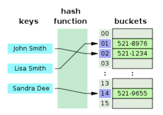
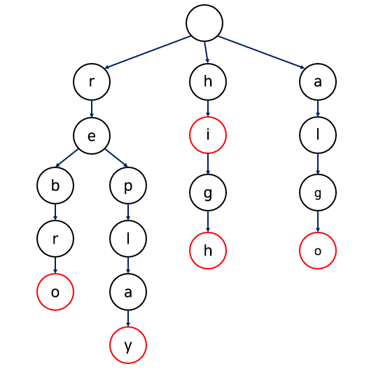

# Database에서 사용되는 자료구조

---

# 특징

- 효율적인 데이터 관리와 빠른 검색을 가능하게 하는 자료구조를 사용한다.
- 즉, **대량의 데이터를 효율적으로 저장하고 관리**하기 위한 시스템을 구축하기 위함.

## B 트리

균형 잡힌 트리 자료구조로, 인덱싱에 널리 사용된다.
삽입, 삭제, 검색 연산에서 모두 로그 시간 복잡도를 가진다.

- 장점

  1. 한 노드에 여러 키를 저장하기 때문에 디스크 접근 횟수를 줄일 수 있다.
  2. 모든 리프 노드가 동일한 깊이를 가지는 균형 잡힌 구조이다.
  3. 데이터의 추가와 삭제가 빈번한 환경에서 효율적으로 동작한다.

- 단점
  1. 노드 분할과 병합 과정이 까다로워 구현이 복잡하다.
  2. 각 노드에 여러 키와 포인터를 저장하므로 메모리 사용량이 증가한다.
  3. 노드 단위로 데이터를 관리하기 때문에 작은 데이터 변경에도 전체 노드 수정이 필요할 수 있다.

EX) PostgreSQL

## B+ 트리

B 트리의 변형으로, 모든 데이터는 리프 노드에 저장되고 내부 노드는 인덱스 역할만 한다.
리프노드가 연결 리스트로 연결되어 있어 순차 접근이 용이하다.
대부분의 RDBMS에서 기본 인덱스 구조로 사용된다.

- 장점

  1. 리프 노드가 순차적으로 연결되어 있어 범위 검색에 유리하다.
  2. 내부 노드는 인덱스 역할만 하므로 디스크 사용 효율이 좋다.

- 단점
  1. B 트리와 유사하게 구현이 까다롭다.
  2. 데이터 변경 시 리프 노드의 순차 연결 리스트도 업데이트가 필요하여 쓰기 작업이 다소 복잡하다.

EX) MySQL, SQLite, Oracle Database

## 해시 테이블

키와 값으로 구성된 쌍을 저장하는 자료구조로, 키를 해시 함수에 적용하여 데이터 위치를 결정한다.
빠른 검색 속도를 제공하지만, 범위 검색에는 적합하지 않다.

- 장점

  1. 해시 함수를 사용하여 평균적으로 상수 시간에 검색이 가능하다.
  2. 비교적 간단하게 구현 가능하다.
  3. 불필요한 노드나 포인터가 없어서 메모리 사용이 효율적이다.

- 단점
  1. 동일한 해시 값을 가질 경우 충돌이 발생하기 때문에 추가적인 로직이 필요하다.
  2. 순서를 고려하지 않기 때문에 범위 검색에 적합하지 않다.
  3. 데이터가 증가하면 해시 테이블의 크기를 재조정해야한다.

EX) Redis, Memcached, Cassandra

## 비트맵 인덱스

각 데이터 값에 대해 비트맵을 사용하는 인덱스 구조이다.
빠른 논리 연산으로 복잡한 쿼리를 효율적으로 처리할 수 있다.

- 장점

  1. AND, OR, NOT 과 같은 논리 연산을 통해 복잡한 쿼리를 빠르게 처리할 수 있다.
  2. 압축에 용이하여 저장 공간을 절약할 수 있다.
  3. 집계 쿼리에서 빠른 응답을 제공할 수 있다.

- 단점
  1. 데이터의 삽입, 삭제, 업데이트 시 비트맵을 모두 수정해야 하므로 비용이 많이 든다.
  2. 값의 종류가 많아지면 비트맵의 수가 증가하여 저장 공간과 처리 비용이 증가한다.

EX) Oracle Database의 OLAP 응용 프로그램, IBM Db2, SAP HANA

## 트라이

키를 문자 단위로 분해하여 저장하며, 접두사 검색, 자동 완성 기능에 효과적이다.

- 장점

  1. 문자열의 각 문자를 노드로 분해하여 저장하므로 검색 속도가 빠르다.
  2. 특징 접두사를 가진 문자열 검색에 효율적이다.
  3. 접두사를 공유하여 메모리 사용을 최적화 할 수 있다.

- 단점
  1. 키의 길이가 길어지면 트리의 깊이가 깊어져 성능이 저하될 수 있다.
  2. 구현이 다소 복잡하다.

EX) MongoDB, Elasticsearch, Microsoft SQL Server

---

## 추가 질문
