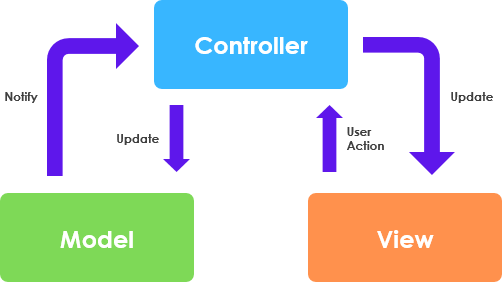

# MVC 패턴이란?

---

> 어플리케이션을 Model, View, Controller라는 세 가지 주요 구성요소로 구분한 디자인 패턴

주로 사용자 인터페이스를 가진 응용 프로그램에 사용되며, 개발과 유지 보수를 쉽게 하기 위해 주로 사용한다. Spring과 JSP 기반 예시 코드를 활용하여 설명할 예정이다.


- **Model**

  - **어플리케이션의 기능**을 표현하는 부분으로 요청에 대한 처리를 담당한다.
  - Controller로 부터 넘어온 정보를 이용하여 수행하고 결과를 반환한다.
  - 구성 요소
    - 도메인 객체(Domain Object/Entity): 비즈니스 개념을 표현
    - 비즈니스 로직(Service): 도메인 규칙 및 처리 로직
    - 데이터 접근 계층(Repository/DAO) : 모델이 외부 저장소와 연결되도록 도와주는 요소

- **View**

  - 클라이언트에게 보여줄 결과 **페이지를 반환**하는 역할이다.
  - 사용자의 요청을 Controller에게 전달한다.
  - Controller로 부터 응답받은 Model 정보를 가공하여 페이지를 만들어서 다시 Controller에게 응답한다.
    > EX) Controller에게 글 정보 조회 요청 -> 응답 받은 글 정보로 페이지를 제작하여 반환

- **Controller**

  - 어플리케이션의 **행위를 정의**하는 부분으로 요청의 전반적인 흐름을 제어한다.
  - Client의 요청을 분석하여 Logic 처리를 위한 Model단을 호출한다.
  - Model의 응답에 따른 적절한 View를 사용자에게 반환한다.
    > EX) 글 정보 조회 요청 -> id를 추출하여 Model에게 처리 넘기기 -> 적절한 View를 선택하여 페이지를 반환

## MVC 요청 흐름


## MVC 규칙을 지키는 방법

- Model은 Controller나 View에 의존하면 안된다.
- View는 Model에만 의존해야 하고, Controller에는 의존하면 안된다.
- View가 Model로부터 데이터를 받을 때는 사용자마다 다르게 보여주어야 하는 데이터에 한해서만 받아야 한다.
- View가 Model로부터 데이터를 받을 때는 반드시 Controller에서 받아야 한다.

### 장점

- 컴포넌트의 명확한 역할 분리로 인해 서로간의 **결합도**를 낮출 수 있다.
- 코드의 **재사용성 및 확장성**을 높일 수 있다.
  - 각 구성요소는 다른 구성요소와 함께 재사용이 가능하다.
- 테스트에 용이하고 **유지보수성**이 좋다.
  - 단위 테스트 및 통합 테스트 개발이 수월하다.
- 개발자 간의 **커뮤니케이션 효율**을 높일 수 있다.
  - 역할이 분리되어 있어 코드 충돌을 방지하기 쉽다.

### 단점

- 개발과정이 복잡해 **초기 개발속도가 늦은 편**이다.
- 초보자가 이해하고 개발하기에 **다소 어려움**이 있다.
- Controller의 역할이 과도하게 커진다면 부하가 커지게 된다.
  - 이를 **Massive-View-Controller** 현상이라고 한다.
  - 하나의 Controller에 수많은 View와 Model이 연결되어 있기 때문이다.

---

## 추가 질문

- HTML 페이지가 아니라 JSON이나 TEXT를 응답하는것도 MVC라고 할 수 있을까?

  > 사용자로 응답하는 View의 형태가 HTML이 아니라 JSON일 뿐 MVC라고 할 수 있다.
  > 하지만, Controller 안에서 JSON을 직접 만드는 것은 좋지 않다.
  >
  > ```java
  > // HTML
  > @Controller
  > public class UserController {
  >
  >        @GetMapping("/user")
  >       public String getUser(Model model) {
  >          model.addAttribute("user", userService.getUser());
  >          return "userView"; // → Thymeleaf, JSP 같은 템플릿으로 HTML 렌더링
  >      }
  >
  > }
  >
  > ```
  >
  > ```java
  > // JSON
  > @RestController
  > public class UserApiController {
  >
  >      @GetMapping("/api/user")
  >     public UserDto getUser() {
  >        return userService.getUser(); // → JSON 직렬화되어 응답
  >
  >     }
  >
  > }
  > ```
