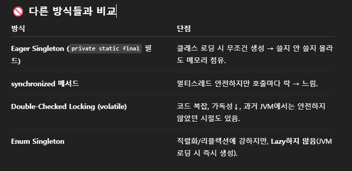

# 디자인 패턴

## 디자인 패턴이란?

- 정의 : 반복되는 설계 문제를 검증된 구조로 푸는 재사용 가능한 패턴으로 설계하는것
- 효과 : 결합도↓, 응집도↑, 변경 용이성↑, 커뮤니케이션 공통어로 협업능력 올라감
  - 결합도 (Coupling) : 모듈들이 얼마나 서로 엮여 있는지, `낮을수록 좋음`(바꾸기 쉬움)
  - 응집도 (Cohesion) : 한 모듈 안의 기능들이 한 가지 일에 얼마나 집중하는지, `높을수록 좋음` (이해/테스트가 쉬움)
- 핵심 : “변경에 유연”, “의존성 역전”, “구현보다 인터페이스”, “조합(컴포지션)”

  - 컴포지션 : 상속 대신 필드로 다른 객체를 넣어 기능을 조합하는 방식, 변경에 유연함
    - 일부 패턴에서 컴포지션 대신에 상속을 사용하기도함

  ```java
  // 상속 X: 알림 기능을 "가지고" 사용
  class SmsSender {
  	void send(String m){
  			System.out.println("[SMS] " + m);
  		}
  	}

  class OrderNotifier { // 1.상속을 받지 않고
  	//2.사용할 의존성을 생성자로 주입
    private final SmsSender sms; // 조합
    OrderNotifier(SmsSender sms){ this.sms = sms; }
    void notifyOrderPlaced(){ sms.send("주문이 접수되었습니다"); }
  }

  class App {
  	public static void main(){
  		OrderNotifier orderNotifier = new OrderNotifier(new SmsSender());
  	}
  }

  ```

## SOLID 원칙

- **객체 지향 설계의 5가지 기본 원칙**
- **S**(단일 책임 원칙 - SRP ) : 클래스는 `하나의 이유`로만 변경되어야 함
  → 역할분리, 관심사 분리
- **O**(개방, 폐쇠 원칙 - OCP ) : `확장에 열려`있어야 하며, `수정에는 닫혀`있어야 한다.
  → 추상에 의존, 전략, 템플릿, 데코레이터로 확장
- L(리스코프 치환 원칙 - LSP) : 하위 타입은 상위 타입을 대체 가능해야 함
  → 계약준수, 예외/전제조건 강화 금지
  - 상위 클래스 타입으로 객체를 선언하여 하위 클래스의 인스턴스를 받으면, 업캐스팅된 상태에서 부모의 메서드를 사용해도 동작이 의도대로 흘러가야 함
  - 부모 메서드의 오버라이딩을 조심스럽게 따져가며 해야한다.
  - Collection 인터페이스가 LSP의 대표예
  - LinkedList → HashSet 으로 바꿔도 `add()` 메서드 실행은 의도대로 작동됨
- I(인터페이스 분리 원칙 - ISP) : 클라이언트별 작은 인터페이스
  → 살찐 인터페이스 지양
  - 인터페이스의 단일 책임을 강조
  - 클라이언트의 목적과 용도에 적합한 인터페이스 만을 제공
  - 인터페이스를 분리해놓고 나중에 가서 인터페이스들을 또 분리하는 행위를 하지 않도록 설계 해야한다.
- **D**(의존성 역전 - DIP) : 구현이 아니라 `추상에 의존` 함
  → DI/IoC 컨테이너, 인터페이스 도입
  - 어떤 클래스를 참조해서 사용해야할 때 그 클래스(구현체)를 직접 참조 하지 않고 그 대상의 상위 요소( 추상 클래스 or 인터페이스)로 참조 해서 설계하라는 원칙

## 생성 패턴

- 추상화된 생성, 느슨한 결합, 테스트 용이하게, DI 친화
- 생성 로직을 별도 계층(팩토리, 빌더, 프로토타입, 싱글턴)에 가둔다.
- “변하는 건 **생성**이야. 그래서 **생성과 사용을 분리**했어.”

### 1) Singleton

- 앱 전체에서 설정/캐시/연결 풀처럼 인스턴스 1개만 있어도 될 때
- 스레드 세이프한 단일 인스턴스 보장, `전역 가변상태는 되도록 두지 않기`
- 예시코드

  ```java
  // lazy holder: 안전하고 간단
  public final class RedisClient {

      private RedisClient() { }

      private static class Holder {
          private static final RedisClient INSTANCE = new RedisClient();
      }

      public static RedisClient getInstance() {
          return Holder.INSTANCE;
      }

      public String get(String key) {
          // 실제라면 Redis GET 호출
          return "mock:" + key;
      }

      public void set(String key, String value) {
          // 실제라면 Redis SET 호출
          System.out.println("[REDIS SET] " + key + " = " + value);
      }
  }

  // AppSingleton.java
  public class AppSingleton {
      public static void main(String[] args) {
          RedisClient redis = RedisClient.getInstance();
          redis.set("coupon:11st:BLACK", "applied");
          System.out.println(redis.get("coupon:11st:BLACK"));
      }
  }
  ```

- lazyholder
  - `Config` 클래스가 **로드될 때**는 내부 클래스 `Holder`가 **아직 로드되지 않음**
  - `getInstance()`를 **처음 호출하는 순간** JVM이 `Holder`를 로드하고, `INSTANCE`를 **딱 한 번** 생성. → 사용할때 메모리 사용, 락 경쟁 없이 빠른 호출(JVM이 보장), 테스트 독립적 이라는 이점을 가짐
    

### 2) Factory Method

- 생성 로직이 바뀌거나 타입이 늘어날 때, 호출자는 무슨 구현체 클래스인지 몰라도 되게.
- 생성과 사용 분리, 인터페이스 반환
- 예시코드

  ```java
  // PayFactory.java
  interface PayGateway {
      String pay(int won);
  }

  class KakaoPay implements PayGateway {
      @Override
      public String pay(int won) {
          return "[KAKAO PAY] " + won + "원 결제 완료";
      }
  }

  class TossPay implements PayGateway {
      @Override
      public String pay(int won) {
          return "[TOSS PAY] " + won + "원 결제 완료";
      }
  }

  abstract class PayDialog {
      abstract PayGateway create();
  }

  class MobilePayDialog extends PayDialog {
      @Override
      PayGateway create() {
          // 상황에 따라 KakaoPay/TossPay 선택 가능
          return new KakaoPay();
      }
  }

  // AppFactory.java
  public class AppFactory {
      public static void main(String[] args) {
          PayDialog dialog = new MobilePayDialog();
          PayGateway gw = dialog.create();
          String receipt = gw.pay(12_000);
          System.out.println(receipt);
      }
  }
  ```

### 3) Builder

- 선택 항목이 많아 생성자/세터가 지저분할 때
- 단계적, 가독성 높은 생성
- 예시코드

  ```java
  // Gmail.java
  class Gmail {

      private final String  to;
      private final String  subject;
      private final String  body;
      private final boolean important;

      private Gmail(Builder b) {
          this.to        = b.to;
          this.subject   = b.subject;
          this.body      = b.body;
          this.important = b.important;
      }

      public String preview() {
          return "[GMAIL] to=" + to +
                 ", subject=" + subject +
                 ", important=" + important +
                 ", body=" + body;
      }

      static class Builder {
          private String  to;
          private String  subject;
          private String  body;
          private boolean important;

          public Builder to(String v)       { this.to = v; return this; }
          public Builder subject(String v)  { this.subject = v; return this; }
          public Builder body(String v)     { this.body = v; return this; }
          public Builder important()        { this.important = true; return this; }

          public Gmail build() { return new Gmail(this); }
      }
  }

  // AppBuilder.java
  public class AppBuilder {
      public static void main(String[] args) {
          Gmail mail = new Gmail.Builder()
                  .to("boss@corp.com")
                  .subject("주간 리포트")
                  .body("첨부 참조 바랍니다.")
                  .important()
                  .build();

          System.out.println(mail.preview());
      }
  }

  ```

## 구조 패턴

- 클래스/객체의 구성(합성) 과 연결 방식이 바뀜
- 어댑터/데코레이터/프록시처럼 **연결부/감싸는 층**에 가둔다.
- 형태와 연결을 바꿔도 클라이언트는 그대로 → 인터페이스 유지
- 인터페이스 호환(Adapter), 기능 덧입힙(Decorater), 대리/접근 제어(Proxy), 단순 진입점(Facade), 부분-전체(Composite), 다중 구현 분리(Bridge)
- “변하는 건 **연결/형태**야. 그래서 **합성/어댑트/래핑**으로 숨겼어.”

### 4) Adapter

- `외부/레거시 인터페이스`가 달라서 바로 못 쓸 때
- **호환 계층(어뎁터)을 하나 끼워 넣기**
- 예시코드

  ```java
  // LotteAdapter.java
  interface StockService {
      int left(String sku);
  }

  class LotteLegacy {
      int remain(String code) {
          // 레거시 시스템 호출
          return 7;
      }
  }

  class LotteAdapter implements StockService {

      private final LotteLegacy legacy = new LotteLegacy();

      @Override
      public int left(String sku) {
          return legacy.remain(sku);
      }
  }

  // AppAdapter.java
  public class AppAdapter {
      public static void main(String[] args) {
          StockService stock = new LotteAdapter();
          int left = stock.left("LOTTE-APPLE-001");
          System.out.println("[롯데마트 재고] LOTTE-APPLE-001 = " + left + "개");
      }
  }
  ```

### 5) Decorator

- 기능을 “옵션처럼” 붙였다 뗄 때(로그, 암호화)
- 상속 대신 조합으로 래핑
- 마지막 데코레이터는 생성자가 없어야 끝날 수 있음.
- 예시코드

  ```java
  // NotifierDecorator.java
  interface Notifier {
      void send(String msg);
  }

  class ConsoleNotifier implements Notifier {
      @Override
      public void send(String msg) {
          System.out.println("[CONSOLE] " + msg);
      }
  }

  class SlackDecorator implements Notifier {

      private final Notifier base;

      public SlackDecorator(Notifier base) {
          this.base = base;
      }

      @Override
      public void send(String msg) {
          base.send(msg);
          System.out.println("[SLACK] " + msg);
      }
  }

  class EmailDecorator implements Notifier {

      private final Notifier base;

      public EmailDecorator(Notifier base) {
          this.base = base;
      }

      @Override
      public void send(String msg) {
          base.send(msg);
          System.out.println("[EMAIL] " + msg);
      }
  }

  // AppDecorator.java
  public class AppDecorator {
      public static void main(String[] args) {
          Notifier notifier =
                  new EmailDecorator(
                      new SlackDecorator(
                          new ConsoleNotifier()
                      )
                  );

          notifier.send("쿠팡 주문 접수: #A-12345");
      }
  }
  ```

### 6) Proxy

- 접근 제어/캐시/지연 로딩/원격 호출 전후처리
- 같은 인터페이스의 “대리 객체”
- 예시코드

  ```java
  // S3Proxy.java
  import java.util.*;

  interface S3Meta {
      String head(String key);
  }

  class RealS3Meta implements S3Meta {
      @Override
      public String head(String key) {
          // 원격 호출(비쌈)
          return "[S3 REMOTE HEAD] " + key;
      }
  }

  class CacheProxy implements S3Meta {

      private final RealS3Meta real = new RealS3Meta();
      private final Map<String, String> cache = new HashMap<>();

      @Override
      public String head(String key) {
          return cache.computeIfAbsent(key, real::head);
      }
  }

  // AppProxy.java
  public class AppProxy {
      public static void main(String[] args) {
          S3Meta meta = new CacheProxy();
          System.out.println(meta.head("video/2025/10/a.mp4")); // 원격
          System.out.println(meta.head("video/2025/10/a.mp4")); // 캐시
      }
  }
  ```

### 7) Facade

- 내부 모듈이 많아 `진입점 하나로 숨기고 싶을 때`
- 복잡 호출을 한 메서드로 감싸기
- 예시코드

  ```java
  // VideoFacade.java
  class VideoFacade {

      public void uploadAndTranscode(String file) {
          // S3.put(file);
          // MediaConvert.start(job);
          // Dynamo.saveStatus(...);
          // SNS.notify(...);
          System.out.println("[FACADE] " + file + " 업로드→트랜스코드→DB기록→알림");
      }
  }

  // AppFacade.java
  public class AppFacade {
      public static void main(String[] args) {
          VideoFacade vf = new VideoFacade();
          vf.uploadAndTranscode("family-trip.mov");
      }
  }
  ```

## 행위 패턴

- 책임 분배, 알고리즘, 대화(협력) 방식이 바뀜
- 알고리즘(Strategy/Template)이나 상호작용(Observer/Command/State/Chain 등) 객체에 가둔다.
- `누가 무엇을 언제 어떻게 한다를 유연하게` 바꿈
- 정책 교체(Strategy), 골격+훅(Template Method), 이벤트 푸시(Observer), 요청 캡슐화(Command), 상태 전이(State), 책임 연쇄(Chain of Responsibility), 반복자(Iterator), 중재자(Mediator), 메멘토(Memento), 인터프리터(Interpreter), 방문자(Visitor)
- “변하는 건 **협력/알고리즘**이야. 그래서 **전략/상태/이벤트**로 갈아끼워.”

### 8) Strategy

- 알고리즘/정책을 갈아끼우고 싶을 때(if-else 폭주 방지)
- 인터페이스로 전략 주입(OCP)
- 동적 바인딩
- 배송비 계산 교체 예시코드

  ```java
  // ShippingStrategy.java
  interface ShippingFee {
      int calc(int price);
  }

  class Rocket implements ShippingFee {
      @Override
      public int calc(int price) {
          return 0; // 로켓은 무료
      }
  }

  class Normal implements ShippingFee {
      @Override
      public int calc(int price) {
          return (price >= 30_000) ? 0 : 3_000;
      }
  }

  class Checkout {

      private final ShippingFee fee;

      public Checkout(ShippingFee fee) {
          this.fee = fee;
      }

      public int pay(int price) {
          return price + fee.calc(price);
      }
  }

  // AppStrategy.java
  import java.util.Arrays;

  public class AppStrategy {
      public static void main(String[] args) {
          Checkout rocketCheckout = new Checkout(new Rocket());
          Checkout normalCheckout = new Checkout(new Normal());

          System.out.println("[로켓] 최종 결제액 = " + rocketCheckout.pay(25_000));
          System.out.println("[일반] 최종 결제액 = " + normalCheckout.pay(25_000));
      }
  }

  ```

- 탐색 알고리즘 교체 예시코드

  ```java
  // SearchStrategy.java
  interface Search {
      int find(int[] a, int target);
  }

  class LinearSearch implements Search {
      @Override
      public int find(int[] a, int target) {
          for (int i = 0; i < a.length; i++) {
              if (a[i] == target) return i;
          }
          return -1;
      }
  }

  class BinarySearch implements Search {
      @Override
      public int find(int[] a, int target) {
          int left  = 0;
          int right = a.length - 1;
          while (left <= right) {
              int mid = left + (right - left) / 2; // 오버플로 방지
              if (a[mid] == target) return mid;
              if (a[mid] < target)  left = mid + 1;
              else                  right = mid - 1;
          }
          return -1;
      }
  }

  // AppStrategy.java
  import java.util.Arrays;

  public class AppStrategy {
      public static void main(String[] args) {
          int[] data = { 1, 3, 4, 7, 9, 12, 15 };
          Search linear = new LinearSearch();
          Search binary = new BinarySearch();

          System.out.println("[선형탐색] 9 위치 = " + linear.find(data, 9));
          System.out.println("[이진탐색] 9 위치 = " + binary.find(data, 9));
          System.out.println("랜덤 액세스 가능? 배열이니까 YES → 이진탐색 유효");
      }
  }
  ```

### 9) Template Method

- 처리 골격은 같고, 단계 몇 개만 다를 때
- 상위가 순서 고정, 하위가 훅만 구현
- 예시코드

  ```java
  // DailyJob.java
  abstract class DailyJob { // 일일 리포트

  		// 클래스 마다 실행 순서는 고정시켜버림
  		// 골격을 갖추게함
  		// 세부 로직들은 다를 수 있음
      public final void run() {
          load();
          process();
          save();
          notifyDone();
      }

  		//클래스 마다 달라질 메소드들
      protected abstract void load();

      protected abstract void process();

  		//클래스 마다 공통 사용되는 메소드들
      protected void save() {
          System.out.println("[SAVE] 기본 저장");
      }

      protected void notifyDone() {
          System.out.println("[NOTIFY] 작업 완료");
      }
  }

  // AppTemplate.java
  public class AppTemplate {
      public static void main(String[] args) {
          DailyJob job = new BigQuerySalesReport();
          job.run();
      }
  }
  ```

### 10) Observer

- 이벤트를 구독자에게 푸시로 전파
- 발행자-구독자 느슨한 결합
- 구독 안하고 일정 시간 마다 물어보는 것 → 폴링방식
- 구독 리스트 사람들에게 이벤트 발생시 알려 주는것 → 푸시방식
- 예시코드

  ```java
  // PriceObserver.java
  import java.util.*;

  interface Subscriber {
      void on(String message);
  }

  class PriceTopic {

      private final List<Subscriber> subs = new ArrayList<>();

      public void subscribe(Subscriber s) {
          subs.add(s);
      }

      public void priceDrop(String sku, int won) {
          for (Subscriber s : subs) {
              s.on("[푸시] " + sku + " 가격 하락: -" + won + "원");
          }
      }
  }

  // AppObserver.java
  public class AppObserver {
      public static void main(String[] args) {
          PriceTopic topic = new PriceTopic();

          topic.subscribe(msg -> System.out.println("[KAKAO] " + msg));
          topic.subscribe(msg -> System.out.println("[EMAIL] " + msg));

          topic.priceDrop("11ST-HEADSET-001", 5000);
      }
  }
  ```

### 11) Command

- 요청을 객체로 캡슐화해서 로깅/재시도/Undo.
- “무엇을 실행”을 객체가 가진다
- 예시코드

  ```java
  // CartCommand.java
  interface CartCommand {
      void exec(); //세부 로직 캡슐화
  }

  class AddItem implements CartCommand { //"추가" 실행을 AddItem 객체가 가지게됨
      @Override
      public void exec() {
          System.out.println("장바구니에 상품 추가");
      }
  }

  class RemoveItem implements CartCommand {
      @Override
      public void exec() {
          System.out.println("장바구니에서 상품 삭제");
      }
  }

  class Button {
      public void click(CartCommand cmd) {
          cmd.exec();
      }
  }

  // AppCommand.java
  public class AppCommand {
      public static void main(String[] args) {
          Button btn = new Button();

          boolean add = true; // 예: 사용자 입력
          if (add) {
              btn.click(new AddItem());
          } else {
              btn.click(new RemoveItem());
          }
      }
  }
  ```

### 12) State

- 상태에 따라 행동이 달라지고 분기가 폭주 할때 사용
- 상태를 객체로 분리하고 교체로 전이
- 예시코드

  ```java
  // OrderState.java
  interface OrderState {
      OrderState next();
      String     name();
  }

  class Waiting implements OrderState {
      @Override
      public OrderState next() { return new Preparing(); } //상태 전이
      @Override
      public String name()     { return "결제대기"; }
  }

  class Preparing implements OrderState {
      @Override
      public OrderState next() { return new Shipping(); }
      @Override
      public String name()     { return "준비중"; }
  }

  class Shipping implements OrderState {
      @Override
      public OrderState next() { return new Done(); }
      @Override
      public String name()     { return "배송중"; }
  }

  class Done implements OrderState {
      @Override
      public OrderState next() { return this; }
      @Override
      public String name()     { return "완료"; }
  }

  // AppState.java
  public class AppState {
      public static void main(String[] args) {
          OrderState s = new Waiting();
          for (int i = 0; i < 5; i++) {
              System.out.println("현재 상태: " + s.name());
              s = s.next();
          }
      }
  }

  ```

### 추가 내용

## 알게 모르게 사용한 디자인 패턴들

### Singleton

- 스프링 빈의 기본 스코프가 싱글톤임

### Proxy (AOP)

- @Transactional
  - 트랜잭션 시작/커밋을 프록시가 앞뒤로 감쌈
- @Cacheable
  - 캐시 조회도 프록시가 전처리

### Template Method

- RedisTemplate, **RestTemplate(Spring HTTP 동기 클라이언트)**

### Adapter

- MVC(HTTP↔객체), @RestController
  - (HttpMessageConverter가 JSON<->객체 어댑팅)
- (STOMP↔WebSocket 어댑터), @MessageMapping("/room/{id}")

### Facade

- SimpMessagingTemplate (고수준 단일 통로)

  ```java
  @Service
  @RequiredArgsConstructor
  public class ChatNotifier {
      private final SimpMessagingTemplate simp; // 세션/브로커 복잡성 숨김

      public void toRoom(Long roomId, Object payload) {
          simp.convertAndSend("/topic/room/" + roomId, payload);
      }
  }
  ```

### Observer (발행/구독)

- 리스트(구독자, 어떠한 목록) 전체에 뭔가를 뿌려줄 때 사용 (채팅방, 구독자 알림)

### Builder

- URL/HTTP 조립

```java
// SearchClient.java
@Service
public class SearchClient {
    public String buildUrl(String keyword, int page) {
        return UriComponentsBuilder.fromHttpUrl("https://api.example.com/search")
                .queryParam("q", keyword)
                .queryParam("page", page)
                .toUriString();
    }
}
```

---

## 질문

- Lazyholder 클래스도 static 이라 메모리에 먼저 잡힐 것 같은데 미리 메모리에 잡힌다면 클래스 안의 인스턴스도 스태틱이니 잡히지 않나?
