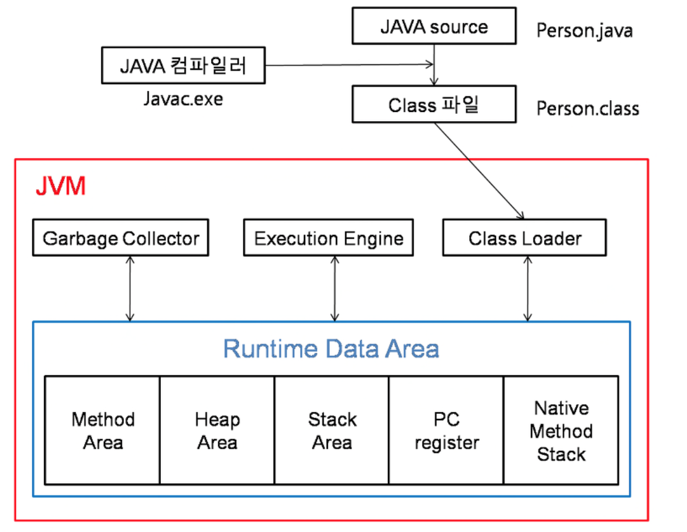

# JVM이란?

---

> Java로 개발한 프로그램을 컴파일하여 만들어지는 바이트코드를 실행시키기 위한 가상머신

즉, JVM은 자바 기반 어플리케이션을 실행시키는 것이 목적이다. 또한 어느 기기나 운영체제 상에서도 실행될 수 있도록 메모리를 관리하고 최적화한다.

### 특징

자바 프로그램이 어느 기기나 운영체제 상에서도 실행될 수 있도록 하는 특징 덕분에 **Java의 플랫폼 독립적**인 특징을 가질 수 있게 해준다. 헷갈리지 말아야 할 부분으로 **JVM 자체**는 각 플랫폼 마다 서로 다르게 구현되므로 **플랫폼 종속적**이라고 할 수 있다.

### 실행 과정

1. 프로그램이 실행되면, JVM은 OS로부터 이 프로그램이 필요로하는 메모리를 할당받는다.
2. 자바 컴파일러가 자바 소스코드(.java)를 읽고, 자바 바이트코드(.class)로 변환시킨다.
3. 변경된 class 파일들을 클래스 로더를 통해 JVM 메모리 영역으로 로딩한다.
4. 로딩된 class 파일들은 Execution engine을 통해 해석된다.
5. 해석된 바이트 코드는 메모리 영역에 배치되어 기능이 동작하며, 필요에 따라 스레드 동기화나 가비지 컬렉션 같은 메모리 관리 작업을 수행한다.

### 여기서 Runtime Data Areas는?

JVM이 운영체제 위에서 실행되면서 할당받는 메모리 영역을 뜻하고, 총 5가지 영역(PC 레지스터, JVM 스택, 네이티브 메서드 스택, 힙, 메서드 영역)으로 이루어져있다.

- **PC Register**

  - 각 쓰레드마다 하나씩 존재하며, 현재 실행 중인 JVM 명령어의 주소(바이트코드 위치)를 저장한다.
  - 즉, 지금 어떤 명령어를 실행 중인지 알려주는 역할.

- **JVM Stack**

  - 쓰레드마다 하나씩 존재하며, 자바의 메서드가 호출될 때마다 스택이 하나씩 쌓인다.
  - 각 스택 프레임에는 다음 정보가 들어있음:

    - Local Variable Array: 지역 변수, 매개변수 저장
    - Operand Stack: 연산 중간 결과 저장
    - Frame Data: 메서드 리턴 주소, 예외 정보 등

  - 메서드 실행이 끝나면 해당 스택 프레임이 pop된다.

- **Native Method Stack**

  - JVM 이 아닌 네이티브 코드(C/C++ 등) 를 실행할 때 사용되는 스택이다.

- **Heap**

  - JVM 전체에서 공유되는 영역이다.
  - 모든 객체와 배열이 저장되는 곳으로, new 키워드로 생성된 데이터는 모두 Heap에 저장된다.
  - 객체 생성시 로딩되며, 가비지 컬렉션의 대상.

- **Method Area**

  - JVM 전체에서 공유되는 영역.
  - 클래스 로딩 시 그 클래스의 메타데이터(클래스 이름, 부모 클래스 정보, 인터페이스 정보 등)을 저장한다.
  - static 변수, final 상수, 상수 풀 등이 여기에 존재한다.
  - 클래스 로딩시 생성된다.

### 가비지 컬렉션(Garbage Collection)?

자바 이전에는 프로그래머가 모든 프로그램 메모리를 관리했지만, 자바에서는 JVM이 프로그램 메모리를 관리한다!
가비지 컬렉션은 자바 프로그램에서 사용되지 않는 메모리를 지속적으로 찾아내서 제거하는 역할을 한다.

> 참조되지 않은 객체들을 탐색 후 삭제 → 삭제된 객체의 메모리 반환 → 힙 메모리 재사용

---

## 추가 질문

- Heap이 JVM 전체에서 공유되는 영역이라면 다른 스레드간 접근이 가능한 것 아니냐?
  > 모든 스레드가 접근 가능하기 때문에 한 스레드가 생성한 객체를 다른 스레드가 참조할 수 있다.
  > 하지만 그렇기 때문에 안전하지 않다.
  > 여러 스레드가 동시에 같은 객체를 수정하거나 읽으면 문제가 생길 수 있기 때문!
  >
  > - 해결책으로 Concurrent Collections(ConcurrentHashMap, CopyOnWriteArrayList, BlockingQueue)와 같이 Thread Safe한 자료구조를 사용한다.
  > - 웹 서버 캐시, 스레드풀 큐, 세션 관리, 메시지 큐에 사용된다.
- 가비지 컬렉션은 Heap 메모리에 저장된 객체만 삭제하는지?
  > Heap 메모리를 정리하는 것이 목적이다.
  > 클래스 언로드 시점에서 Method Area의 메타정보를 클래스 단위로 회수 할 수는 있으나, Heap에서만 객체를 회수하는 것이라고 생각해도 무방.
