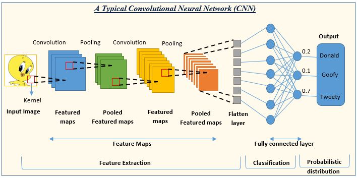
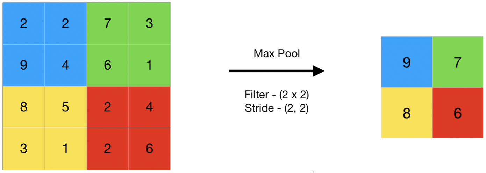
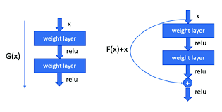

# CNN (Convolutional Neural Network)

---

이미지 처리에 특화된 인공지능 모델에 대한 내용이다

## 정의

**이미지의 특징을 자동으로 찾아내는 딥러닝 모델**

- 사진 속 패턴을 스스로 학습
- 이미지 분류, 얼굴 인식 등에 활용
- 고양이/강아지 구분, 필기체 숫자 인식 등

## 왜 CNN인가?

**일반 신경망의 문제점**

- 이미지를 한 줄로 펼치면 위치 정보가 사라짐
- 파라미터가 너무 많아짐 (200×200 이미지만 해도 수백만 개)
- 학습이 어렵고 느림

**CNN의 장점**

- 이미지 형태 그대로 처리
- 주변 픽셀끼리 묶어서 보기 때문에 효율적
- 같은 패턴을 여러 위치에서 재사용

## 주요 구성 요소

### Convolution Layer (합성곱 층)

**이미지에서 특징을 찾아내는 층**

- 작은 필터(3×3, 5×5)로 이미지를 훑으며 패턴 탐지
- 처음엔 선, 엣지 같은 단순한 특징 찾기
- 깊어질수록 눈, 코 같은 복잡한 특징 찾기
    
    
    

### Pooling Layer (풀링 층)

**이미지 크기를 줄이는 층**

- 주로 Max Pooling 사용 (영역 내 최댓값만 선택)
- 계산량 감소, 중요한 특징만 남김
- 물체 위치가 조금 바뀌어도 인식 가능

### Fully Connected Layer (완전 연결 층)

**최종 판단을 내리는 층**

- 추출한 특징들을 종합해서 결론 도출
- "이건 고양이다" vs "이건 강아지다" 판단

## 유명한 CNN 모델들

### LeNet (1998)

- 최초로 성공한 CNN
- 손글씨 숫자 인식에 사용

### AlexNet (2012)

- 이미지 인식 대회에서 압도적 우승
- 딥러닝 붐의 시작

### ResNet (2015)

- 매우 깊은 네트워크 (100층 이상)
- **Skip Connection**: 층을 건너뛰는 지름길 추가
- 현재도 많이 사용됨

- (cf) Yolo는 CSPDarknet 계열 사용
    
    **WHY?**
    
    | 특성 | Darknet (YOLO 백본) | ResNet |
    | --- | --- | --- |
    | **설계 목적** | 실시간 객체 탐지 | 이미지 분류 정확도 |
    | **속도** | 매우 빠름 ⚡ | 상대적으로 느림 |
    | **정확도** | 준수 | 매우 높음 🎯 |
    | **주 사용처** | YOLO (실시간 탐지) | 분류, 전이학습 |
    - **공통점**: 둘 다 CNN 계열 (Convolution Layer 사용)
    - **차이점**: ResNet은 정확도, Darknet은 속도에 집중

## 어디에 사용될까?

### 일상 속 CNN

- **스마트폰 카메라**: 얼굴 인식, 인물/배경 분리
- **소셜 미디어**: 사진 자동 태그, 부적절한 콘텐츠 필터링
- **의료**: X-ray, CT 영상 분석
- **자율주행**: 차량, 보행자, 신호등 인식
- **쇼핑**: 이미지로 상품 검색

### 전이 학습 (Transfer Learning)

**다른 사람이 이미 학습시킨 모델 활용하기**

- 수백만 장의 이미지로 학습된 모델을 가져옴
- 마지막 층만 내 데이터로 재학습
- 적은 데이터로도 좋은 결과 가능
- 실무에서 가장 많이 쓰는 방법

---

### 추가질문

Q1.) Darknet이나 ResNet 둘 다 과적합이 난걸 어떻게 확인하나?

- A1.) 두 경우를 떠나서 모든 학습에 적용되는 내용이다.
    - 학습 과정에서 Train Loss, Validation Loss 수치에 주목 해야한다.
    - Train Loss는 줄어드는게 정상이다.
    - 하지만 동시에 Validation Loss 수치가 증가하면 과적합을 강하게 의심해야 한다.