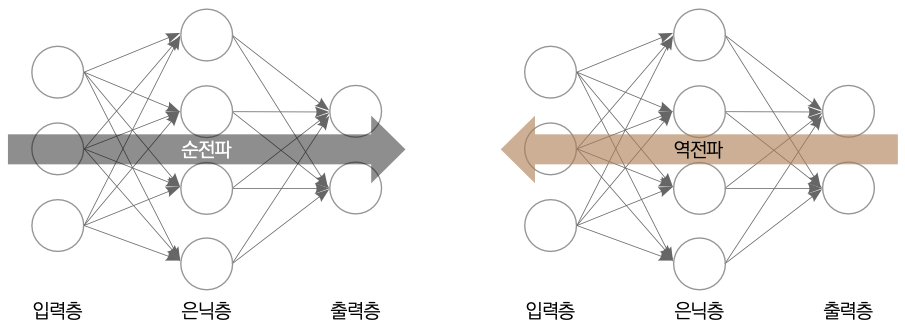
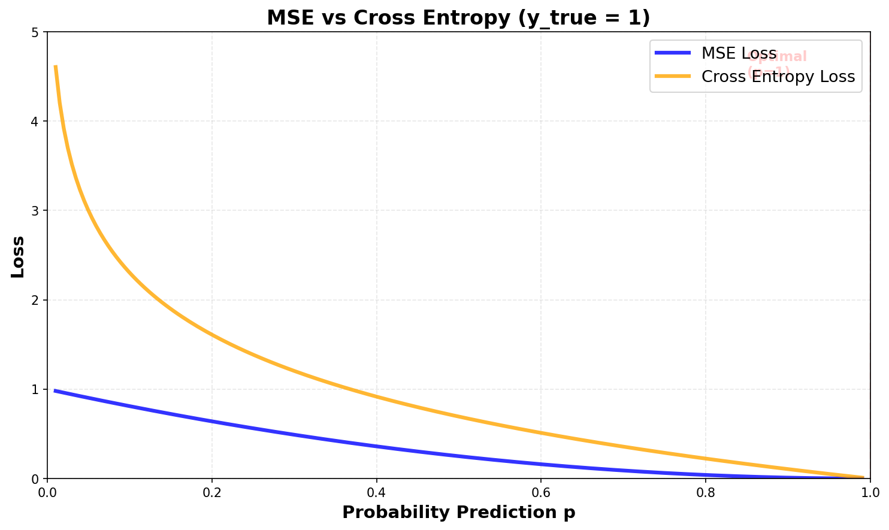
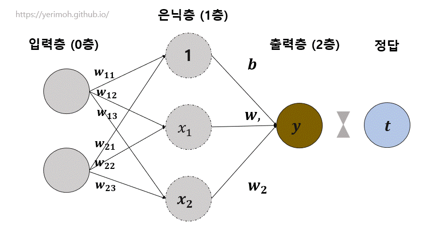
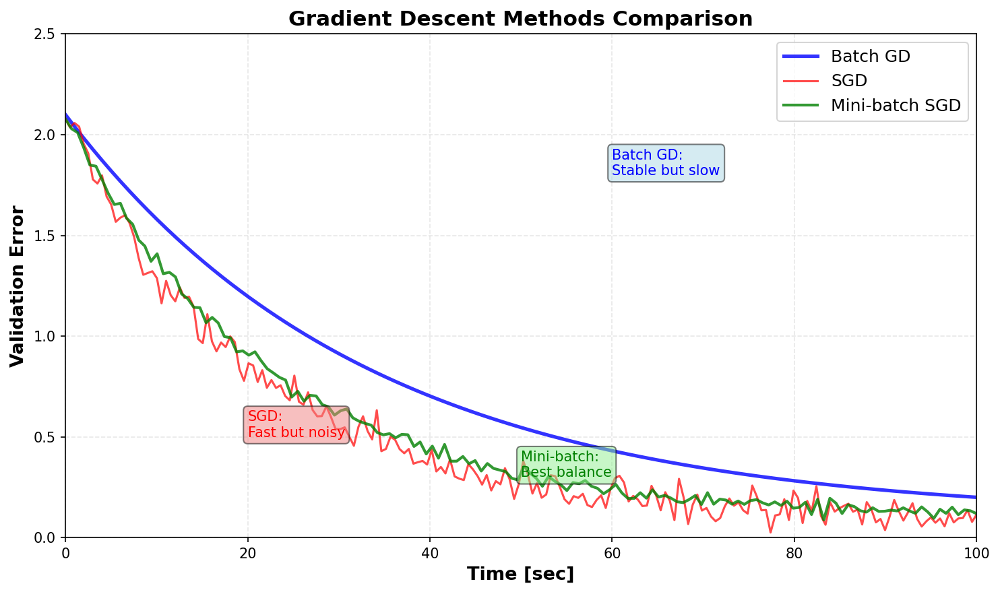

# ML - 신경망 학습

신경망 학습에 대한 내용이다

## 정의

**데이터로부터 패턴을 찾아 예측 모델을 만드는 과정**

- 입력 데이터 → 신경망 → 출력(예측)
- 예측과 정답의 차이(손실)를 줄이는 방향으로 가중치 조정
- 역전파를 통한 효율적인 그래디언트 계산
- 경사하강법으로 최적의 가중치 탐색

## 순전파 (Forward Propagation)

**입력에서 출력까지 데이터가 흐르는 과정**

### 신경망 구조

- **입력층 (Input Layer)**: 데이터 입력
- **은닉층 (Hidden Layer)**: 특징 추출 및 변환
- **출력층 (Output Layer)**: 최종 예측값

### 계산 과정

**입력 → 가중합 → 활성화 함수 → 출력의 반복**

각 층에서는:

1. **가중합 계산**: z = W·x + b (선형 변환)
2. **활성화 함수 적용**: a = f(z) (비선형 변환)

**활성화 함수의 역할**

- **비선형성 추가**: 선형 결합만으로는 XOR 같은 복잡한 패턴 학습 불가
- **ReLU**: f(x) = max(0, x) - 현재 가장 많이 사용
- **Sigmoid**: f(x) = 1 / (1 + e^(-x)) - 출력을 0~1 사이로
- **Softmax**: 확률 분포로 변환 (다중 분류)



## 손실 함수 (Loss Function)

**모델의 예측이 얼마나 틀렸는지 측정하는 함수**

### 회귀 문제

**MSE (Mean Squared Error)**

```
L = (1/n) Σ(y_pred - y_true)²

```

- 제곱 오차의 평균
- 이상치에 민감 (제곱 때문)
- 미분 가능, 수렴 안정적

**MAE (Mean Absolute Error)**

```
L = (1/n) Σ|y_pred - y_true|

```

- 절댓값 오차의 평균
- 이상치에 덜 민감
- 0 근처에서 미분 불가

### 분류 문제

**Binary Cross Entropy**

```
L = -[y·log(y_pred) + (1-y)·log(1-y_pred)]

```

- 이진 분류 (0 또는 1)
- 확률 예측에 적합

**Categorical Cross Entropy**

```
L = -Σ y_i·log(y_pred_i)

```

- 다중 분류 (여러 클래스)
- One-hot encoding 사용

| 문제 유형 | 손실 함수 | 출력 활성화 |
| --- | --- | --- |
| 회귀 | MSE, MAE | 없음 (선형) |
| 이진 분류 | Binary Cross Entropy | Sigmoid |
| 다중 분류 | Categorical Cross Entropy | Softmax |



## 역전파 (Backpropagation)

**손실을 줄이기 위해 각 가중치를 얼마나 조정해야 하는지 계산하는 알고리즘**

### 왜 필요한가?

- 다층 신경망에서 각 가중치가 손실에 미치는 영향 계산
- 모든 가중치를 일일이 테스트하면 비효율적 (조합 폭발)
- 미분의 연쇄 법칙(Chain Rule)을 사용한 효율적 계산

### 체인 룰 (Chain Rule)

**합성 함수의 미분**

```
z = f(g(x))일 때
dz/dx = (dz/dg) × (dg/dx)

```

**신경망 예시**

```
Loss = L(y_pred(z(x)))

dL/dW = (dL/dy_pred) × (dy_pred/dz) × (dz/dW)

```

### 역전파 과정

**5단계로 이루어지는 효율적인 학습 알고리즘**

1. **순전파**: 입력 → 출력 계산, 각 층의 값 저장
2. **손실 계산**: L = loss_function(y_pred, y_true)
3. **출력층 그래디언트**: dL/dy_pred 계산
4. **역방향 전파**: 출력층 → 은닉층 → 입력층 방향으로 그래디언트 계산
5. **가중치 업데이트**: W = W - α × dL/dW

**핵심 아이디어**

- 각 가중치가 손실에 미치는 영향을 **체인 룰**로 계산
- 출력층부터 거꾸로 계산하면 **중복 계산 방지**
- 한 번의 역전파로 **모든 가중치의 그래디언트** 계산 가능



## 경사하강법 (Gradient Descent)

**그래디언트 반대 방향으로 가중치를 조금씩 이동하여 최적값 탐색**

### Batch Gradient Descent

```python
# 전체 데이터로 그래디언트 계산
gradient = compute_gradient(X_train, y_train)
W = W - learning_rate × gradient

```

**장점**: 안정적인 수렴
**단점**: 대용량 데이터에서 느림, 메모리 부족

### Stochastic Gradient Descent (SGD)

```python
# 샘플 1개씩 그래디언트 계산
for x, y in zip(X_train, y_train):
    gradient = compute_gradient(x, y)
    W = W - learning_rate × gradient

```

**장점**: 빠름, 메모리 효율적, Local Minimum 탈출 가능
**단점**: 불안정한 수렴, 노이즈 많음

### Mini-batch Gradient Descent (실무 표준)

```python
# 작은 배치로 그래디언트 계산
for batch in data_loader(X_train, y_train, batch_size=32):
    X_batch, y_batch = batch
    gradient = compute_gradient(X_batch, y_batch)
    W = W - learning_rate × gradient

```

**장점**: Batch GD와 SGD의 균형
**일반적 배치 크기**: 32, 64, 128, 256

| 방식 | 업데이트 빈도 | 속도 | 안정성 |
| --- | --- | --- | --- |
| Batch GD | 에포크당 1회 | 느림 | 높음 |
| SGD | 샘플당 1회 | 빠름 | 낮음 |
| Mini-batch | 배치당 1회 | 적절 | 적절 |

### 학습률 (Learning Rate)

**가중치 업데이트 크기를 조절하는 하이퍼파라미터**

```
W = W - α × gradient  # α가 학습률

```

- **너무 크면**: 발산, 최적값 지나침
- **너무 작으면**: 수렴 느림, Local Minimum에 갇힘
- **일반적 값**: 0.001 ~ 0.01



## 그래디언트 문제

### Vanishing Gradient (그래디언트 소실)

**역전파 시 그래디언트가 0에 가까워지는 현상**

**원인**

- Sigmoid/Tanh의 미분값이 작음 (최대 0.25)
- 깊은 네트워크에서 곱셈 누적 → 0으로 수렴
- 앞쪽 층은 학습이 거의 안 됨

**예시**

```
Layer 10: gradient = 0.25
Layer 9:  gradient = 0.25 × 0.25 = 0.0625
Layer 8:  gradient = 0.0625 × 0.25 = 0.015
...
Layer 1:  gradient ≈ 0.000001 (거의 0)

```

**해결 방법**

1. **ReLU 활성화 함수**
    - 미분값이 0 또는 1
    - 그래디언트 소실 완화
2. **Batch Normalization**
    - 각 층의 입력 정규화
    - 안정적인 그래디언트 흐름
3. **Residual Connection (ResNet)**
    - Skip connection으로 그래디언트 직접 전달
    - 매우 깊은 네트워크 학습 가능
4. **가중치 초기화**
    - Xavier, He 초기화
    - 적절한 분산 유지

### Exploding Gradient (그래디언트 폭발)

**역전파 시 그래디언트가 무한대로 발산하는 현상**

**원인**

- 가중치가 큰 경우
- RNN에서 시퀀스가 길 때

**해결 방법**

- **Gradient Clipping**: 그래디언트 크기 제한
- **가중치 정규화**: L2 Regularization
- **적절한 가중치 초기화**


## 학습 곡선 (Learning Curve)

- **Train Loss**: 학습 데이터 손실 (계속 감소)
- **Validation Loss**: 검증 데이터 손실 (중요!)
- **과적합 신호**: Train Loss는 감소, Val Loss는 증가

**조기 종료 (Early Stopping)**

- Validation Loss가 더 이상 개선되지 않으면 학습 중단
- 과적합 방지
- 일반적으로 5~10 에포크 patience 설정

### 하이퍼파라미터 튜닝

**중요한 하이퍼파라미터**

- **학습률 (Learning Rate)**: 0.001 ~ 0.01
- **배치 크기 (Batch Size)**: 32, 64, 128
- **에포크 수 (Epochs)**: 과적합 전까지
- **은닉층 크기**: 문제 복잡도에 따라
- **활성화 함수**: ReLU가 기본
    
    
    

## 최신 기술 및 발전

### 고급 최적화 알고리즘

**Momentum**

- 이전 그래디언트 방향을 고려
- 관성을 추가하여 빠른 수렴
- Local Minimum 탈출에 유리

**Adam (Adaptive Moment Estimation)**

- 현재 실무 표준 옵티마이저
- 학습률 자동 조정
- Momentum + RMSprop 결합
- 대부분의 경우 좋은 성능

### 정규화 기법

**Dropout**

- 학습 시 일부 뉴런을 무작위로 끔
- 과적합 방지
- 앙상블 효과

**Batch Normalization**

- 미니배치 단위로 정규화
- 학습 안정화, 속도 향상
- Vanishing Gradient 완화

### 가중치 초기화

**Xavier Initialization**

- Sigmoid/Tanh에 적합
- 분산 = 2 / (n_in + n_out)

**He Initialization**

- ReLU에 적합
- 분산 = 2 / n_in

---