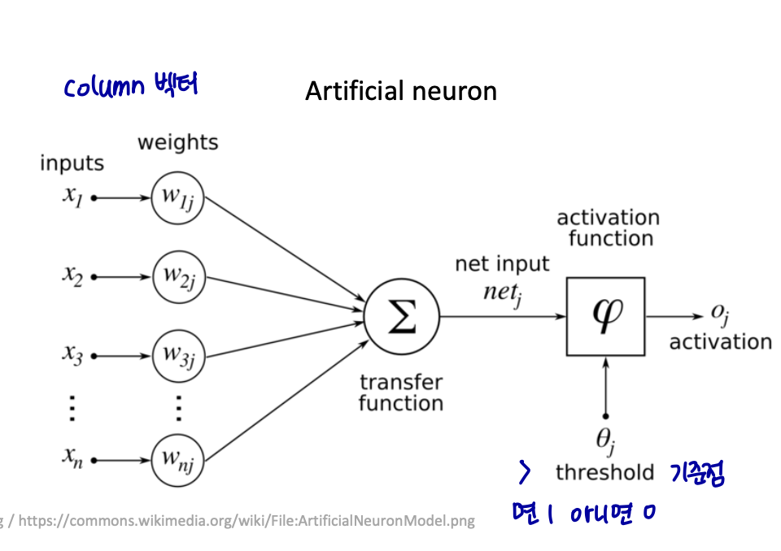
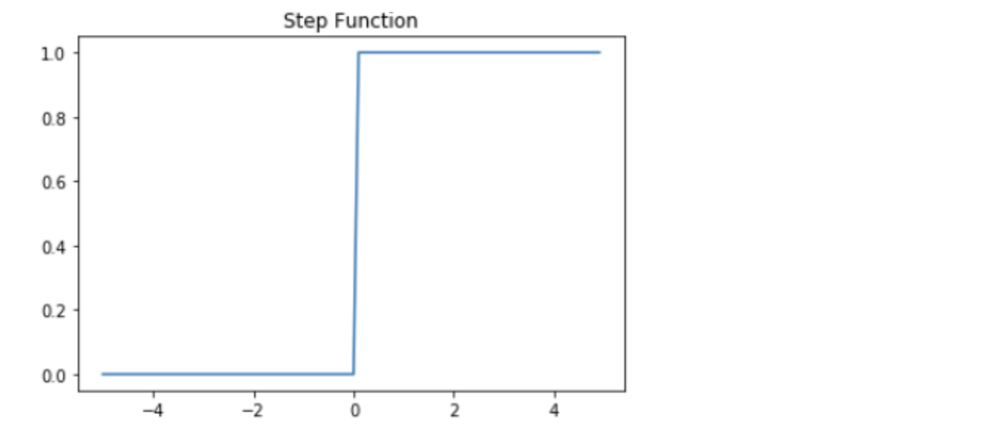
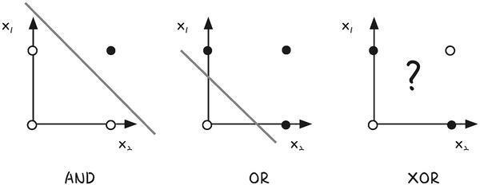
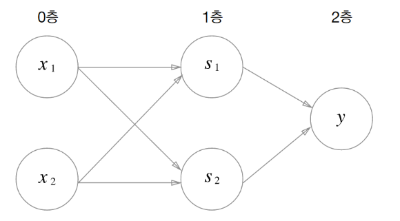
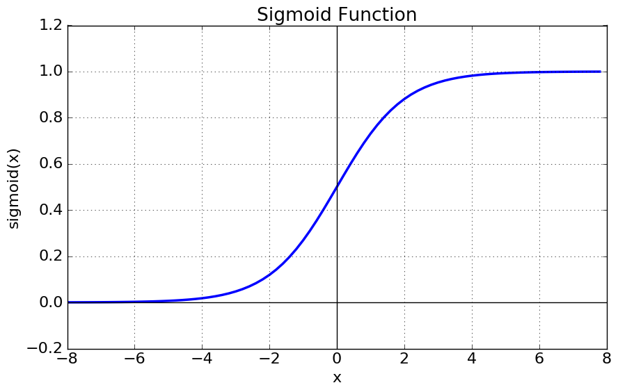
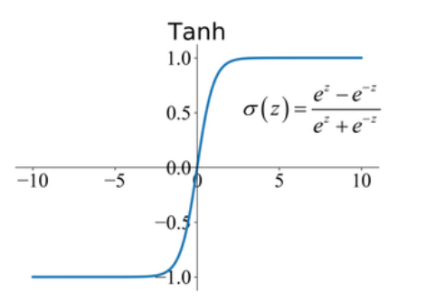
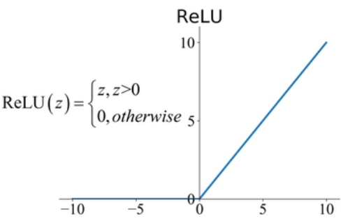

# 퍼셉트론과 뉴럴 네트워크

---

# 퍼셉트론이란?

> 인공 신경망의 기원이 돠는 알고리즘으로, 다수의 입력으로부터 하나의 결과를 내보내는 알고리즘이다.

퍼셉트론은 실제 뇌를 구성하는 신경 세포 뉴런의 동작과 유사하게, 다수의 신호를 입력으로 받아 하나의 신호를 출력한다.



위 그림에서 n개의 입력값 x를 받고, 가중치 w와 함께 종착지로 전달된다. 여기서 가중치의 값이 크면 클수록 해당 입력 값이 중요하다는 것을 의미한다.



퍼셉트론에서 각 가중치 곱의 전체 합이 threshold를 넘으면 출력 신호로서 1을 전달하고, 아니면 0을 전달한다. 위와 같은 함수를 계단 함수라고 한다. 추가적으로 편향값인 b를 퍼셉트론의 입력으로 사용된다.

## 한계


이처럼 퍼셉트론은 하나의 입력단과 출력단으로 구성되어 있다. 하지만 위 그림처럼 XOR 논리 게이트를 구현할 때는 직선 하나로 영역을 구분지을 수 없다는 한계가 있다.

# 다층 퍼셉트론

그래서 층을 여러개 쌓아서 다층 퍼셉트론을 구현하여 XOR 문제를 해결할 수 있다.


```python
    def XOR(x1, x2):
     s1 = NAND(x1, x2)
     s2 = OR(x1, x2)
     y = AND(s1, s2)
     return y
```

여기서 입력층과 출력층 사이에 s1, s2가 있는 층을 **은닉층**이라 한다. 은닉층을 여러번 쌓아서 단층 퍼셉트론으로는 표현하지 못한 다양한 것을 표현할 수 있다.
이러한 형태가 일반적인 **뉴럴 네트워크**의 형태이다.

# 활성화 함수

뉴럴 네트워크에서 계단 함수 뿐 아니라 다양한 함수를 사용할 수 있는데, 이처럼 입력값을 출력값으로 변환하는 함수를 **활성화 함수**라 한다.

- **sigmoid**
  
  큰 음수 값일 수록 0에 가까워지고 큰 양수 값일 수록 1이 된다.
  이진 분류 문제에 주로 사용되며, 기울기 소실 문제가 있다.

- **tanh**
  
  시그모이드와 비슷하지만 실수 값을 입력받아 -1 ~ 1 사이의 값으로 압축한다.
  시그모이드 함수보다 학습 수렴 속도가 빠르며, 주로 순환 신경망인 RNN에서 사용된다.

- **ReLU**
  
  입력이 0을 넘으면 그 입력을 그대로 출력하고, 음수는 0을 출력한다.
  학습 속도를 크게 향상 시킬 수 있으며, 주로 심층 신경망인 DNN에서 사용된다.

---

## 추가 질문
