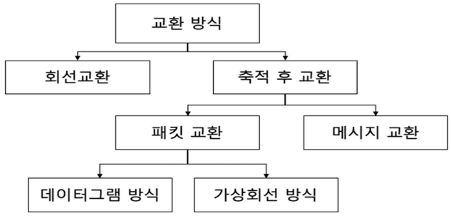

# OSI 3계층 - 네트워크계층

---

OSI 중 3계층에 대한 내용이다

## 정의

**논리적 주소(IP)를 기반으로 서로 다른 네트워크 간 통신을 담당**

- IP 주소로 목적지 식별
- 라우터가 최적 경로 선택
- 2계층(MAC)은 같은 네트워크 내, 3계층(IP)은 다른 네트워크 간 통신

## IP 주소

### IPv4

**32비트 논리적 주소** (예: 192.168.0.1)

- 4개의 옥텟(8비트)으로 구성
- 약 43억 개의 주소 (현재는 거의 고갈)

**공인 IP vs 사설 IP**

- **공인 IP**: 인터넷에서 직접 통신 가능한 유일한 주소
- **사설 IP**: 내부 네트워크 전용 (NAT로 공인 IP 변환 필요)
    - 10.0.0.0/8
    - 172.16.0.0/12
    - 192.168.0.0/16

**특수 IP**

- **127.0.0.1 (localhost)**: 자기 자신을 가리키는 주소
- **0.0.0.0**: 모든 IP 주소 (서버 바인딩 시 사용)

### IPv6

**128비트 주소** (예: 2001:0db8::1)

- IPv4 고갈 문제 해결
- 거의 무한대의 주소 공간

## 서브넷

**네트워크를 더 작은 단위로 나누는 것**

- 예: 192.168.1.0/24
    - /24는 앞 24비트가 네트워크 부분
    - 뒤 8비트가 호스트 부분 (256개 호스트 가능)

**왜 서브넷을 나누는가?**

- 네트워크 효율성 (브로드캐스트 트래픽 감소)
- 보안 (네트워크 분리)
- IP 관리 용이

**같은 서브넷 판단**

- 192.168.1.10/24와 192.168.1.20/24 → 같은 서브넷 (직접 통신)
- 192.168.1.10/24와 192.168.2.10/24 → 다른 서브넷 (라우터 필요)

## 네트워크 전송 방식

### 회선 교환 (Circuit Switching)

- **통신 전에 전용 경로를 먼저 설정**
- 연결 설정 → 데이터 전송 → 연결 해제
- 경로 독점 사용 (안정적)
- 예: 전화망
- 단점: 사용하지 않아도 자원 점유 (비효율적)

### 패킷 교환 (Packet Switching)

- **데이터를 패킷 단위로 나눠서 독립적으로 전송 - IP가 사용**
- 연결 설정 없이 바로 전송
- 각 패킷이 독립적으로 라우팅 (경로가 다를 수 있음)
- 네트워크 자원 공유 (효율적)
- 예: 인터넷
- 단점: 패킷 순서 보장 안 됨, 네트워크 혼잡 시 지연 발생

## 라우팅

**패킷을 목적지까지 전달하기 위한 경로 선택**

- 라우터가 라우팅 테이블을 보고 다음 목적지(Next Hop) 결정
- 같은 네트워크: 직접 전달
- 다른 네트워크: 라우터로 전달

## 핵심 프로토콜

### NAT (Network Address Translation)

**사설 IP ↔ 공인 IP 변환**

- 여러 기기가 하나의 공인 IP를 공유
- 포트 번호로 각 기기 구분 (PAT)

**왜 필요한가?**

- IPv4 주소 부족 문제 해결
- 비용 절감 (공인 IP 1개만 필요)
- 내부 네트워크 보안 (외부에서 내부 IP 직접 접근 불가)

**개발할 때 주의할 점**

- **포트 포워딩 필요**: 외부에서 내부 서버 접근 시
    - 예: 공인IP:8080 → 192.168.0.10:3000
- **P2P 통신 어려움**: WebRTC 등에서 STUN/TURN 필요
- **Docker 환경**: 컨테이너도 NAT 사용 (host network 모드로 우회 가능)

### ICMP

**네트워크 진단 프로토콜**

- **ping**: 연결 확인
    - `ping 8.8.8.8` → 구글 DNS 서버 연결 테스트
- **traceroute**: 경로 추적
    - 어느 구간에서 지연/장애가 있는지 확인

**실무 활용**

- 배포 후 서버 연결 확인
- 네트워크 문제 1차 진단
- API 서버 응답 확인
    
    
    

## 보안

### IP Spoofing

- 출발지 IP 주소를 위조하여 신뢰받는 서버인 것처럼 위장
- 인증 우회, DDoS 공격 시 출발지 추적 회피 목적

### Smurf Attack

- ICMP를 이용한 DDoS 증폭 공격
- 출발지 IP를 피해자로 위조 → 브로드캐스트로 ICMP 요청
- 네트워크 내 모든 장비가 피해자에게 응답 → 트래픽 폭주

### DDoS (Distributed Denial of Service)

- 다수의 공격자가 동시에 대량 패킷 전송
- 라우터나 서버 과부하로 정상 서비스 불가

## 질문
- Q1.) NAT를 쓸 때 ip가 내/외부로 나가는데 외부에서 들어오는 요청이 서버로 찾아가는 과정
    - A1.) 내부에서 외부로 나갈때 변환은 자동으로 이뤄진다.
        - 외부에서 내부의 경우 포트포워딩을 통해 수동으로 내부 포트와 매핑을 시켜야한다. → 포트포워딩
- Q2.) WebRTC NAT 사용이 어렵다. NAT 환경에서 WebRTC 사용하려면 어떻게 요청 경로를 구축해야 하는지
    - A2.) 시그널링 서버 + STUN/TURN 서버가 필요하다.
        - 시그널링 서버: SDP와 ICE candidate 교환(직접 구현해야함)
        - STUN 서버: 자신의 공인 IP포트 확인, NAT 타입 파악
        - TURN 서버: 직접 연결 실패 시 중계 기능(잘 안씀)
        - (cf) ICE 프로토콜 : 위 서버를 조합해 최적 경로 탐색
        - → **OpenVidu**: 시그널링 자동화 + STUN/TURN 내장 + SFU 미디어 서버 제공
        - WebRTC 전체 복잡도 해결 (개발 시간 단축)
        - 다자간 통화 최적화 (서버 중계 방식)
