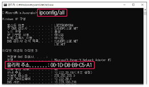
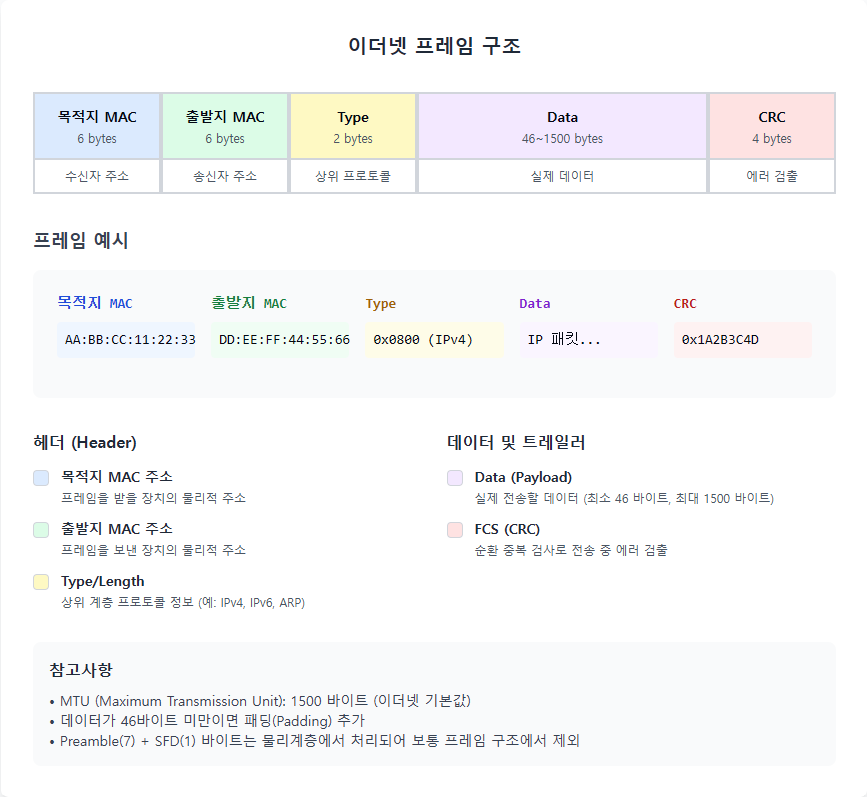
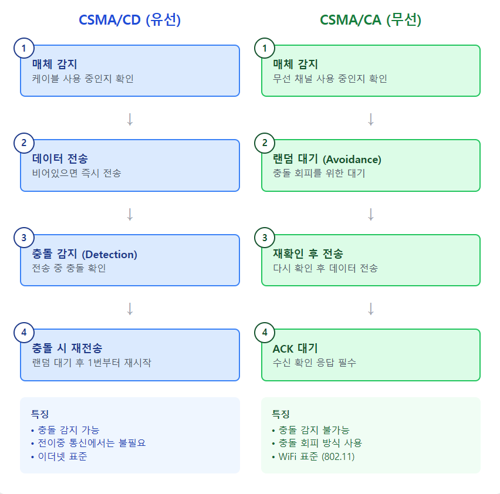
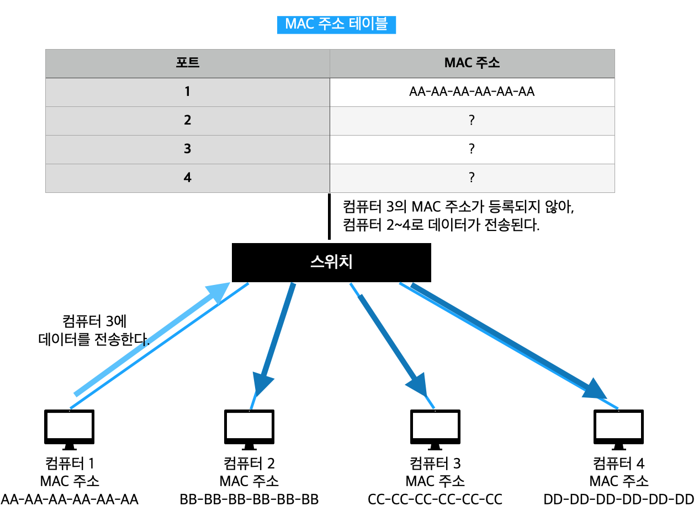
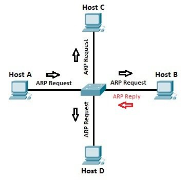
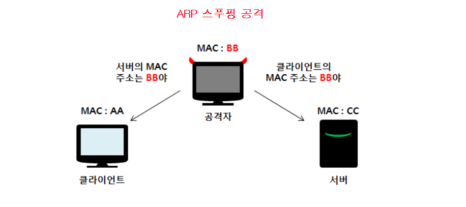
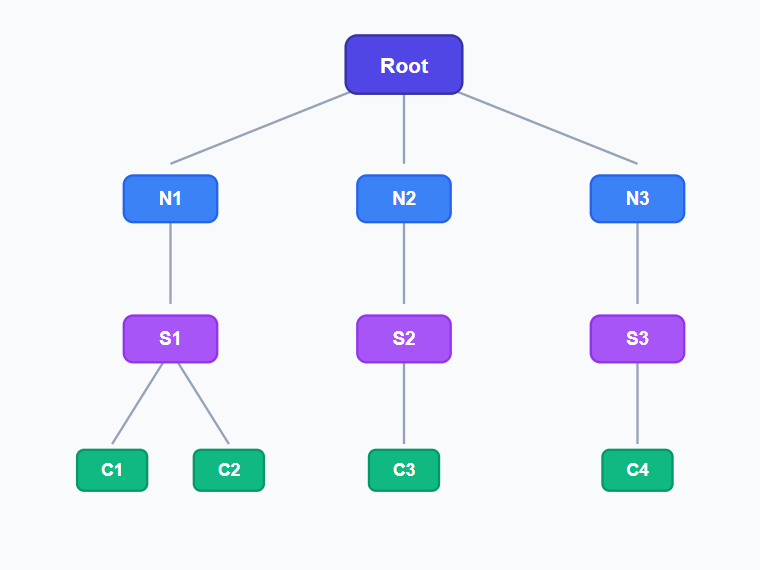

# OSI 2계층 - 데이터링크계층

---

OSI 중 2계층에 대한 내용이다

## 정의

**물리계층에서 받은 비트를 프레임 단위로 묶어 에러 없이 전달**

- MAC 주소 기반 통신
- 에러 검출/수정 담당
- 동일 네트워크 내 통신 담당

## 매체 접근 제어(MAC) 주소

**48비트 물리적 주소** (예: AA-BB-CC-11-22-33)

- 앞 24비트: 제조사 코드 (OUI)
- 뒤 24비트: 고유 번호
- **FF-FF-FF-FF-FF-FF**: 브로드캐스트
- NIC(랜카드)에 고정된 주소
    
    
    

## 프레임 구조

- **헤더**: 목적지/출발지 MAC 주소
- **데이터**: 실제 전송 내용
- **트레일러**: 에러 검출용 CRC

## 에러 검출

- 패리티 비트: 1비트 에러만 검출 (간단하지만 부정확)
- 체크섬 : 데이터 합산 검증
- 해밍 코드 : 에러 검출 + 수정 가능
- **CRC** : 다항식으로 나머지 계산(이더넷 표준, **가장 정확**함)
- 에러 발견 시 프레임 폐기 → 상위 계층이 재전송 처리

## 매체별 통신 방법

### CSMA/CD (유선 - 이더넷)

1. 전송 전 케이블 상태 확인
2. 비어있으면 전송
3. **충돌 감지 시** 랜덤 대기 후 재전송
4. 전이중 통신에서는 사용 안 함 (충돌 없음)

### CSMA/CA (무선 - WiFi)

1. 전송 전 매체 확인
2. 비어있으면 **랜덤 대기** 후 전송
3. ACK 받으면 성공
4. **무선**은 충돌 감지가 어려워 **회피 방식** 사용

## 장비

### 스위치

- **MAC 주소 테이블**로 포트 학습
- 목적지 MAC 주소 확인 → 해당 포트로만 전송
- 충돌 도메인 분리 (각 포트 독립적)
- 브로드캐스트는 모든 포트로 전송
- 만약 MAC 주소 테이블에 원하는 MAC 주소가 없다면?
    - 모든 주소로 데이터 전송(Flooding)
    - MAC 주소가 일치하지 않는 다른 디바이스는 NIC 단에서 해당 프레임 폐기 → 원하는 목적지에 전송

### 허브 (비교용)

- 모든 포트로 브로드캐스트 (1계층)
- 충돌 발생

## 핵심 프로토콜

## ARP (Address Resolution Protocol)

**IP 주소 → MAC 주소 변환**

1. ARP Request 브로드캐스트 ("192.168.0.10의 MAC은?")
2. 해당 IP 장치만 ARP Reply 응답
3. MAC 주소를 ARP 캐시에 저장

## RARP (Reverse ARP)

- MAC 주소 → IP 주소 변환
- DHCP 도입으로 거의 안씀

## (cf) ARP 스푸핑

### 개념

- 피해자 PC의 ARP 캐시를 조작하여 트래픽을 해커에게 유도하는 공격

### (ex)

- 피해자 게이트웨이(192.168.0.1), 게이트웨이 MAC(GW:GW:GW), 해커 MAC(HH:HH:HH)
- 해커 → 피해자 PC: "게이트웨이(192.168.0.1)의 MAC은 HH:HH:HH야" (가짜 ARP Reply)
- 피해자 ARP 캐시: 192.168.0.1 → HH:HH:HH (잘못된 정보 캐싱)
- 피해자가 외부로 데이터 전송 시 해커에게 프레임 전송됨
- 해커가 내용 확인 후 실제 게이트웨이로 포워딩 → 중간자 공격(MITM)

**피해**

- 세션, 비밀번호 등 통신 정보 탈취 및 패킷 변조 가능

**대응**

- Static ARP: ARP 캐시 수동 고정(→ 매번 갱신 필요)
- Dynamic ARP Inspection(**DAI**): 스위치에서 ARP 패킷 검증, **현업에서 사용**
- HTTPS 사용: 암호화로 내용 보호

**추가**

- 내 게이트웨이 주소와 같은지만 확인하면 해결되는게 아닐까?
    - ARP는 신뢰 기반이라 따로 검증을 하지 않는다.
    - 라우터(게이트웨이) 재부팅 / 교체 시 MAC 정보 초기화 → 정상인지 판별 어려움
    - 사용자가 매번 게이트웨이, MAC 주소를 외우지 않음

### (cf) MAC Flooding

### 개념

- 스위치의 MAC 주소 테이블을 오버플로우시켜 변별력을 없애는 공격

**(ex)**

1. 해커가 수많은 가짜 MAC 주소로 프레임 전송
2. 스위치 MAC 테이블이 가득 참 (오버플로우)
3. 스위치 동작 X → 허브처럼 정보 저장만 하게 됨
4. 해커가 같은 네트워크의 모든 트래픽 접근 가능

**대응**

- Port Security : 포트당 허용 MAC 주소 개수 제한
- MAC Address Limit : MAC 테이블 크기 제한

---

### 추가 질문

- Q1) DHCP가 어떻게 RARP를 대체하는가?
    - A1) RARP는 IP주소”만” 제공해준다.
        - DHCP는 IP주소 이외에 서브넷 마스크, 게이트웨이 등 기본 세팅을 “임대” 형태로 제공
- Q2) 첨부한 사진 중 C1 → C2로 정보를 가장 빨리 전달하는 방법은?
    - A2) C1 → S1 → C2
        1. C1이 ARP Broadcasting → S1이 Flooding 
        2. C2가 응답 → S1이 C1에게 C2의 MAC 주소 전달
        3. C1 → S1 → C2로 데이터 전송

