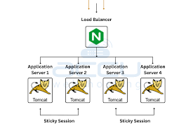

# OSI 5계층 - 세션계층

---

OSI 중 5계층에 대한 내용이다

## 정의

**애플리케이션 간의 연결(세션)을 설정, 관리, 종료하는 계층**

- 통신 세션의 시작과 종료 제어
- 대화(Dialogue) 제어 및 동기화
- 데이터 교환 관리
- 4계층(전송)은 데이터 전달, 5계층은 논리적 연결 관리

## 세션(Session)이란?

**두 애플리케이션 간의 논리적 연결 단위**

- 연결(Connection)은 물리적/전송 계층 개념
- 세션은 애플리케이션 관점의 대화 단위
- 예시: 웹 로그인 후 로그아웃까지, 채팅방 입장부터 퇴장까지

## 주요 기능

### 1. 대화 제어 (Dialogue Control)

**통신 방식 결정**

- **반이중(Half-Duplex)**: 한 번에 한 방향만 통신 (무전기)
- **전이중(Full-Duplex)**: 양방향 동시 통신 (전화, 현대 채팅)
    
    
    

### 2. 동기화 (Synchronization)

**데이터 전송 중 체크포인트 설정**

- 대용량 파일 전송 시 중간 지점 표시
- 오류 발생 시 체크포인트부터 재전송
- 처음부터 다시 보내지 않아도 됨

### 3. 토큰 관리 (Token Management)

**반이중 통신에서 전송 권한 제어**

- 토큰을 가진 측만 데이터 전송 가능
- 충돌 방지 및 순서 제어

## 주요 프로토콜

### NetBIOS

- Windows 네트워크 세션 관리
- 파일/프린터 공유
- 현재는 SMB/CIFS로 대체

### RPC (Remote Procedure Call)

- 원격 프로시저 호출
- gRPC, JSON-RPC로 발전

### PPTP/L2TP

- VPN 터널링
- 암호화된 세션 제공

## 실제 적용 사례

### 웹 세션 관리

**HTTP는 무상태(Stateless) → 세션으로 상태 유지**

1. 로그인 시 서버가 세션 ID 생성
2. 쿠키에 세션 ID 저장
3. 이후 요청마다 세션 ID 전송
4. 서버가 세션 ID로 사용자 식별

**세션 스토어**: Redis, Memcached, DB

### 데이터베이스 세션

- 커넥션 풀 사용
- 세션당 트랜잭션 상태 유지
- 타임아웃으로 리소스 관리

### WebSocket

- HTTP 업그레이드로 세션 수립
- 실시간 양방향 통신
- 채팅, 알림, 게임에 사용

## 세션 관리

### 세션 타임아웃

- 비활성 상태 일정 시간(15~30분) 후 종료
- 보안 및 리소스 관리

### 세션 클러스터링

- Sticky Session: 같은 서버로 라우팅
- Session Replication: 서버 간 세션 복제
- Centralized Store: Redis 등 중앙 저장소
    
    
    

## 세션 vs 연결 vs 쿠키

| 구분 | 세션(Session) | 연결(Connection) | 쿠키(Cookie) |
| --- | --- | --- | --- |
| 계층 | 5계층(세션) | 4계층(전송) | 7계층(응용) |
| 저장 위치 | 서버 | 네트워크 | 클라이언트 |
| 수명 | 논리적 대화 단위 | 물리적 연결 단위 | 설정된 만료 시간 |
| 목적 | 상태 유지 | 데이터 전송 | 클라이언트 식별 |

## 보안

### 세션 하이재킹

**공격자가 세션 ID 탈취하여 사용자로 위장**

**공격 방법**

- 스니핑: 네트워크 패킷 가로채기
- XSS: 자바스크립트로 쿠키 탈취
- 세션 고정: 미리 알고 있는 세션 ID 사용

**방어 방법**

- HTTPS 사용
- HttpOnly, Secure 쿠키 플래그
- 로그인 시 세션 ID 재생성
- IP 주소 검증

### CSRF (Cross-Site Request Forgery)

**세션 유지 상태에서 악의적 요청 실행**

- 사용자 로그인 → 악성 사이트 방문 → 자동으로 쿠키 전송

**방어 방법**

- CSRF 토큰 사용
- SameSite 쿠키 속성
- Referer 검증

## 최신 기술

### JWT (JSON Web Token)

**세션 대신 토큰 기반 인증**

- 서버에 세션 저장 불필요 (Stateless)
- 확장성 우수
- 단점: 즉시 무효화 어려움

### OAuth 2.0

- 소셜 로그인 (Google, GitHub)
- Access Token + Refresh Token

### gRPC

- HTTP/2 기반 RPC
- 마이크로서비스 통신에 적합