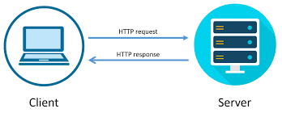
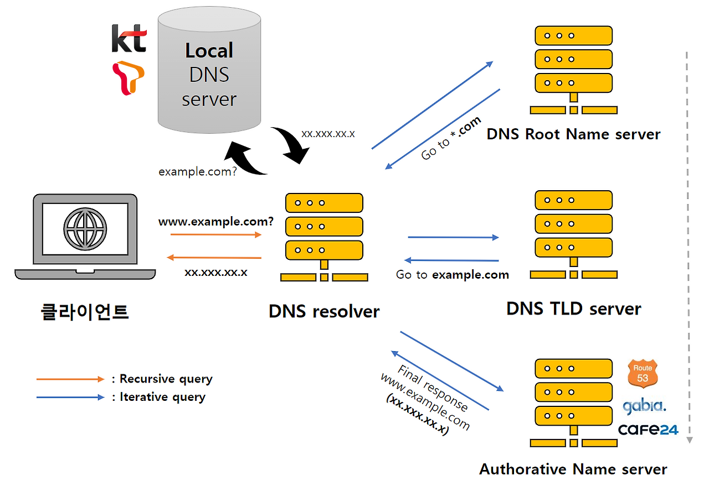
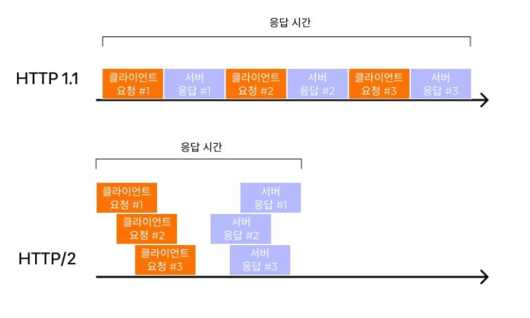
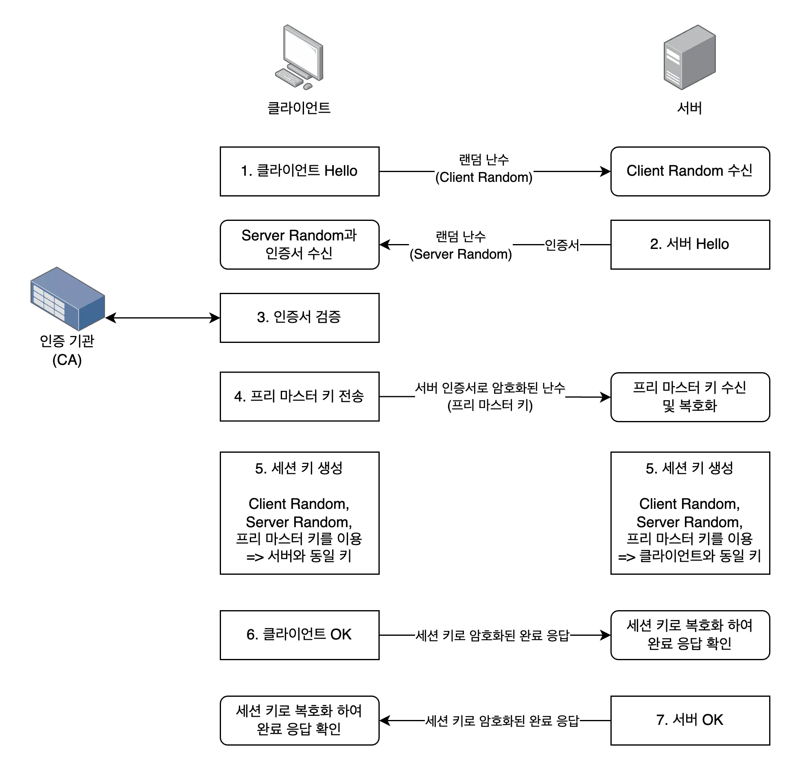
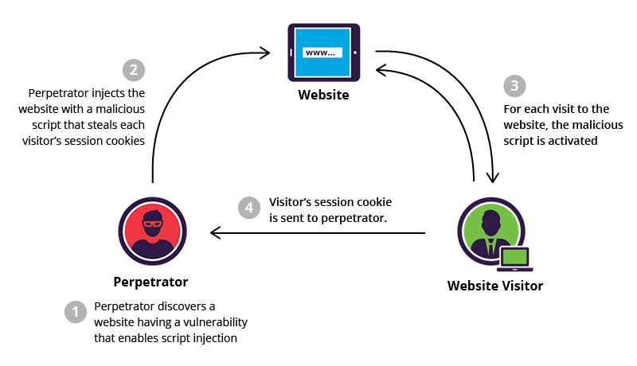

# OSI 7계층 - 응용계층

---

OSI 중 7계층에 대한 내용이다

## 정의

**사용자와 가장 가까운 계층으로, 애플리케이션 서비스를 제공**

- 사용자 인터페이스와 네트워크 간의 접점
- 다양한 프로토콜을 통해 데이터 교환
- HTTP, DNS, FTP, SMTP 등 애플리케이션 프로토콜 정의
- 하위 계층의 복잡성을 숨기고 추상화된 인터페이스 제공

## 주요 프로토콜

### HTTP/HTTPS (HyperText Transfer Protocol)

**웹 브라우저와 서버 간 통신 프로토콜**

- **HTTP**: 평문 전송, 포트 80
- **HTTPS**: SSL/TLS 암호화, 포트 443
- 요청-응답 모델 (Stateless)
- 메서드: GET, POST, PUT, DELETE, PATCH 등

**HTTP 메서드**

(cf) Idempotent → 여러번 적용해도 결과에 반영이 없는 형태(멱등성)

- **GET**: 리소스 조회 (Idempotent)
- **POST**: 리소스 생성 (Non-Idempotent)
- **PUT**: 리소스 전체 수정 (Idempotent)
- **PATCH**: 리소스 부분 수정 (Case By Case)
    ```
    # 멱등성 있는 경우
    PATCH /users/1 (body: {age: 30})
    → age를 30으로 설정 (여러 번 해도 age=30)

    # 멱등성 없는 경우
    PATCH /users/1 (body: {age: +1})
    → age를 1 증가 (결과 변동)
    ```
- **DELETE**: 리소스 삭제 (Idempotent)

**HTTP 상태 코드**

- **2xx (Success)**: 200 OK, 201 Created, 204 No Content
- **3xx (Redirect)**: 301 Moved Permanently, 302 Found, 304 Not Modified
- **4xx (Client Error)**: 400 Bad Request, 401 Unauthorized, 403 Forbidden, 404 Not Found
- **5xx (Server Error)**: 500 Internal Server Error, 502 Bad Gateway, 503 Service Unavailable



### DNS (Domain Name System)

**도메인 이름을 IP 주소로 변환하는 시스템**

- What if → 도메인이 없다면?
    1. 사용자는 google.com에 접속하려한다.
    2. 도메인이 없다고 가정하면 ip 주소를 직접 입력해야 한다.
    3. 서버 이전, 로드밸런스, 재시작 등 ip 주소는 수시로 바뀐다.
    4. 사용자가 매번 ip 주소를 알아내 메모장 등에 수시로 정리해야한다.
- 계층적 분산 데이터베이스 구조
- 포트 53 (주로 UDP, TCP도 지원)
- 캐싱을 통한 성능 최적화

**DNS 조회 과정**

1. 브라우저 캐시 확인
2. OS 캐시 확인 (hosts 파일)
3. 로컬 DNS 서버 (ISP) 조회
4. 루트 DNS 서버 → TLD 서버 → 권한 DNS 서버
5. IP 주소 반환 및 캐싱

**DNS 레코드 타입**

- **A**: 도메인 → IPv4 주소
- **AAAA**: 도메인 → IPv6 주소
- **CNAME**: 도메인 별칭 (Canonical Name)
- **MX**: 메일 서버 지정
- **TXT**: 텍스트 정보 (SPF, DKIM 등)
- **NS**: 네임 서버 지정



### 이메일 프로토콜

**SMTP (Simple Mail Transfer Protocol)**

- 메일 전송 프로토콜, 포트 25 (또는 587, 465)
- 클라이언트 → 서버, 서버 → 서버 전송
- PUSH 방식

**POP3 (Post Office Protocol v3)**

- 메일 수신 프로토콜, 포트 110 (또는 995)
- 서버에서 메일 다운로드 후 삭제
- 한 기기에서만 관리

**IMAP (Internet Message Access Protocol)**

- 메일 수신 프로토콜, 포트 143 (또는 993)
- 서버에 메일 보관, 동기화
- 여러 기기에서 동시 관리 가능

### 파일 전송 프로토콜

- **FTP (File Transfer Protocol)**: 파일 전송, 포트 20/21
- **FTPS (FTP over SSL/TLS) :** 포트 990
- **SCP** **(Secure Copy Protocol) :** SSH 기반 보안 파일 전송, 포트 22, 간단
- **SFTP (SSH File Transfer Protocol) :** SSH 기반 파일 전송, 포트 22, SCP 상위호환

### 기타 프로토콜

- **SSH (Secure Shell)**: 원격 접속, 포트 22
- **Telnet**: 원격 터미널 (보안 취약), 포트 23
- **WebSocket**: 양방향 실시간 통신, HTTP 업그레이드

## HTTP 상세

### HTTP/1.1 vs HTTP/2

| 특성 | HTTP/1.1 | HTTP/2 |
| --- | --- | --- |
| 연결 방식 | 연결당 1개 요청 | 멀티플렉싱 |
| 헤더 압축 | X | HPACK 압축 |
| 서버 푸시 | X | O |
| 우선순위 | X | 스트림 우선순위 |
| 바이너리 프로토콜 | 텍스트 | 바이너리 |

**HTTP/1.1의 문제점**

- **HOL Blocking**: 앞 요청 지연 시 뒤 요청도 대기
- **중복 헤더**: 매 요청마다 동일 헤더 전송
- **연결 제한**: 브라우저당 도메인별 6~8개 연결 제한

**HTTP/2의 개선점**

- **멀티플렉싱**: 하나의 연결로 여러 요청/응답 동시 처리
- **헤더 압축**: HPACK으로 중복 제거
- **서버 푸시**: 클라이언트 요청 전 리소스 전송
- **스트림 우선순위**: 중요 리소스 우선 전송



### RESTful API

**REST (Representational State Transfer) 아키텍처 스타일**

**REST 원칙**

1. **Stateless**: 각 요청은 독립적
2. **Client-Server**: 관심사 분리
3. **Cacheable**: 응답 캐싱 가능
4. **Uniform Interface**: 일관된 인터페이스
5. **Layered System**: 계층 구조

**RESTful API 설계**

- 리소스는 URI로 표현 (명사 사용)
- HTTP 메서드로 행위 표현
- JSON/XML로 데이터 전송
- 상태 코드로 결과 전달

```
GET    /users          # 사용자 목록 조회
GET    /users/123      # 특정 사용자 조회
POST   /users          # 사용자 생성
PUT    /users/123      # 사용자 전체 수정
PATCH  /users/123      # 사용자 부분 수정
DELETE /users/123      # 사용자 삭제

```

## 보안

### HTTPS와 SSL/TLS

**SSL/TLS (Secure Sockets Layer / Transport Layer Security)**

- 전송 계층과 응용 계층 사이에서 암호화
- TLS 1.2, TLS 1.3 (최신)
- 대칭키 + 비대칭키 암호화 조합

**HTTPS 동작 과정**

1. **클라이언트 → 서버**: Client Hello (지원 암호화 방식)
2. **서버 → 클라이언트**: Server Hello + 인증서 (공개키 포함)
3. **클라이언트**: 인증서 검증 (CA 확인)
4. **클라이언트**: 대칭키 생성 → 공개키로 암호화 전송
5. **서버**: 개인키로 복호화 → 대칭키 획득
6. **양방향**: 대칭키로 암호화 통신



### 주요 보안 위협

**SQL Injection**

- 입력값에 SQL 구문 삽입
- 데이터베이스 조작/탈취
- **대응**: Prepared Statement, 입력값 검증

```jsx
"SELECT Count(*) FROM Users WHERE Username=' admin ' AND 
Password=' anything 'or'1'='1 ' ";
```

**XSS (Cross-Site Scripting)**

- 악성 스크립트 삽입
- 사용자 세션 탈취, 피싱
- **대응**: 입력값 이스케이프, CSP 헤더



**CSRF (Cross-Site Request Forgery)**

- 사용자 권한으로 의도하지 않은 요청 전송
- **대응**: CSRF 토큰, SameSite 쿠키

**DDoS (Distributed Denial of Service)**

- 대량 트래픽으로 서버 마비
- **대응**: CDN, Rate Limiting, WAF

## 최신 기술

### HTTP/3

**QUIC 프로토콜 기반 (UDP)**

- TCP의 HOL Blocking 완전 해결
- 연결 수립 시간 단축 (0-RTT)
- 네트워크 전환 시에도 연결 유지 (Connection Migration)
- Chrome, Safari에서 기본 지원

### gRPC

**고성능 RPC 프레임워크**

- Protocol Buffers로 직렬화
- HTTP/2 기반 스트리밍
- 다양한 언어 지원
- 마이크로서비스 간 통신에 적합

### GraphQL

**API를 위한 쿼리 언어**

- 클라이언트가 필요한 데이터만 요청
- 단일 엔드포인트
- Over-fetching/Under-fetching 해결
- REST의 대안으로 부상

### WebRTC

**실시간 P2P 통신**

- 브라우저 간 직접 통신
- 화상/음성 통화, 파일 공유
- NAT Traversal (STUN, TURN)
- Zoom, Discord 등에서 활용

---
### 추가질문

- Q1.) http 메서드 중 멱등성 추가 설명
    - A1.) Patch의 경우 Case By Case로 상황마다 다르다(예시 참조)