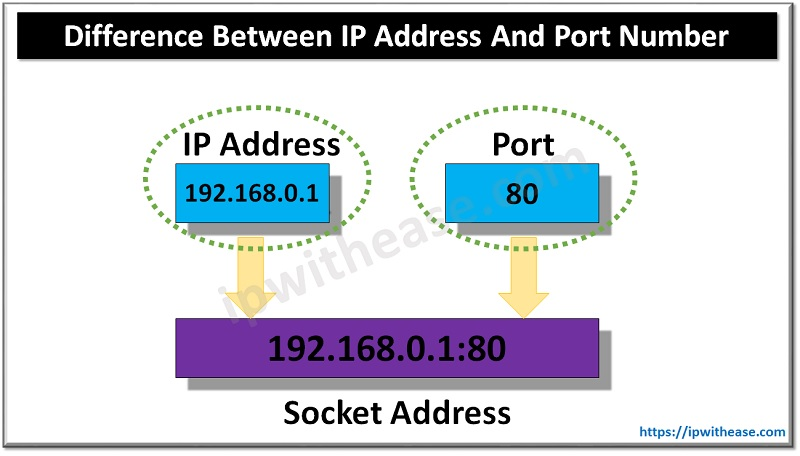
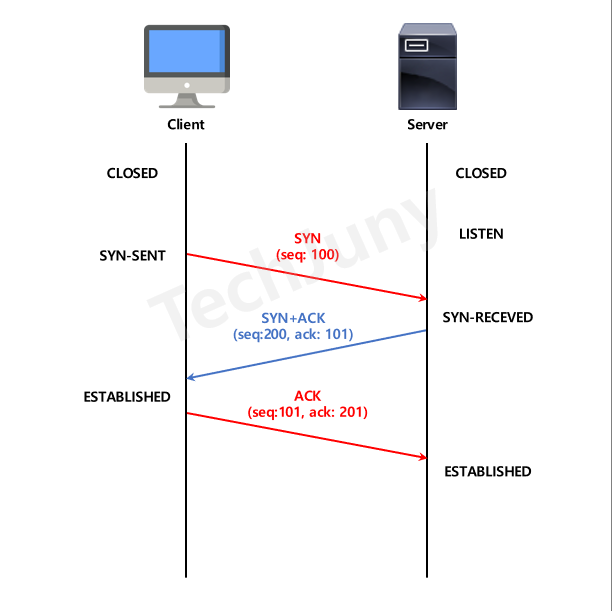
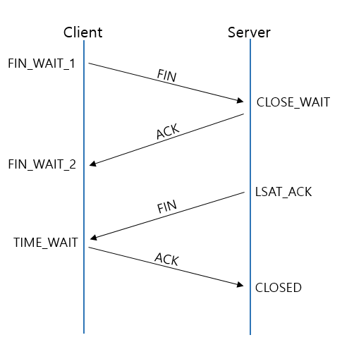
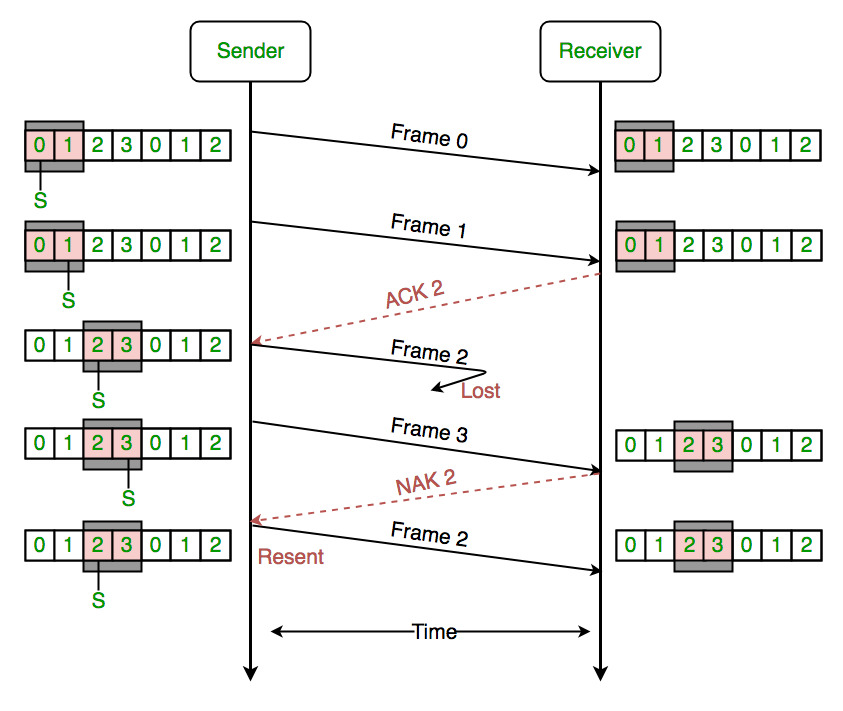
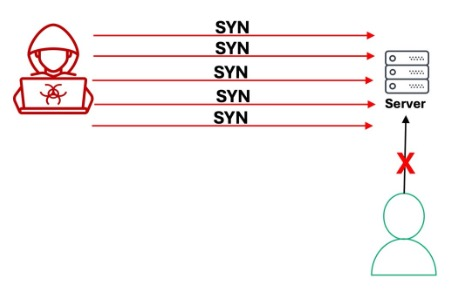

# OSI 4계층 - 전송계층

---

OSI 중 4계층에 대한 내용이다

## 정의

**종단 간(End-to-End) 신뢰성 있는 데이터 전송을 담당**

- 포트 번호로 애플리케이션 구분
- 데이터 분할 및 재조립
- 오류 제어 및 흐름 제어
- 3계층(IP)은 목적지까지 배달, 4계층은 정확한 프로세스까지 전달

## 포트(Port)

**애플리케이션을 식별하는 논리적 번호 (0~65535)**

- IP 주소가 집 주소라면, 포트는 집 안의 각 방 번호

**포트 범위**

- **Well-Known Ports (0~1023)**: 시스템 예약 포트
    - 22: SSH
    - 80: HTTP
    - 443: HTTPS
    
- **Registered Ports (1024~49151)**: 사용자 애플리케이션 등록 가능
    - 3000: React 개발 서버
    - 3306: MySQL
    - 5432: PostgreSQL
    - 6379: Redis
    - 8080: Tomcat 기본 포트
    - 27017: MongoDB
- **Dynamic Ports (49152~65535)**: 동적 할당 (클라이언트 임시 포트)

## TCP (Transmission Control Protocol)

**연결 지향, 신뢰성 있는 전송 프로토콜**

### 특징

- **연결 지향**: 데이터 전송 전 연결 수립 (3-way handshake)
- **신뢰성**: 데이터 순서 보장, 오류 검출 및 재전송
- **흐름 제어**: 수신자 버퍼 초과 방지
- **전이중 통신**: 양방향 동시 통신 가능

### 3-Way Handshake (연결 수립)

1. **클라이언트 → 서버**: SYN (연결 요청)
2. **서버 → 클라이언트**: SYN + ACK (요청 수락)
3. **클라이언트 → 서버**: ACK (연결 확립)

**왜 3번인가?**

- 양방향 통신 확인 필요
- 서버와 클라이언트 모두 송수신 능력 검증
- 2-way면 서버→클라이언트 전송 능력 미확인

### 4-Way Handshake (연결 종료)

1. **클라이언트 → 서버**: FIN (종료 요청)
2. **서버 → 클라이언트**: ACK (요청 확인)
3. **서버 → 클라이언트**: FIN (종료 준비 완료)
4. **클라이언트 → 서버**: ACK (최종 확인)

**왜 4번인가?**

- 서버가 아직 전송할 데이터가 남아있을 수 있음
- ACK 보낸 후 남은 데이터 전송 완료 → FIN 전송
- 즉시 종료하면 데이터 손실 가능

**TIME_WAIT 상태**

- 마지막 ACK 전송 후 일정 시간(2MSL) 대기
- 서버의 FIN 재전송에 대비
- 같은 포트 즉시 재사용 방지

### 흐름 제어 (Flow Control)

**수신자가 처리할 수 있는 속도로 전송**

- 수신자 버퍼 크기(Window Size) 전달
- 송신자는 Window Size만큼만 전송
- 버퍼 가득 차면 Window Size = 0 전송 (송신 중단)

**슬라이딩 윈도우 (Sliding Window)**

- 확인 응답 없이도 여러 패킷 연속 전송
- ACK 받으면 윈도우 이동하며 다음 패킷 전송
- 효율적인 데이터 전송 가능

## UDP (User Datagram Protocol)

**비연결 지향, 빠른 전송 프로토콜**

### 특징

- **비연결성**: 연결 수립 과정 없음
- **비신뢰성**: 순서 보장 X, 재전송 X
- **단순함**: 헤더가 간단 (TCP보다 오버헤드 적음)
- **빠름**: 오버헤드 적어 실시간 전송에 적합
- **브로드캐스트/멀티캐스트** 지원

### UDP 사용 사례

- **실시간 스트리밍**: YouTube, Netflix 라이브
- **온라인 게임**: 약간의 패킷 손실은 무시 가능
- **VoIP**: Zoom, Discord 음성 통화
- **DNS**: 빠른 조회 필요 (TCP도 지원하지만 주로 UDP)
- **DHCP**: IP 주소 자동 할당

## TCP vs UDP 비교

| 특성 | TCP | UDP |
| --- | --- | --- |
| 연결 방식 | 연결 지향 | 비연결 |
| 신뢰성 | 보장 (재전송) | 보장 안 함 |
| 순서 보장 | O | X |
| 속도 | 느림 (오버헤드 큼) | 빠름 |
| 헤더 크기 | 20바이트 이상 | 8바이트 |
| 용도 | 파일 전송, 웹, 메일 | 스트리밍, 게임, VoIP |
| 예시 | HTTP, HTTPS, FTP, SSH | DNS, DHCP, 게임, 실시간 영상 |

## 보안

### SYN Flooding

**TCP 3-way handshake 취약점 공격**

- 공격자가 대량의 SYN 패킷 전송
- 서버는 SYN+ACK 보내고 연결 대기 (Half-Open)
- 공격자는 ACK 안 보냄 → 서버 연결 큐 가득 참
- 정상 사용자 연결 불가 (DoS)

**대응 방법**

- SYN Cookie: 연결 상태를 저장하지 않고 쿠키로 검증
- 방화벽/IDS에서 차단
- 백로그 큐 크기 증가 (근본 해결 X)
    
    
    

### TCP RST 공격

- RST 패킷으로 정상 연결 강제 종료
- 중간자 공격으로 시퀀스 넘버 예측 필요
- 방화벽에서 비정상 RST 차단

### UDP Flooding

- 대량의 UDP 패킷 전송으로 서버 과부하
- 연결 없어서 탐지/차단 어려움
- Rate Limiting으로 완화

## 최신 기술

### HTTP/3 (QUIC)

**UDP 기반의 새로운 전송 프로토콜**

- TCP의 HOL Blocking 문제 해결
- 연결 수립 시간 단축 (0-RTT)
- 패킷 손실 시에도 다른 스트림은 정상 전송
- 구글, 클라우드플레어 등에서 활발히 도입 중

### TCP Fast Open

- 3-way handshake 중 데이터 함께 전송
- 연결 수립 시간 단축
- 쿠키 기반 검증으로 SYN Flooding 방어

---
### 질문사항

- Q1.) SYN flooding에서 서버가 SYN + ACK를 안보낼 순 없나?
- A1.) 일반적인 TCP 연결은 서버가 연결 정보를 메모리에 저장한다.
    - 공격자가 ACK를 보내지 않으면 연결이 종료되지 않고, 반복되면 큐가 가득 찬다.
    - SYN Cookie 방식을 사용하면, 서버가 메모리에 연결 정보를 담지 않는다.
    - 이 쿠키를 SYN+ACK 패킷 내부(Sequence Number)에 실어서 보낸다.
    - 정상 클라이언트인 경우 ACK를 보낼 때 값 +1을 패킷(Acknowledgment Nubmer)에 실어서 보낸다.
    - 받은 ACK의 값에 -1을 해서 자신이 만든 쿠키인지 검증한다.
