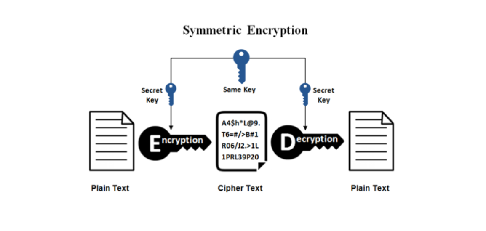
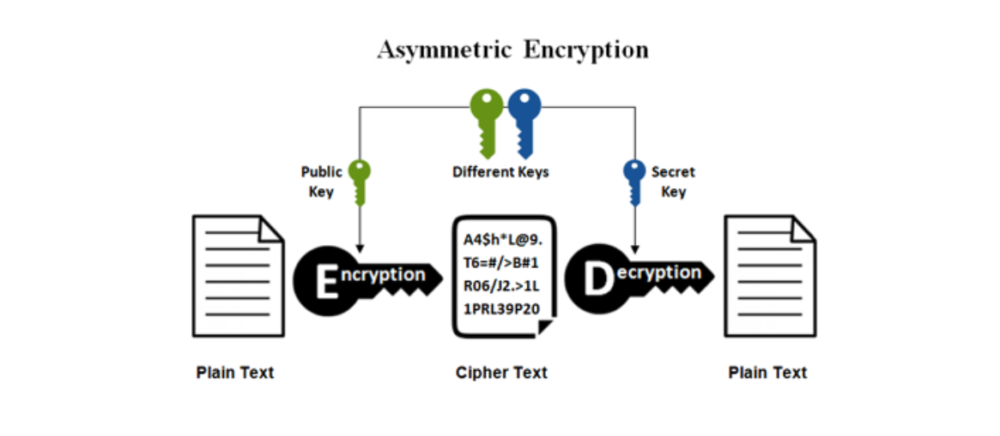
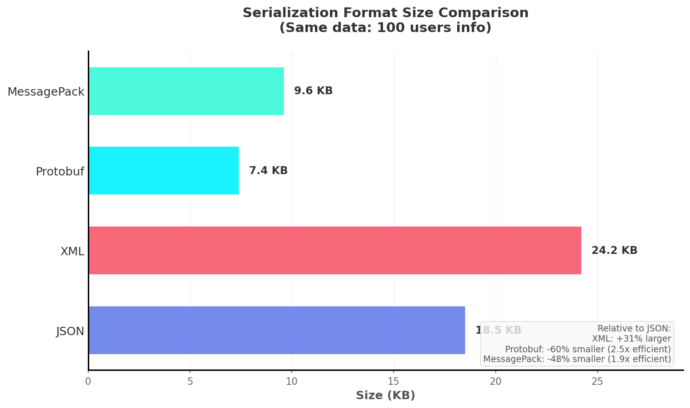
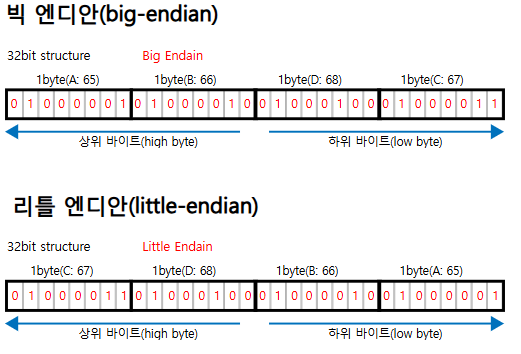

# OSI 6계층 - 표현계층

---

OSI 중 6계층에 대한 내용이다

## 정의

**데이터를 애플리케이션이 이해할 수 있는 형식으로 변환하는 계층**

- 데이터 형식 변환 및 표현
- 암호화/복호화
- 압축/압축해제
- 7계층(애플리케이션)은 데이터 사용, 6계층은 데이터 표현 담당

## 표현(Presentation)이란?

**같은 데이터를 다른 시스템이 이해할 수 있게 번역하는 것**

- 서로 다른 인코딩 체계 간 변환
- 네트워크 표준 형식 ↔ 애플리케이션 형식
- 예시: UTF-8 텍스트를 ASCII로, JSON을 객체로, 암호문을 평문으로

## 주요 기능

### 1. 데이터 변환 (Translation)

**서로 다른 데이터 형식 간 변환**

- 문자 인코딩 변환: ASCII ↔ EBCDIC ↔ UTF-8
- 엔디안 변환: Little Endian ↔ Big Endian
- 데이터 구조 직렬화: 객체 ↔ JSON/XML/Protobuf

**예시**

```
애플리케이션: { "name": "홍길동", "age": 25 }
표현계층: UTF-8로 인코딩된 JSON 문자열
네트워크: 바이트 스트림

```

### 2. 암호화/복호화 (Encryption/Decryption)

**데이터 보안을 위한 암호화**

- 송신 시: 평문 → 암호문
- 수신 시: 암호문 → 평문
- SSL/TLS가 대표적

**대칭키 vs 비대칭키**

- 대칭키: 암호화/복호화 동일 키 (AES, DES)
- 비대칭키: 공개키/개인키 쌍 (RSA, ECC)





### 3. 압축/압축해제 (Compression/Decompression)

**전송 데이터 크기 최소화**

- 무손실 압축: GZIP, Deflate, Brotli
- 손실 압축: JPEG, MP3, H.264
- HTTP Content-Encoding 헤더 사용

**압축 효과**

- 대역폭 절약
- 전송 시간 단축
- 저장 공간 효율화

## 문자 인코딩

### ASCII

- 7비트 (128자)
- 영문, 숫자, 기본 특수문자
- 확장 ASCII (8비트, 256자)

### Unicode

- 전 세계 모든 문자 표현
- UTF-8: 가변 길이 (1~4바이트)
    - ASCII 호환 (1바이트)
    - 한글: 3바이트
    - 웹 표준
- UTF-16: 2바이트 또는 4바이트
    - Windows, Java 내부 사용
- UTF-32: 고정 4바이트

### 인코딩 문제 사례

```
예시: "한글" → EUC-KR로 저장 → UTF-8로 읽음 → "����" (깨짐)
해결: 올바른 인코딩 선언 필요

```

## 데이터 직렬화

### JSON (JavaScript Object Notation)

- 텍스트 기반, 가독성 우수
- 웹 API 표준
- 단점: 크기가 크고 파싱 비용

### XML (eXtensible Markup Language)

- 태그 기반, 스키마 정의 가능
- SOAP, 레거시 시스템
- 단점: 장황함, 오버헤드

### Protocol Buffers (Protobuf)

- Google 개발, 바이너리 포맷
- 작고 빠름
- gRPC에서 사용
- 단점: 가독성 낮음, 스키마 필요

### MessagePack

- JSON과 유사하지만 바이너리
- JSON보다 작고 빠름

### 직렬화 포맷 비교

| 구분 | JSON | XML | Protobuf | MessagePack |
| --- | --- | --- | --- | --- |
| 형식 | 텍스트 | 텍스트 | 바이너리 | 바이너리 |
| 크기 | 중 | 대 | 소 | 소 |
| 속도 | 중 | 느림 | 빠름 | 빠름 |
| 가독성 | 높음 | 높음 | 낮음 | 낮음 |
| 사용처 | REST API | SOAP, 설정 | gRPC | 게임, 캐싱 |



## 주요 프로토콜

### SSL/TLS

- 암호화 통신 프로토콜
- HTTPS, FTPS, SMTPS
- TLS 1.2/1.3 권장

## 데이터 표현 표준

### MIME (Multipurpose Internet Mail Extensions)

- 파일 타입 식별
- Content-Type 헤더
- 예시: `text/html`, `application/json`, `image/png`

### XDR (External Data Representation)

- 플랫폼 독립적 데이터 표현
- RPC에서 사용

### ASN.1 (Abstract Syntax Notation One)

- 데이터 구조 정의 언어
- 인증서(X.509), SNMP에서 사용

## 엔디안 (Endianness)

**바이트 순서 표현 방식**

### Little Endian

- 낮은 주소에 낮은 바이트
- Intel x86, ARM (대부분)

### Big Endian

- 낮은 주소에 높은 바이트
- 네트워크 바이트 오더
- 일부 RISC 프로세서

**예시: ABDC**

- **Big Endian**: 상위 바이트가 먼저 (왼쪽부터)
- **Little Endian**: 하위 바이트가 먼저 (오른쪽부터)
    
    
    

**네트워크 통신**

- 네트워크는 Big Endian (Network Byte Order)
- `htonl()`, `ntohl()` 함수로 변환

## 보안

### 중간자 공격 (MITM)

**암호화되지 않은 통신 가로채기**

**방어 방법**

- TLS/SSL 사용 (HTTPS)
- 인증서 검증
- Certificate Pinning

### 데이터 변조

**전송 중 데이터 변경**

**방어 방법**

- HMAC (Hash-based Message Authentication Code)
- 디지털 서명
- TLS의 무결성 검증

### 인코딩 공격

**잘못된 인코딩으로 보안 우회**

- UTF-8 오버롱 인코딩
- URL 인코딩 이중 디코딩
- 방어: 입력 검증, 정규화

## 최신 기술 및 트렌드

### Brotli 압축

- Google 개발
- GZIP보다 15~20% 작음
- 현대 브라우저 지원

### HTTP/2 & HTTP/3

- 헤더 압축 (HPACK, QPACK)
- 바이너리 프로토콜
- 성능 향상

### WebAssembly (WASM)

- 바이너리 포맷
- 브라우저에서 네이티브 성능
- 다양한 언어 지원

### Zero-Copy 직렬화

- FlatBuffers, Cap'n Proto
- 역직렬화 없이 데이터 접근
- 초고성능 필요 시

## 표현계층 vs 애플리케이션계층

| 구분 | 표현계층 (6계층) | 애플리케이션계층 (7계층) |
| --- | --- | --- |
| 역할 | 데이터 형식 변환 | 사용자/응용 프로그램 인터페이스 |
| 예시 | JSON 인코딩, GZIP 압축 | HTTP 요청, 이메일 전송 |
| 관심사 | "어떻게 표현할까?" | "무엇을 할까?" |

**실제로는**

- 현대 네트워크에서는 두 계층이 혼재
- HTTP API가 직렬화, 압축, 암호화 모두 처리
- 개념적 구분은 여전히 유용

---
### 추가질문
- Q1) 대칭키와 비대칭키 암호화의 예시, EC2 원격접속시에는 어떤 방식을 사용하나?
    - A1) EC2 원격접속으로 둘 다 설명 가능하다.
        1. 개인키를 가진 사용자가 서버에 접속을 요청한다.
        2. 사용자가 개인키로 서명 생성 → 서버가 공개키로 서명 검증 (비대칭키 인증)
        3. 인증 성공 시 세션 키 생성
        4. 이후 세션 키로 통신(대칭키 암호화)