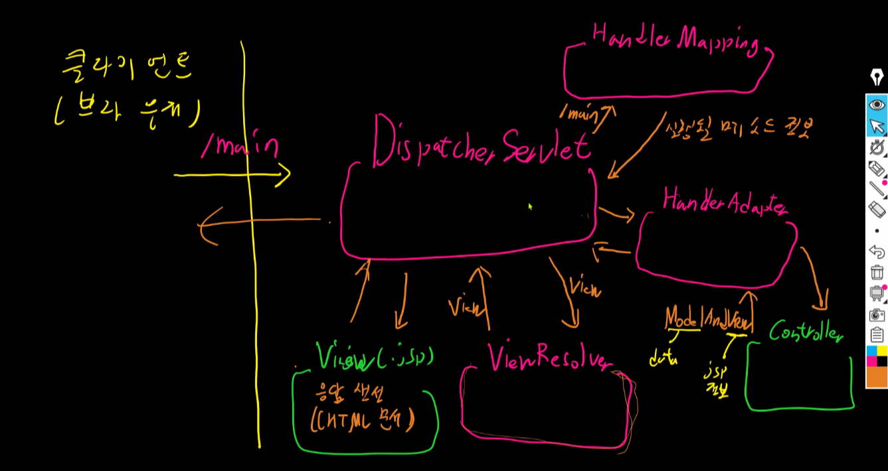

# CS 스터디 25.10.17

# WS/WAS 에 대하여

자 WS는 Web Server를 의미하고, WAS는 Web Application Server를 의미한다!

## 그렇다면 Web Server 부터 알아보자.

### Web Server 란?

- Web Server는 우리가 웹 요청 흐름을 순서대로 본다면, 브라우저 바로 다음에 나오는 부분이다.
- 유저가 브라우저를 통해 특정 URL에 접속하면, Web Server가 정적 리소스를 반환한다!
- 즉, 가장 간단하게 Web Server는 HTML, CSS, Javascript 와 같은 파일 리소스 그 자체를 반환해 주는 것이 주요 임무라고 할 수 있다!

### 그렇다면 Web Server의 역할은 정적 리소스 반환이 끝인가? ㄴㄴ

- Web Server의 역할은 아래와 같다

1. 정적 리소스 반환 (HTML, CSS, Javascript 등)
2. 요청 라우팅 및 프록시
   1. 유저가 동적으로 특정 엔드 포인트에 API를 요청하면 Web Server가 WAS로 프록시 해주어야 한다!
3. 로드 밸런싱
   1. 여러 WAS 인스턴스에 트래픽을 분산 시켜주기도 함
4. SSL/TLS
   1. HTTPS 보안 통신과 같은 암호화 처리도 해줌
5. 캐싱
   1. 정적 리소스를 캐싱하여 성능을 높이기도 함

### 자 그러면 이런 Web Server 용 어플리케이션은 어떤게 있을까?

- Nginx
- Apache HTTP Server
- Lighttpd
- Caddy
- 등등이 있다

## 다음으로 WAS (Web Application Server)에 대해서 알아보자.

- WAS 는 클라이언트의 HTTP 요청을 처리하고 어플리케이션 로직을 실행해 동적 응답을 생성하는 서버이다.
- 대표적으로 Tomcat(Java), Node.js(JavaScript), Jetty, JBoss, WebLogic 등이 있다!

### 동작 순서를 알아보자.

1. WS로부터 받은 HTTP 요청을 파싱한다. (Tomcat의 Coyote 모듈이 수행)
2. URL 매핑 정보에 따라 어떤 서블릿이 처리할지 결정하고, DispatcherServlet이 해당 요청을 받는다.
3. DispatcherServlet이 Spring 컨테이너에서 매핑된 Controller를 찾아 실행한다.
4. Controller에서 비즈니스 로직이 처리되고 결과를 반환한다.
5. WAS가 이 결과를 HTTP 응답으로 포장하고 WS로 전달한다.
6. WS가 클라이언트(브라우저)로 응답을 반환한다.

# MVC 흐름도

# 스프링 프로젝트(Legacy) 구동 순서

1. 톰캣(웹 컨테이너)이 web.xml 읽어서 프로젝트 관련 내용 초기화
2. 리스너 등록 (ContextLoaderListener)
   ContextLoaderListener
   => 애플리케이션의 시작, 종료 시 특정 작업 수행
   시작 - 루트 스프링 컨테이너(공용 창고)(root-context.xml 읽음)
3. DispatcherServlet 등록 및 url매핑
   DispathcerServlet 초기화과정에 자신이 사용할 스프링 컨테이너 생성
   => servlet-context.xml을 읽어서 스프링 컨테이너 생성

# springMVC 요청 처리 순서

요청 url "/main"

1. DispatcherServlet이 요청 수신
2. DispatcherServlet이 HandlerMapping에 "/main"과 매핑된 Controller의 메서드 정보 요청
3. DispatcherServlet은 실행될 메서드 정보를 받아서 HandlerAdapter에게 해당 메소드 실행 요청
4. Controller 요청을 처리하고 ModelAndView 반환 (View : "main")
5. HandlerAdapter가 Model의 데이터를 request에 복사
6. ModelAndView를 받은 DispatcherServlet은 ViewResolver에게 View 정보 넘김
7. ViewResolver는 "main"에 접두사 , 접미사를 붙여서 해당 .jsp가 존재하는지 확인
8. 존재한다면 DispatcherServlet이 해당 .jsp(View)로 포워딩
9. 해당 .jsp는 response에 응답(HTML 문서)을 채워넣음
10. 클라이언트(브라우저)는 해당 HTML 문서를 받음

### 추가 질문

- 서버 사이드 렌더링을 하는 경우 WS가 있다고 해야 하나 없다고 해야 하는가?
  - 진호: Tomcat이 WS의 일부 역할을 가지고 있다고 알고 있음.
  - 정우: 위 내용과 비슷
- 답변: SSR을 한다고 해서 WS가 없는 것은 아니라고 보는 것이 맞다.
  - 왜냐하면, WAS가 WS의 기능을 일부분 포함하고 있기 때문에 WS가 존재한다고 생각하는 것이 맞다. 특히 톰캣의 경우 더더욱 그렇다고 할 수 있다.
  - 여기서 일부분 포함하는 WS의 기능은 정적 파일 서빙이 있음.
