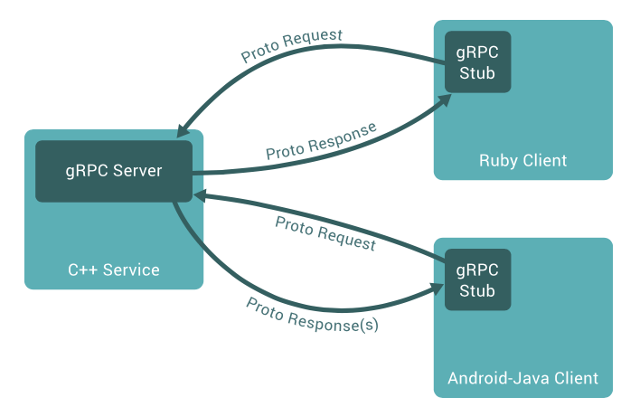

# gRPC

🧩 gRPC란?

**Google Remote Procedure Call.**

다른 서버의 함수를 내 코드처럼 부를 수 있게 해주는 통신 방식

HTTP/2 위에서 돌아가고, 데이터는 **ProtoBuf**(바이너리 형태)로 주고받음

그래서 REST처럼 JSON으로 주고받는 것보다 훨씬 빠르고 가벼움

---

## ProtoBuf(프로토버퍼)란?

### 🧩DTO와의 공통점

| 항목     | 설명                                      |
| -------- | ----------------------------------------- |
| **역할** | 서버와 클라이언트 간 데이터 전달용 객체   |
| **형태** | 필드와 타입으로 구성                      |
| **용도** | 요청(Request), 응답(Response) 메시지 정의 |

즉, Java의 `UserDto`, `OrderResponse`처럼 gRPC의 `message User`도 “이 구조로 데이터를 주고받자”는 약속

---

### 둘의 차이점

| 구분               | ProtoBuf (message)                  | DTO                                     |
| ------------------ | ----------------------------------- | --------------------------------------- |
| **언어 의존성**    | 없음 (언어 중립적 IDL)              | 있음 (보통 Java, Python 등 코드로 작성) |
| **직렬화 방식**    | ProtoBuf → 바이너리 (빠르고 작음)   | JSON, Object → 텍스트 기반 (느림)       |
| **필드 번호**      | 있음 (ex: `string name = 1;`)       | 없음                                    |
| **코드 생성 방식** | `.proto` 파일에서 자동 생성         | 수동 작성                               |
| **하위 호환성**    | 번호 기반이라 필드 추가/삭제에 유연 | 직접 수정 시 호환 깨질 수 있음          |

---

### 정리

- `message` = DTO 개념.
- 다만 **언어 중립적**, **컴파일로 자동 생성**, **이진 직렬화 포맷**이라는 점이 다르다.
- 결국 REST의 DTO가 “사람이 직접 만든 설계서”라면,
  ProtoBuf는 “기계가 이해하고 자동으로 생성하는 설계서”



---

## gRPC vs REST

| 구분                | REST                         | gRPC                        |
| ------------------- | ---------------------------- | --------------------------- |
| **프로토콜**        | HTTP/1.1                     | HTTP/2                      |
| **데이터 포맷**     | JSON (문자열)                | ProtoBuf (바이너리)         |
| **성능**            | 직관적이지만 느림            | 빠르고 효율적               |
| **계약(Interface)** | 없음 (명시적으로 정의X)      | `.proto` 파일로 명확히 정의 |
| **스트리밍**        | 제한적 (SSE, WebSocket 필요) | 기본 지원 (단방향/양방향)   |
| **호환성**          | 언어 간 쉬움 (JSON 표준)     | ProtoBuf 컴파일 필요        |
| **디버깅**          | 텍스트로 쉬움                | 바이너리라 도구 필요        |

---

## 💡 왜 사용하는가?

- **서비스 간 통신이 많을 때** (예: MSA 구조)
- **낮은 지연시간**이 중요한 환경
- **양방향 스트리밍**이 필요한 서비스 (예: 채팅, 실시간 모니터링)
- **내부 통신용**으로 REST보다 빠르고 타입 안전한 설계가 필요할 때

---

## grpc의 장단점

### 장점

- 빠름 (ProtoBuf + HTTP/2)
- 서비스 인터페이스 명세 관리가 쉬움
- 양방향 스트리밍 가능
- 언어 간 호환 (Java ↔ Python ↔ Go 등)

### 단점

- 브라우저 직접 호출 어려움 (프록시 필요)
- ProtoBuf 학습 곡선 있음
- 디버깅/로깅이 REST보다 불편

---

## grpc가 효과적인 사용 케이스

✅ **적합한 경우**

- MSA 내부 통신 (서버 ↔ 서버)
- 실시간 스트리밍, 로그 수집, AI inference 요청
- 내부 시스템 간 고속 데이터 전송

🚫 **덜 적합한 경우**

- 외부 공개용 API (REST가 여전히 표준)
- 단순 CRUD 기반 서비스 (오버엔지니어링 위험)

---

## gRPC 통신 과정

1️⃣ **proto 정의**

- 서버와 클라이언트가 공통으로 이해할 “약속문서” (.proto 파일) 작성.
  여기에 RPC 메서드 이름, 요청/응답 메시지 구조를 정의.

2️⃣ **코드 생성**

- `.proto` 파일을 gRPC 컴파일러(`protoc`)로 컴파일 → 각 언어용 코드(stub, 메시지 클래스) 자동 생성.
- stub이란?
  | 항목 | 설명 |
  | ------------- | ------------------------------------------------------- |
  | **Stub** | 서버의 함수를 대신 호출하는 **클라이언트 측 대리 객체** |
  | **역할** | RPC 요청을 만들어 서버로 전송하고, 응답을 받아서 반환 |
  | **생성 방법** | `.proto` 파일을 `protoc`로 컴파일할 때 자동 생성됨 |
  | **종류** | BlockingStub(동기), FutureStub(비동기), AsyncStub(콜백) |

3️⃣ **서버 실행**

- 서버는 생성된 *서비스 인터페이스*를 상속받아 실제 로직을 구현
- gRPC 서버를 띄워 요청 대기

4️⃣ **클라이언트 요청**

- 클라이언트는 생성된 *stub*을 이용해 서버의 RPC 메서드를 직접 호출하듯 사용
- 내부적으로는 HTTP/2 프레임으로 직렬화된 데이터(ProtoBuf)가 네트워크로 전송됨

5️⃣ **응답 수신**

- 서버에서 응답 메시지를 ProtoBuf로 직렬화 → 클라이언트가 역직렬화해서 결과를 받음

---

## Java 예시

```java
// 1️⃣ hello.proto
syntax = "proto3";

service Greeter {
  rpc SayHello (HelloRequest) returns (HelloReply);
}

message HelloRequest {
  string name = 1;
}
message HelloReply {
  string message = 1;
}

// 2️⃣ 서버 구현
public class HelloService extends GreeterGrpc.GreeterImplBase {
    @Override
    public void sayHello(HelloRequest req, StreamObserver<HelloReply> responseObserver) {
        HelloReply reply = HelloReply.newBuilder()
            .setMessage("Hello, " + req.getName())
            .build();
        responseObserver.onNext(reply);
        responseObserver.onCompleted();
    }
}
```

```java
import io.grpc.ManagedChannel;
import io.grpc.ManagedChannelBuilder;

public class HelloClient {
    public static void main(String[] args) {
        // 1. 채널 생성 (서버 주소와 포트 지정)
        ManagedChannel channel = ManagedChannelBuilder
                .forAddress("localhost", 50051)
                .usePlaintext() // TLS 미적용
                .build();

        // 2. Stub 생성 (자동 생성된 GreeterGrpc 클래스 사용)
        GreeterGrpc.GreeterBlockingStub stub = GreeterGrpc.newBlockingStub(channel);

        // 3. 요청 객체 생성
        HelloRequest request = HelloRequest.newBuilder()
                .setName("Jinho")
                .build();

        // 4. 서버 호출
        HelloReply response = stub.sayHello(request);

        // 5. 결과 출력
        System.out.println("서버 응답: " + response.getMessage());

        // 6. 채널 종료
        channel.shutdown();
    }
}
```

---

## Python 예시

```python
# server.py
import grpc
from concurrent import futures
import hello_pb2, hello_pb2_grpc

class Greeter(hello_pb2_grpc.GreeterServicer):
    def SayHello(self, request, context):
        return hello_pb2.HelloReply(message=f"Hello, {request.name}")

server = grpc.server(futures.ThreadPoolExecutor(max_workers=10))
hello_pb2_grpc.add_GreeterServicer_to_server(Greeter(), server)
server.add_insecure_port('[::]:50051')
server.start()
server.wait_for_termination()
```

```python
# client.py
import grpc
import hello_pb2, hello_pb2_grpc

with grpc.insecure_channel('localhost:50051') as channel:
    stub = hello_pb2_grpc.GreeterStub(channel)
    response = stub.SayHello(hello_pb2.HelloRequest(name="Jinho"))
    print(response.message)
```

---

## 실무에서의 사용 형태

보통 **MSA 백엔드 간 내부 호출**에 많이 사용함

- API Gateway → REST
- 내부 서비스들 간 → gRPC
- 모니터링은 **Envoy + Prometheus**
- 인증은 **TLS + JWT 메타데이터**
- 배포는 **Kubernetes** (서비스 간 gRPC 통신, LB/HealthCheck)

---

### 요약

REST가 “사람 보기 쉬운 언어”라면,

gRPC는 “서버끼리 빠르고 효율적으로 대화하는 언어”

---

### 질문

- 우리가 기존에 쓰던 REST는 http 1.1인가?
  - `Spring Boot`나 `FastAPI`, `Express` 같은 프레임워크로 작성한 **REST API**는 거의 전부 **HTTP 1.1** 프로토콜 위에서 동작
  - HTTP/1.1은 텍스트 기반이고, 요청–응답 구조가 1:1
- `public class HelloService extends GreeterGrpc.GreeterImplBase` 여기서 GreeterGrpc.GreeterImplBase부분은 자동으로 만들어주는건가??
  - **Protocol Buffers(.proto 파일)** 로부터 **gRPC 플러그인**이 자동으로 만들어주는 클래스
  - .proto 파일 컴파일 → GreeterGrpc.java, HelloRequest.java, [HelloReply.java](http://HelloReply.java) 파일들이 생성

### 예를 들어 이런 `.proto` 파일이 있다면:

```protobuf
syntax = "proto3";

package com.example.helloworld;

service HelloWorld {
  rpc SayHello(HelloRequest) returns (HelloResponse);
}

message HelloRequest {
  string name = 1;
}

message HelloResponse {
  string message = 1;
}
```

---

### `protoc` 명령으로 Java 코드 생성:

```bash
protoc --proto_path=./protos \
  --java_out=./build/generated \
  --grpc-java_out=./build/generated \
  ./protos/helloworld.proto
```

---

### 📂 생성 결과 구조:

```
build/generated/com/example/helloworld/
├── HelloWorldGrpc.java      // gRPC Stub (서버/클라이언트용)
├── HelloRequest.java        // ✅ 자동 생성: 요청 메시지 DTO
├── HelloResponse.java       // ✅ 자동 생성: 응답 메시지 DTO
└── HelloworldOuterClass.java  // (내부 static 클래스, 헬퍼)
```

---
