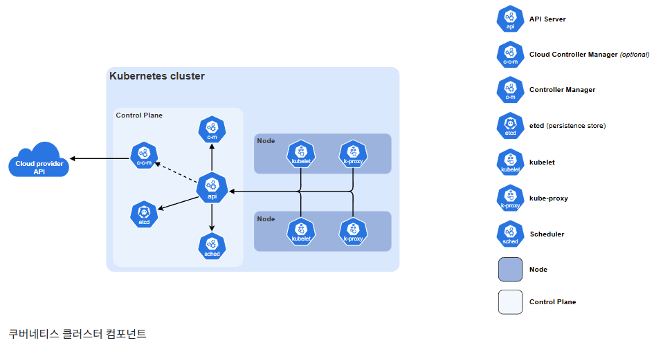

# 쿠버네티스

### 쿠버네티스란?

- 컨테이너 오케스트레이션 도구
- 컨테이너로 배포된 애플리케이션을 자동으로 배포·확장·복구해주는 시스템.
- 쉽게 말해 “운영자가 수동으로 서버 띄우고 끄는 일”을 자동화함.
  - **Docker**: 컨테이너를 “만드는” 도구
  - **Kubernetes (K8s)**: 컨테이너를 “관리하는” 도구

### 쿠버네티스의 장단점

| 구분       | 장점                                                                  | 단점                                  |
| ---------- | --------------------------------------------------------------------- | ------------------------------------- |
| **운영**   | 자동 스케일링 (HPA), 롤링 업데이트, 자가복구(헬스체크 실패 시 재시작) | 초기 설정 복잡, 학습곡선 큼           |
| **배포**   | YAML 선언형 배포 → 환경 일관성 유지                                   | YAML 관리 지옥 (Manifest 수십 개)     |
| **확장성** | 수백~수천 개의 Pod 자동 관리                                          | 네트워크 구조(CNI, Service) 이해 필요 |
| **비용**   | 리소스 효율↑ (Pod 단위로 CPU, 메모리 할당)                            | 과도한 리소스 요청 시 오히려 낭비     |

### 쿠버네티스 사용 이유

| 구분                                     | 설명                                                                          | 실무 효과                                                |
| ---------------------------------------- | ----------------------------------------------------------------------------- | -------------------------------------------------------- |
| **1. 배포 자동화 (Deploy Automation)**   | YAML 선언형으로 서비스 상태를 정의하면, 쿠버네티스가 자동으로 Pod를 배포·관리 | 수동 배포 없이 일정한 패턴 유지, 롤링 업데이트/롤백 지원 |
| **2. 확장성과 자원 효율 (Auto Scaling)** | 트래픽이나 부하에 따라 Pod 수를 자동 조절 (HPA, VPA)                          | 사용량에 맞춘 동적 리소스 관리, 비용 절감                |
| **3. 장애 자가복구 (Self-Healing)**      | Pod 장애 발생 시 자동 재시작 또는 재배치                                      | 서비스 중단 최소화, 운영 인력 개입 감소                  |
| **4. 환경 일관성 (Consistency)**         | 컨테이너 기반으로 개발-스테이징-운영 환경 동일                                | “로컬은 되는데 서버는 안 돼요” 문제 해소                 |
| **5. 멀티클라우드·MSA 친화성**           | AWS, GCP, On-prem 어디서나 동일한 운영 패턴 유지                              | 인프라 종속성↓, 마이크로서비스 아키텍처에 적합           |

## 쿠버네티스의 구조



### 컨트롤 플레인

- 마스터 노드
- 클러스터의 “두뇌”. Pod 배치, 상태관리, 스케줄링 담당.

| 구성요소               | 역할                                     |
| ---------------------- | ---------------------------------------- |
| **API Server**         | `kubectl` 명령을 받아 클러스터 명령 수행 |
| **Scheduler**          | Pod를 어떤 Node에 배치할지 결정          |
| **Controller Manager** | ReplicaSet, Node 등 상태 관리            |
| **etcd**               | 클러스터 상태 저장소 (key-value DB)      |

### 데이터 플레인

- 실제 애플리케이션이 실행되는 영역 (워커 노드)

| 구성요소              | 역할                                     |
| --------------------- | ---------------------------------------- |
| **Kubelet**           | Node에 Pod 실행/상태 보고                |
| **Kube Proxy**        | Pod 간 네트워크 연결 및 로드밸런싱       |
| **Container Runtime** | Docker, containerd 등 실제 컨테이너 실행 |

## 쿠버네티스의 구성요소

| 리소스                          | 역할                                        |
| ------------------------------- | ------------------------------------------- |
| **Pod**                         | 컨테이너 1개 이상을 담는 최소 실행 단위     |
| **Deployment**                  | Pod의 Desired 상태 유지, 롤링 업데이트 지원 |
| **ReplicaSet**                  | Pod 개수 보장                               |
| **Service**                     | Pod 집합의 네트워크 접근점 제공             |
| **ConfigMap / Secret**          | 설정값, 민감정보 주입                       |
| **Ingress**                     | HTTP 외부 요청을 내부 Service로 라우팅      |
| **Namespace**                   | 리소스 논리적 구분 (dev, prod 등)           |
| Taint / Toleration              | 특정 Node에만 Pod를 배치/차단               |
| Probe (Liveness, Readiness)     | 헬스체크용                                  |
| HPA (Horizontal Pod Autoscaler) | CPU/메모리 기준으로 자동 확장               |
| Volume / PVC                    | Pod가 사용할 스토리지 (영속 데이터)         |

## 쿠버네티스 명령어 실행 과정

- **kubectl 명령 전송**
  → `kubectl apply -f deployment.yaml` 실행
  → 명령이 API Server로 전달
- **API Server**
  → etcd에 “Pod를 생성하라”는 Desired 상태 저장
- **Scheduler**
  → Node 리소스 확인 후 적절한 Node 선택
- **Kubelet (해당 Node)**
  → container runtime에게 Pod 생성 요청
  → 실제 컨테이너 실행 시작
- **Kube Proxy & Service**
  → 네트워크 라우팅 설정
  → 클러스터 내/외부 통신 가능

## 쿠버네티스 핵심 명령어

| 목적                       | 명령어                                         | 설명                                             |
| -------------------------- | ---------------------------------------------- | ------------------------------------------------ |
| **1. 리소스 상태 확인**    | `kubectl get pods -o wide`                     | 어떤 노드에 어떤 Pod가 떠 있는지 확인            |
| **2. 로그 확인**           | `kubectl logs -f <pod명>`                      | 실시간 로그 모니터링 (에러 추적 시 필수)         |
| **3. Pod 내부 접속**       | `kubectl exec -it <pod명> -- bash`             | 컨테이너 안에서 직접 디버깅                      |
| **4. 상세 상태 조회**      | `kubectl describe pod <pod명>`                 | Pod 이벤트, 재시작 사유 등 확인                  |
| **5. 배포 실행**           | `kubectl apply -f <파일명>`                    | 새 리소스 생성 또는 업데이트 (배포 기본)         |
| **6. 배포 상태 확인**      | `kubectl rollout status deployment/<이름>`     | 롤링 업데이트 진행 상황 체크                     |
| **7. 롤백**                | `kubectl rollout undo deployment/<이름>`       | 장애 시 이전 버전으로 즉시 복원                  |
| **8. 스케일 조정**         | `kubectl scale deployment <이름> --replicas=3` | 트래픽 증가 시 수동 스케일링                     |
| **9. 리소스 삭제**         | `kubectl delete -f <파일명>`                   | YAML로 생성한 리소스 제거                        |
| **10. 리소스 사용량 확인** | `kubectl top pod`                              | CPU·메모리 사용량 모니터링 (metrics-server 필요) |

### yaml파일 예시

```yaml
# --------------------- Deployment ---------------------
apiVersion: apps/v1 # Deployment 리소스의 API 버전 (현재 안정 버전)
kind: Deployment # 리소스 종류 (Deployment: Pod 집합 관리)
metadata:
  name: backend-app # Deployment 이름
  labels:
    app: backend # 레이블: 리소스 식별용 키-값 (Service와 연결됨)
spec:
  replicas: 3 # 실행할 Pod 개수 (Auto Scaling 없을 땐 직접 설정)
  selector:
    matchLabels:
      app: backend # 어떤 Pod를 관리할지 매칭 기준 (template.labels와 동일해야 함)
  template: # Pod 템플릿 정의 (이 아래 내용으로 Pod가 생성됨)
    metadata:
      labels:
        app: backend # Pod에 붙는 label (Service 연결 시 selector로 사용됨)
    spec:
      containers:
        - name: backend # 컨테이너 이름
          image: myrepo/backend:1.0.0 # 실행할 이미지 (배포 시 새 태그로 교체)
          ports:
            - containerPort: 8080 # 컨테이너 내부 포트 (Spring Boot 기본 포트 등)

          # 리소스 요청/제한 - 없으면 노드 과부하 위험
          resources:
            requests: # 최소 보장 리소스
              cpu: "100m" # CPU 0.1 core
              memory: "128Mi" # 128MB 메모리
            limits: # 최대 사용 제한
              cpu: "500m" # CPU 0.5 core
              memory: "512Mi" # 512MB 메모리

          # Liveness Probe: 장애 감지 → 자동 재시작
          livenessProbe:
            httpGet:
              path: /health # 헬스체크 엔드포인트
              port: 8080
            initialDelaySeconds: 15 # 시작 후 몇 초 뒤부터 체크 시작
            periodSeconds: 20 # 몇 초 간격으로 체크할지

          # Readiness Probe: 준비 완료 여부 확인 → 트래픽 전달 제어
          readinessProbe:
            httpGet:
              path: /health
              port: 8080
            initialDelaySeconds: 5 # 컨테이너 시작 직후 기다리는 시간
            periodSeconds: 10 # 주기적 검사 간격

---
# --------------------- Service ---------------------
apiVersion: v1 # Service 리소스의 API 버전
kind: Service # 리소스 종류 (Service: Pod 집합의 접근점)
metadata:
  name: backend-service # Service 이름
spec:
  selector:
    app: backend # 이 label을 가진 Pod들과 연결 (위의 Deployment와 일치)
  ports:
    - protocol: TCP # 통신 프로토콜
      port: 80 # 클러스터 내부에서 접근할 포트 (고정됨)
      targetPort: 8080 # Pod 컨테이너가 실제 리스닝 중인 포트
  type: ClusterIP # 기본값 (클러스터 내부 전용 IP로 연결)
  # 외부에서 접근할 경우: type을 LoadBalancer로 변경
```

## 쿠버네티스 자주 하는 실수

| 유형                                | 설명                                                       |
| ----------------------------------- | ---------------------------------------------------------- |
| **리소스 요청/제한 미설정**         | CPU, 메모리 미지정 시 노드 과부하 발생                     |
| **ConfigMap 변경 후 재배포 누락**   | Pod 재시작 안 하면 적용 안 됨                              |
| **RollingUpdate 설정 미흡**         | `maxUnavailable=0`, `maxSurge=1` 등 신중히 설정해야 무중단 |
| **Liveness/Readiness Probe 미설정** | Pod가 준비 안 된 상태로 트래픽 받는 문제                   |
| **Namespace 혼용**                  | `default`에 모든 리소스 몰아넣음 → 관리 지옥               |
| **서비스명/포트 불일치**            | `targetPort`와 컨테이너 포트 mismatch로 연결 안 됨         |
| **PVC/PV 설정 실수**                | StorageClass 미설정 시 볼륨 마운트 실패                    |
