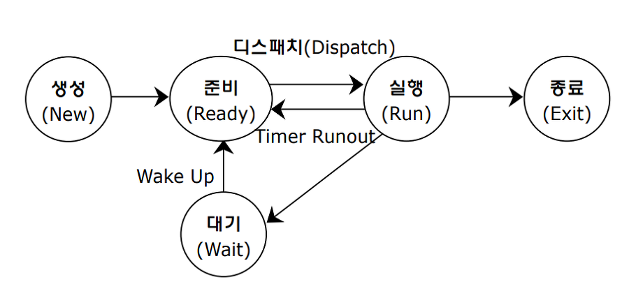

# OS

## OS란

- 하드웨어 자원을 효율적으로 관리하고, 여러 프로그램이 안전하게 동시에 실행되도록 조율하는 소프트웨어
- 핵심 역할 4가지
  - **자원 관리(Resource Management)** – CPU, 메모리, I/O, 파일 등
  - **프로세스 관리(Process Management)** – 생성, 스케줄링, 동기화, 종료
  - **메모리 관리(Memory Management)** – 가상 메모리, 페이징, 스와핑
  - **파일/입출력 관리(I/O Management)** – 디스크, 네트워크 접근

## 프로세스와 스레드

| 구분                  | 핵심 내용                                   | 답변 포인트                                          |
| --------------------- | ------------------------------------------- | ---------------------------------------------------- |
| **프로세스(Process)** | 실행 중인 프로그램, 독립된 메모리 공간 보유 | “서로 격리되어 있고, 문맥 교환 비용이 큼”            |
| **스레드(Thread)**    | 프로세스 내 실행 흐름 단위, 메모리 공유     | “스택만 따로 갖고, 자원 공유로 문맥 교환 빠름”       |
| **포인트**            | “멀티프로세스 vs 멀티스레드”                | 트레이드오프 언급 — 안정성(프로세스) vs 효율(스레드) |

## 🧱 컨텍스트 스위칭

- **CPU가 다른 프로세스로 전환할 때 레지스터, 스택 등 저장·복원하는 과정**
- 비용 발생 → 스레드풀이나 비동기 처리로 최소화

포인트: “스레드 수가 너무 많을 때 왜 느려질까?”

→ 문맥 교환 과다, 캐시 미스, Lock 경합 때문.

## 🧱 커널(Kernel)

운영체제의 핵심. 하드웨어 바로 위에서 **자원과 시스템 콜을 관리**.

> `애플리케이션` ↔ (시스템콜) ↔ `커널` ↔ 하드웨어

| 커널 역할          | 설명                                  | 면접 포인트                        |
| ------------------ | ------------------------------------- | ---------------------------------- |
| **프로세스 관리**  | 스케줄링, 문맥 전환                   | “커널 스레드도 존재한다”           |
| **메모리 관리**    | 가상 메모리, 페이지 교체              | “OOM은 커널이 프로세스 강제 종료”  |
| **파일 시스템**    | inode, 버퍼 캐시 관리                 | “IO 병목 원인 커널 레벨 캐시 확인” |
| **시스템 콜 제공** | `read()`, `fork()` 등 호출 인터페이스 | “커널 모드 전환 비용 존재”         |

## CPU 스케줄링

| 알고리즘                | 설명                               | 특징                         |
| ----------------------- | ---------------------------------- | ---------------------------- |
| **FCFS**                | 도착 순서대로                      | 단순, 비선점, 응답 늦음      |
| **SJF**                 | 짧은 작업 우선                     | 평균 대기시간 ↓, 기아 가능성 |
| **RR**                  | 시간 할당량 단위로 순환            | 응답성 ↑, 문맥교환 오버헤드  |
| **Priority Scheduling** | 우선순위 높은 작업 먼저            | 기아 가능성 → Aging 필요     |
| **포인트**              | “실시간 서비스에서 어떤 스케줄링?” | Round Robin + Priority 조합  |

## 🧠 메모리 구조 (Memory Layout)

프로세스가 메모리를 쓰는 방식.

| 영역             | 설명                              | 예시                      |
| ---------------- | --------------------------------- | ------------------------- |
| **Stack**        | 함수 호출 시 지역 변수 저장, LIFO | 재귀 깊으면 StackOverflow |
| **Heap**         | 동적 할당(`new`, `malloc`)        | GC 대상 (Java)            |
| **Data(Static)** | 전역 변수, static 변수            | `int count = 0;`          |
| **Code(Text)**   | 실행 명령어, 함수 코드            | 프로그램 로직 저장        |

- “스택은 컴파일 타임, 힙은 런타임에 크기 결정된다.”
- “메모리 누수는 힙에서 주로 발생한다.”

## 메모리 관리

| 개념                            | 설명                              | 핵심 키워드                         |
| ------------------------------- | --------------------------------- | ----------------------------------- |
| **페이징(Paging)**              | 메모리를 고정 크기 페이지로 나눔  | 내부 단편화                         |
| **세그멘테이션(Segmentation)**  | 의미 단위(함수, 변수 등)로 나눔   | 외부 단편화                         |
| **가상 메모리(Virtual Memory)** | 실제 메모리보다 큰 주소 공간 제공 | “스왑 발생 시 성능 저하”            |
| **포인트**                      | “서버 메모리 부족 시 어떤 현상?”  | → 스와핑(swap) 발생, CPU I/O 대기 ↑ |

- 페이징 - 고정 - 내부 단편화

```mathematica
논리 주소:  [Page번호 | Offset]
물리 주소:  [Frame번호 | Offset]
```

- 세그멘테이션 - 의미 별 - 외부 단편화

```css
[Code] [Data] [Stack] ...
```

## 단편화

| 구분            | 원인                             | 특징              |
| --------------- | -------------------------------- | ----------------- |
| **내부 단편화** | 고정 크기 블록 할당 시 남는 공간 | 페이징 환경       |
| **외부 단편화** | 가변 크기 블록을 자주 할당/해제  | 세그멘테이션 환경 |

## 🧮 가상 메모리 & 페이징

- **가상 메모리**: 실제 물리 메모리보다 큰 주소 공간을 제공 (스왑, 페이징)
- **페이지 폴트(Page Fault)**: 필요한 페이지가 메모리에 없을 때 디스크에서 불러오는 현상
- **스왑(Swap)**: 자주 안 쓰는 페이지를 디스크로 옮김 → 느려짐

> “가상 메모리는 메모리 보호와 효율을 위해 프로세스마다 독립된 공간을 제공하지만, 스왑이 잦으면 성능이 급격히 떨어집니다.”

## 동기화와 데드락

| 주제                           | 설명                                       | 면접에서 자주 묻는 부분            |
| ------------------------------ | ------------------------------------------ | ---------------------------------- |
| **임계영역(Critical Section)** | 공유 자원 접근 코드 영역                   | Lock, Semaphore, Monitor           |
| **데드락 조건**                | 상호배제 / 점유와 대기 / 비선점 / 순환대기 | “4조건 중 하나라도 깨면 예방 가능” |
| **예방 방법**                  | Lock 순서 고정, Timeout, 자원 회수         | “Lock 획득 순서를 일정하게 유지”   |

### 🧩 임계구역 (Critical Section)

- **공유 자원을 접근하는 코드 영역**
- 한 번에 하나의 스레드만 진입해야 함.

### 데이터 동기화 해결 방법

1. **뮤텍스(Mutex)**
   - “열쇠 하나”로 생각하면 돼.
   - 누군가 자원에 들어가면 락 잠금, 끝나면 해제.
   - 예: `pthread_mutex_lock`, `synchronized` (Java)
2. **세마포어(Semaphore)**
   - 여러 개의 열쇠를 가진 버전.
   - 동시에 n개 스레드 접근 허용.
   - `wait()`로 요청, `signal()`로 반환.
3. **모니터(Monitor)**
   - 언어 차원의 동기화 도구.
   - 내부에서 락 + 조건변수 관리 자동화.
   - Java의 `synchronized`, Python의 `threading.Lock`이 여기에 해당.

## 프로세스 상태 전이



포인트: “`sleep()` 호출 시 어떤 상태?” → 대기 상태(Waiting).

## 인터럽트 & 시스템 콜

| 개념          | 설명                                | 예시                                |
| ------------- | ----------------------------------- | ----------------------------------- |
| **인터럽트**  | 예외·입출력 등으로 CPU 흐름 전환    | I/O 완료, 예외 발생 등              |
| **시스템 콜** | 커널 자원 요청을 위한 인터페이스    | `read()`, `write()`, `fork()` 등    |
| **포인트**    | “사용자 모드와 커널 모드 전환 비용” | “컨텍스트 스위칭 발생, 최소화 중요” |
