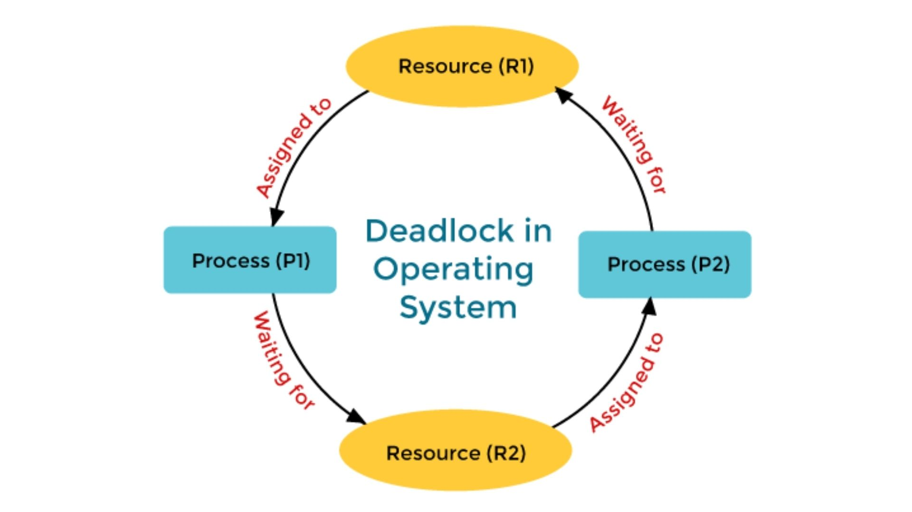
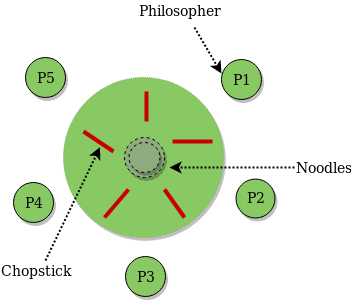

# 교착 상태(Deadlock)

멀티프로세스 환경에서 발생하는 교착 상태에 대한 내용이다

---

## 정의

**두 개 이상의 프로세스가 서로가 가진 자원을 기다리며 무한정 대기하는 상태**

- 프로세스들이 순환 형태로 자원을 요청하며 대기
- 어떤 프로세스도 진행할 수 없는 교착 상태
- 시스템 자원 낭비 및 응답 불가 상태 발생

## 데드락 발생 조건

**다음 4가지 조건이 모두 만족될 때 데드락 발생 (하나라도 깨지면 발생 안 함)**

### 1. 상호 배제 (Mutual Exclusion)

**한 번에 한 프로세스만 자원 사용 가능**

- 프린터, 파일 같은 공유 불가능한 자원
- 동기화를 위해 필수적인 조건

### 2. 점유와 대기 (Hold and Wait)

**자원을 보유한 채로 다른 자원을 기다림**

- 이미 할당받은 자원은 놓지 않음
- 추가 자원을 요청하며 대기

### 3. 비선점 (No Preemption)

**다른 프로세스의 자원을 강제로 빼앗을 수 없음**

- 자원을 가진 프로세스만 자발적으로 반환 가능
- OS가 강제로 회수 불가

### 4. 순환 대기 (Circular Wait)

**프로세스들이 순환 형태로 자원을 기다림**

```
P1 → R2 (P2가 보유)
P2 → R3 (P3가 보유)
P3 → R1 (P1이 보유)

```



## 식사하는 철학자 문제

**데드락을 설명하는 고전적인 예제**

```
상황:
- 5명의 철학자가 원탁에 앉아 있음
- 각 철학자 사이에 포크 1개씩 (총 5개)
- 식사하려면 양쪽 포크 2개 필요

데드락 발생:
1. 모든 철학자가 동시에 왼쪽 포크를 집음
2. 각자 오른쪽 포크를 기다림
3. 아무도 식사 시작 못함 → 데드락

```



## 데드락 처리 방법

### 1. 예방 (Prevention)

**4가지 조건 중 하나를 원천적으로 제거**

- **상호 배제 제거**: 자원 공유 허용 (대부분 불가능)
- **점유와 대기 제거**: 모든 자원을 한 번에 요청 (자원 낭비)
- **비선점 제거**: 자원 강제 회수 (롤백 비용)
- **순환 대기 제거**: 자원에 순서 지정 (가장 실용적)

**장점**: 데드락 원천 차단

**단점**: 자원 활용률 저하

### 2. 회피 (Avoidance)

**안전한 상태를 유지하며 자원 할당 (은행원 알고리즘)**

- 각 프로세스가 필요한 최대 자원을 미리 선언
- 자원 요청 시 안전성 검사 수행
- 데드락 위험이 있으면 대기시킴

**장점**: 데드락 완전 방지

**단점**: 최대 자원량을 미리 알아야 함, 오버헤드

### 3. 탐지 및 회복 (Detection & Recovery)

**데드락 발생을 허용하고 주기적으로 탐지 후 해결**

**탐지**: 자원 할당 그래프에서 사이클 검사

**회복**:

- 프로세스 종료 (일부 또는 전체)
- 자원 선점 및 재할당
- 체크포인트로 롤백

**장점**: 자원 활용률 높음, MySQL, Postgre 등에 내장

**단점**: 복구 비용 발생

### 4. 무시 (Ignorance)

**데드락을 무시하고 발생 시 사용자가 처리**

- Unix, Linux, Windows 등 현대 OS가 채택
- 데드락 발생 빈도가 낮고 처리 비용이 더 큼
- 응용 프로그램 개발자가 직접 처리

## 실무 팁

- 무시 > 예방 > 탐지 및 회복 > 회피 순으로 자주 사용

**데드락 방지 방법**

- 자원 접근 순서를 일관되게 유지
- Lock 획득 순서 고정
- Timeout 설정으로 무한 대기 방지
- 가능하면 Lock-free 자료구조 사용

**예시: 멀티스레드에서 Lock 순서 고정**

```java
// 잘못된 예 (데드락 가능)
Thread 1: lock(A) → lock(B)
Thread 2: lock(B) → lock(A)

// 올바른 예 (데드락 방지)
Thread 1: lock(A) → lock(B)
Thread 2: lock(A) → lock(B)  // 순서 통일

```

---