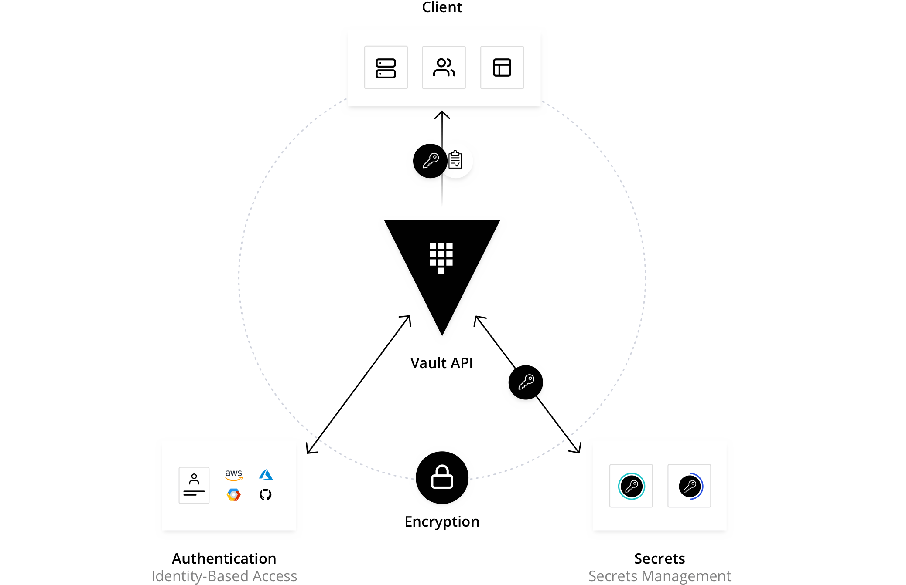

# HashiCorp Vault

## Vault란?

- API 키, 데이터베이스 비밀번호, 인증서 같은 민감한 정보(Secret) 를
  중앙에서 암호화하고 접근을 제어하는 오픈소스 도구
- “시스템 전체의 비밀을 안전하게 저장하고, 필요한 사람(혹은 앱)에게만 **잠깐 빌려주는 금고**.”



### Vault는 단순 저장소가 아니라

- 데이터를 암호화해 저장하고
- 접근 정책에 따라 토큰을 발급하고
- 필요할 때만 비밀을 주고
- 다 쓰면 만료시켜버리는 구조

## Vault의 핵심 (Core Concepts)

| 개념                      | 설명                                                             |
| ------------------------- | ---------------------------------------------------------------- |
| **Secret**                | 보관할 민감정보(API 키, DB PW, TLS 키 등)                        |
| **Secret Engine**         | Secret을 다루는 플러그인. Key/Value, DB, AWS, PKI 등 종류가 있음 |
| **Authentication Method** | 접근 인증 수단 (Token, AppRole, GitHub, LDAP, OIDC 등)           |
| **Policy**                | 어떤 Secret을 누가 읽고 쓸 수 있는지 정의                        |
| **Token**                 | 인증 후 발급되는 접근 토큰 (TTL이 있어 만료됨)                   |
| **Lease**                 | Secret을 임시로 발급할 때의 만료 정책 (DB 비번 자동 회전 등)     |
| **Seal / Unseal**         | Vault 자체가 부팅될 때 잠겨 있고, Key를 입력해야 잠금 해제됨     |

## Vault를 사용하는 이유

### 보안 중심

- GitHub, Jenkins, 서버 로그 등 **어디에도 비밀번호 노출 없이 관리**
- 모든 Secret은 **AES256으로 암호화**되어 저장됨

### 중앙화된 비밀 관리

- 팀, 애플리케이션, 환경(dev/stage/prod)별로 Secret을 체계적으로 구분
- 감사 로그(Audit Log)로 **누가 어떤 비밀에 접근했는지 추적 가능**

### 자동화 & 임시 자격 증명

- DB 접근 계정을 1회성으로 자동 발급 후 일정 시간 뒤 폐기 가능
- TLS 인증서, API 키, Cloud IAM Role 토큰 등을 자동 회전

### 멀티 인증 & 접근 제어

- GitHub / LDAP / Kubernetes Service Account 등 다양한 인증 지원
- “운영팀만 프로덕션 Secret 읽기 가능” 같은 세밀한 정책 작성 가능

## Vault의 장단점

| 구분       | 장점                                                    | 단점                             |
| ---------- | ------------------------------------------------------- | -------------------------------- |
| **보안성** | AES256 암호화, TLS 통신, 접근 정책, Audit Log           | 초기 설정과 권한 관리가 까다로움 |
| **확장성** | Secret Engine 플러그인 구조 (DB, AWS, PKI 등 무한 확장) | 학습곡선 존재 (정책/HCL 문법)    |
| **자동화** | 토큰 TTL, Secret 자동 회전, API 기반 통합 용이          | HA 구성 시 스토리지/락 관리 필요 |
| **운영성** | 오픈소스, API/CLI/UI 모두 제공                          | Root Token 분실 시 복구 어려움   |

## Vault 설정 방법 (로컬 환경 예시)

### ① 설치

```bash
# Mac
brew install vault

# Ubuntu
sudo apt install vault
```

### ② Vault 서버 실행 (개발모드)

```bash
vault server -dev
```

> 개발모드는 자동으로 root token 발급, memory backend 사용 (비영구)

출력 예:

```
Root Token: root
```

### ③ 환경변수 등록

```bash
export VAULT_ADDR='http://127.0.0.1:8200'
export VAULT_TOKEN='root'
```

---

## 6. Vault 사용 예제

### Secret 저장 / 조회 (KV Engine)

```bash
# KV Secret 엔진 활성화
vault secrets enable -path=secret kv

# 비밀 저장
vault kv put secret/myapp DB_USER=admin DB_PASS=1234

# 비밀 조회
vault kv get secret/myapp
```

출력:

```
#pgsql
Key        Value
---        -----
DB_USER    admin
DB_PASS    1234
```

### 비밀 업데이트

```bash
vault kv patch secret/myapp DB_PASS=abcd1234
```

---

### 정책(Policy) 생성

`policy.hcl`

```hcl
path "secret/myapp/*" {
  capabilities = ["read", "list"]
}
```

적용:

```bash
vault policy write dev policy.hcl
```

---

### 사용자/App 인증 (AppRole 예시)

```bash
vault auth enable approle

# AppRole 생성
vault write auth/approle/role/myapp \
  secret_id_ttl=10m \
  token_ttl=20m \
  token_max_ttl=30m \
  policies=dev

# RoleID, SecretID 조회
vault read auth/approle/role/myapp/role-id
vault write -f auth/approle/role/myapp/secret-id
```

앱이 RoleID/SecretID를 통해 Vault에 로그인 → 토큰 발급 → 필요한 Secret 읽기 가능.

### Vault Agent (자동 주입)

Vault Agent를 쓰면 앱이 직접 Vault를 호출하지 않아도

**환경변수나 파일로 Secret을 자동 주입** 받을 수 있음

`vault-agent.hcl`

```hcl
auto_auth {
  method "approle" {
    mount_path = "auth/approle"
    config = {
      role_id_file_path = "./role_id"
      secret_id_file_path = "./secret_id"
    }
  }
  sink "file" {
    config = {
      path = "./token"
    }
  }
}

template {
  source      = "./templates/config.ctmpl"
  destination = "./config/application.properties"
}
```

`config.ctmpl`:

```yaml
spring.datasource.username={{ with secret "secret/myapp" }}{{ .Data.data.DB_USER }}{{ end }}
spring.datasource.password={{ with secret "secret/myapp" }}{{ .Data.data.DB_PASS }}{{ end }}
```

Agent가 Vault에서 Secret을 가져와 `application.properties`에 자동 채워 넣는다.

---

## Valut 실무 적용 패턴

| 환경                 | 방식                                                         |
| -------------------- | ------------------------------------------------------------ |
| **로컬 개발**        | Vault dev 모드 + AppRole 로그인 + CLI로 Secret 주입          |
| **CI/CD**            | Jenkins → Vault Plugin → Build 시점에 Secret 주입            |
| **Kubernetes**       | Vault Agent Injector → Pod 실행 시 Secret 파일/Env 자동 주입 |
| **Spring Boot 연동** | `spring.cloud.vault.*` 설정으로 Property 자동 주입           |

---

## Valut 요약

| 항목          | 설명                                                        |
| ------------- | ----------------------------------------------------------- |
| **Vault란**   | 시크릿을 안전하게 저장하고 접근을 제어하는 중앙 관리 시스템 |
| **핵심 이론** | Secret Engine, Auth Method, Policy, Token, Lease            |
| **사용 이유** | 비밀 노출 방지, 중앙관리, 자동 회전, 감사로그               |
| **장단점**    | 강력한 보안과 자동화 / 초기셋업 및 운영 복잡도              |
| **설정 방법** | 서버 실행 → Secret Engine 활성화 → 정책/권한 설정           |
| **예제**      | KV 저장, AppRole 로그인, Vault Agent 자동주입 등            |

## Valut 사용시 폴더 구조

```groovy
📦 repo-root/
├── 📁 cicd/
│   ├── github-actions/ci.yml              # CI에서 Vault(AppRole) 로그인→시크릿 주입
│   └── jenkins/Jenkinsfile                # (선택) Jenkins 사용 시
│
├── 📁 vault/                               # 공용 Vault 설정 (진짜 핵심만)
│   ├── vault-agent.hcl                    # auto_auth + template 1~2개만
│   ├── templates/
│   │   ├── spring-app.ctmpl               # Spring Boot용 application.properties 템플릿
│   │   └── frontend-env.ctmpl             # FE 빌드시 주입할 .env 템플릿(필요 시)
│   └── policies/
│       └── app-read.hcl                   # 읽기 전용 정책 1개 (서비스 공용)
│
├── 📁 services/
│   ├── backend-user/                      # (Spring Boot 서비스 A)
│   │   ├── src/main/resources/
│   │   │   ├── application.yml            # output/application.properties import
│   │   │   └── bootstrap.yml              # (Spring Cloud Vault 안 쓰면 생략 가능)
│   │   └── output/                        # ⚠️ Git 미추적(ignored). Agent가 생성
│   │       └── application.properties
│   │
│   ├── backend-order/                     # (Spring Boot 서비스 B)
│   │   ├── src/main/resources/application.yml
│   │   └── output/application.properties
│   │
│   └── frontend-web/                      # (React/Vue 등)
│       ├── .env.example                   # 공개 가능한 키/형식만
│       └── .env.local                     # ⚠️ Git 미추적. CI가 vault로 생성(선택)
│
└── 📄 .gitignore
    # services/**/output/*
    # services/frontend-web/.env.local
```

## CICD 예제

```groovy
// Jenkinsfile — Vault(AppRole)에서 시크릿만 받아와 빌드에 사용하는 최소 예시
pipeline {
  agent any
  environment {
    VAULT_ADDR = 'https://vault.internal:8200'
    VAULT_KV_PATH = 'secret/data/myapp'
  }

  stages {
    stage('Vault Login & Fetch') {
      steps {
        withCredentials([
          string(credentialsId: 'VAULT_ROLE_ID', variable: 'ROLE_ID'),
          string(credentialsId: 'VAULT_SECRET_ID', variable: 'SECRET_ID')
        ]) {
          sh '''
            # 로그인
            VAULT_TOKEN=$(curl -s -X POST -H "Content-Type: application/json" \
              -d "{\"role_id\":\"$ROLE_ID\",\"secret_id\":\"$SECRET_ID\"}" \
              $VAULT_ADDR/v1/auth/approle/login | jq -r '.auth.client_token')

            # 시크릿 가져오기
            SECRETS=$(curl -s -H "X-Vault-Token: $VAULT_TOKEN" \
              $VAULT_ADDR/v1/$VAULT_KV_PATH)
            DB_USER=$(echo $SECRETS | jq -r '.data.data.DB_USER')
            DB_PASS=$(echo $SECRETS | jq -r '.data.data.DB_PASS')

            export DB_USER DB_PASS
          '''
        }
      }
    }

    stage('Build') {
      steps {
        sh './mvnw clean package -Dspring.datasource.username=$DB_USER -Dspring.datasource.password=$DB_PASS'
      }
    }
  }
}

```
