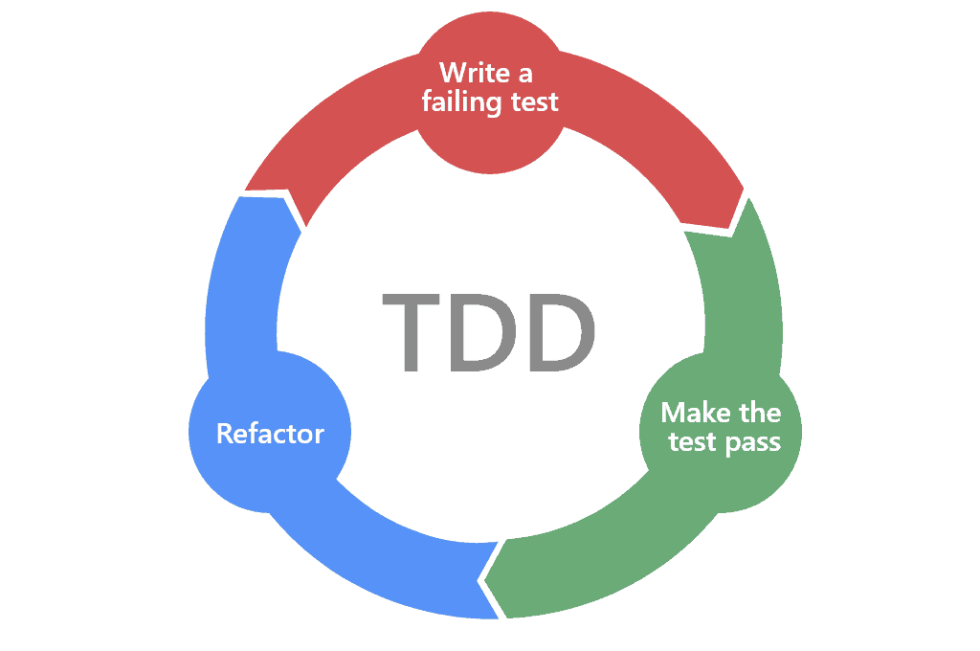
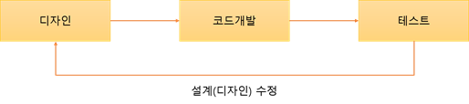
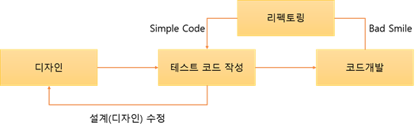
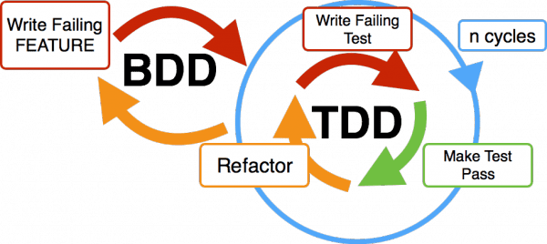

# TDD와 BDD에 대하여

---

# TDD란?

> Test Driven Development의 약자로, 개발 과정에서 테스트를 중심으로 코드를 작성하는 방법론.



개발자는 먼저 **실패하는 테스트 케이스**를 작성하고, 해당 테스트를 통과하는 코드를 작성하는 방식이다. 이렇게 하면 미리 예상되는 각종 경우의 수를 테스트 케이스로 만들어두고, 테스트가 모두 통과할 때 까지 코드를 수정하게된다. TDD는 기능과 모듈간 상호작용 보다는 개별 함수나 메서드의 동작을 중심으로 테스트한다. 유닛테스트, 통합테스트를 주로 진행한다.

- **기존 방식**
  
  위 그림처럼 우리는 일반적으로 개발할 때, 설계를 하고 코드 개발을 마친 후 테스트 과정을 거친다.

- **TDD 방식**
  
  하지만 TDD는 테스트 케이스를 먼저 작성하고 코드를 개발하는 절차를 밟는다.

## 과정

1. **테스트 코드 작성**

   - ```java
       public class CalculatorTest {
           @Test
           void plus() {
               int result = Calculator.plus(1, 2);
               Assertions.assertEquals(3, result);
           }
       }
     ```

2. **테스트 코드 실행**

   - 처음엔 구현한 코드가 없으니 테스트 실패하게 된다.

3. **실패한 테스트 코드를 성공시키기 위한 최소한의 코드를 구현**

   - ```java
       public class Calculator {
           public static int plus(int a, int b) {
                return a + b;
           }
       }
     ```

4. **새로운 테스트 작성**
   - ```java
       public class CalculatorTest {
           @Test
           void plus() {
               int result = Calculator.plus(1, 2);
               Assertions.assertEquals(3, result);
               Assertions.assertEquals(-1, Calculator.plus(0, -1));
           }
       }
     ```

## 특징

- 매우 짧은 개발 서클의 반복을 갖는 프로세스이다.
- 새로운 기능을 추가할 때 꼼꼼한 검증을 통해 안심하고 진행할 수 있어서 코드 품질이 향상된다.
- 디버깅 시간이 비교적 짧다.
- 코드량이 증가하기 때문에 빠른 생산성이 요구되는 시점에서는 부적절하다.
- 불필요한 오버 엔지니어링을 방지한다.

---

# BDD란?

> Behavior Driven Development의 약자로, 사용자의 행위를 중심으로 시스템을 설계하고 테스트하는 개발 방법론.



BDD는 TDD에서 발전된 개념으로, “무엇을 테스트할지”를 개발자 관점이 아닌 **비즈니스 요구사항(사용자 스토리) 관점**에서 정의한다.
즉, 코드보다는 기능의 **동작 시나리오**를 중심으로 개발이 진행된다. 시나리오 해석 및 연결에 용이한 Cucumber이라는 도구로 예시로 들어보겠다.

## 과정

1. **시나리오 작성**

   - Given-When-Then 구조를 사용하여 명확한 행위 중심 테스트를 작성한다.
     > EX) 온라인 쇼핑몰 개발 상황
     > Given: 사용자가 상품 목록 페이지에 접근한 상태
     > When: 사용자가 상품을 선택하고 장바구니에 담으려고 한다.
     > Then: 상품이 장바구니에 추가되어야 한다

2. **시나리오에 맞는 테스트 코드 작성**

   - ```java
        public class CartStepDefinitions {

            private List<String> productList;
            private List<String> cart;
            private String selectedProduct;

            @Given("the user is on the product list page")
            public void userOnProductListPage() {
                productList = List.of("Laptop", "Phone", "Headphones");
                cart = new ArrayList<>();
            }

            @When("the user adds a product to the cart")
            public void userAddsProductToCart() {
                selectedProduct = productList.get(0); // 예: Laptop
                cart.add(selectedProduct);
            }

            @Then("the product should appear in the cart")
            public void productShouldBeInCart() {
                Assertions.assertTrue(cart.contains(selectedProduct));
            }
        }
     ```

3. **시나리오 실행 → 실패 확인 → 코드 구현**
   - 모든 시나리오가 통과될 때까지 반복

## 특징

- 사용자 행위 중심으로 개발이 진행된다.
- 비즈니스 담당자, QA, 개발자 간의 의사소통이 원활해진다.
- 테스트 명세가 문서로서의 역할을 하며, 요구사항 변경에 강하다.
- 시나리오 기반이라 직관적이지만, 초기 설정 및 작성량이 많다.
- TDD보다 기능의 의도에 더 집중한다.

---

## 추가 질문
