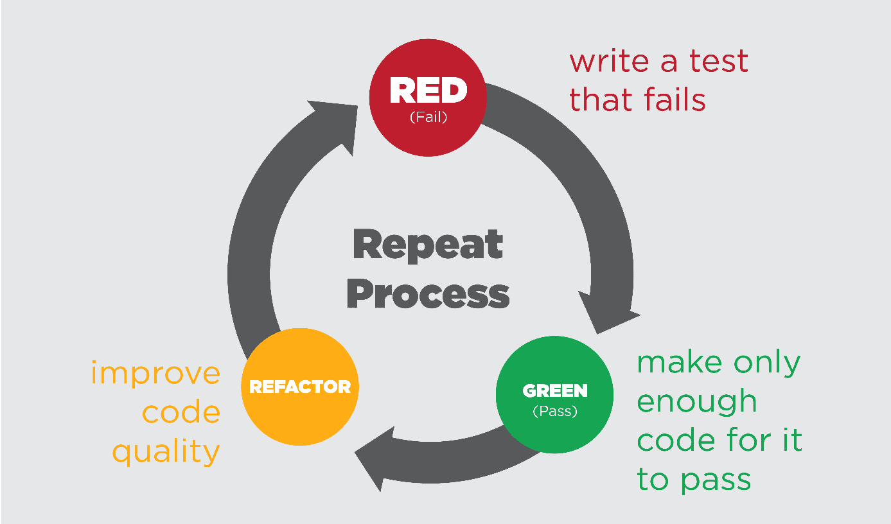

# 단위 테스트와 통합 테스트



# 단위 테스트 vs 통합 테스트

- **단위(Unit) 테스트**: “작은 조각”을 검증. 보통 **하나의 클래스/함수**를 다른 의존성은 **가짜(mock/stub)** 로 대체해서 빠르고 결정적으로 확인
  예) `OrderService.calculateTotal()` 로직이 쿠폰/배송비 규칙을 제대로 계산하는지
- **통합(Integration) 테스트**: 실제 또는 실제에 가까운 환경에서 **여러 컴포넌트가 함께** 잘 동작하는지 확인
  예) 컨트롤러 ↔ 서비스 ↔ JPA ↔ **실제 DB(Testcontainers)**, 보안 필터, 메시징 등.

## 언제 무엇을 돌리나?

- **단위 테스트**
  - 작성 시점: **기능을 설계·구현하는 즉시**, 아주 자주.
  - 실행 빈도: **커밋마다**, 로컬에서 수십/수백 번 돌아가도 부담 없는 속도.
  - 목적: 빠른 피드백, 로직 품질 보증, 리팩터링 안전망.
- **통합 테스트**
  - 작성 시점: “조립”과 경계(웹/DB/메시지/캐시) 동작을 확인할 때.
  - 실행 빈도: PR/CI에서 주기적으로. 로컬에서는 필요한 부분만.
  - 목적: 설정/빈 주입/트랜잭션/쿼리/시큐리티 등 **실제 런타임 상호작용** 검증.

---

## 단위 테스트가 필요한 케이스

1. **순수 로직(입력→출력)**
   - 요금/할인/수수료 계산, 포인트 적립 규칙, 정렬/필터링 로직
   - I/O 없이 함수만으로 검증 가능
2. **분기/규칙이 많은 결정부**
   - “VIP이고 재고가 N 이상이면 A, 아니면 B” 같은 비즈니스 조건
   - 분기가 많을수록 회귀 위험 ↑
3. **버그가 났던 부분 / 경계값**
   - off-by-one, null/빈배열/최대치 등
4. **도메인 불변조건**
   - “주문 총액 = 라인아이템 합 + 배송비 − 할인액” 같은 식
   - 한 줄 식으로 항상 참이어야 하는 것들
5. **자체 구현한 변환/파싱/매핑**
   - JSON ↔ DTO ↔ Entity 사이의 비표준 규칙

### 반대로 **굳이 안 해도 되는 것**

- 단순 게터/세터, 롬복, 프레임워크가 보장하는 기능(@Autowired 자체 등)
- private 메서드(공개 메서드를 통해 간접 검증)
- 단순 “배선” 코드는 통합/슬라이스 테스트로 커버

---

## TDD 기본 사이클 (Red → Green → Refactor)

1. **새 기능 정의 (요구사항 분석)**

   - “사용자가 주문 총액을 계산하면, 쿠폰과 배송비 규칙이 적용되어야 한다.”
   - 기능 단위로 **테스트 이름으로 표현**할 수 있게 문장 정리부터 함.

   예)

   `calculateTotal_2만원이상_배송비0원`

   `calculateTotal_쿠폰10퍼할인_최대3천`

---

1. **테스트 코드 작성 (Red 단계)**
   - 구현은 안 되어 있어도 일단 **테스트부터 작성**.
   - 컴파일 에러거나 테스트 실패하는 상태여야 함 (그래야 “Red”).
   - 예시:
     ```java
     @Test
     void calculateTotal_쿠폰10퍼할인_적용된다() {
         OrderService service = new OrderService(); // 아직 구현 안 됨
         int total = service.calculateTotal(10000, true); // 예상 동작
         assertThat(total).isEqualTo(9000); // 실패해야 정상
     }
     ```

---

1. **구현 코드 작성 (Green 단계)**
   - 테스트가 통과하도록 최소한의 코드만 작성.
   - 처음엔 하드코딩도 괜찮음, 테스트를 초록불로 만드는 게 목표.
   - 예시:
     ```java
     public int calculateTotal(int price, boolean coupon) {
         return coupon ? (int)(price * 0.9) : price;
     }
     ```

---

1. **리팩터링 (Refactor 단계)**
   - 코드 중복 제거, 변수명 개선, 구조 정리.
   - 테스트가 있으니까 **안심하고 수정 가능**.

---

1. **테스트 재실행**
   - 전체 테스트 돌려서 녹색 유지 확인.
   - 새 요구사항 나오면 다시 Red → Green → Refactor 반복.

---

### 💡 정리

| 단계             | 내용                            | 코드 작성 시점 |
| ---------------- | ------------------------------- | -------------- |
| 기능 정의        | 요구사항을 테스트 문장으로 정리 | 테스트 전      |
| 테스트 코드 작성 | 실패하는 테스트 작성            | 구현 전        |
| 구현 코드 작성   | 테스트 통과하는 최소 구현       | 테스트 후      |
| 리팩터링         | 구조 개선, 중복 제거            | 테스트 통과 후 |

---

## 클린 테스트 핵심

### 1. **FIRST 원칙**

- **F**ast → 빠르게 실행 (DB·네트워크 의존 X)
- **I**ndependent → 테스트끼리 독립 (순서, 데이터 공유 X)
- **R**epeatable → 어디서 실행해도 같은 결과
- **S**elf-validating → 콘솔 확인 없이 assert로 자동 판별
- **T**imely → 구현 전에 작성 (TDD 흐름)

---

### 2. **구조**

테스트는 항상 아래 순서로 깔끔히 나눠라:

```java
// Given-When-Then (AAA 패턴)
given: 준비 (입력, mock)
when: 실행 (대상 메서드 호출)
then: 검증 (assert)
```

---

### 3. **좋은 테스트 습관**

- **테스트 이름이 요구사항을 말하게**:
  `calculateTotal_2만원이상은_배송비0원()`
- **테스트 안에 로직(if, for)** 두지 말기. → 기대값은 상수로.
- **경계값과 예외 케이스도 반드시 포함**.
- **외부 자원(DB, Redis 등)** 은 Testcontainers나 Mock 사용.
- **중복 제거**는 Fixture나 Builder로 정리.

---

### 4. **테스트 피라미드**

단위(Unit) 많게 → 통합(Integration) 적게 → E2E 아주 적게

→ **빠르고 정확한 피드백** 유지

---

클린 테스트 요약

> “빠르고, 독립적이며, 항상 같은 결과를 내고, 자동으로 검증되며, 구현보다 먼저 존재하는 테스트”

### 클린 테스트 원칙과 연결

이렇게 테스트 주도로 개발하면,

- 테스트가 **명세서 역할**을 하고
- 나중에 기능이 바뀌어도 **자동 회귀 검증**이 가능
- 그리고 코드 구조가 자연스럽게 **테스트하기 쉬운 형태**로 정리됨
