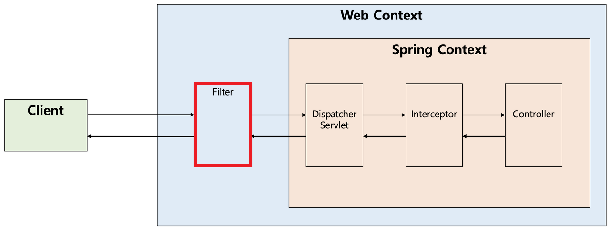
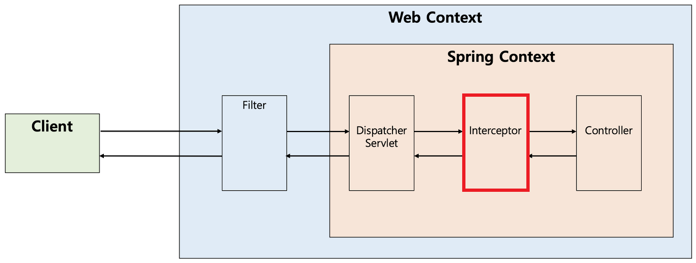
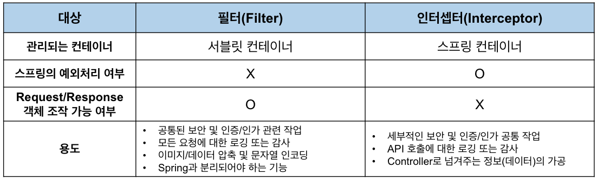

# Filter와 Interceptor에 대하여

---

# Filter란?

> Spring에서 Dispatcher Servlet에 요청이 전달되기 전과 후에 URL 패턴에 맞는 모든 요청에 대해 부가작업을 처리할 수 있는 기능을 제공한다.

Dispatcher Servlet은 Spring의 가장 앞단에 존재하는 프론트 컨트롤러이므로, 필터는 스프링 범위 밖에서 처리가 된다.



### Filter의 메소드

필터를 추가하기 위해서는 Filter 인터페이스를 구현해야 하며 3가지 (init, doFilter, destroy) 메소드를 가지고 있다.

```java
    public interface Filter {

        public default void init(FilterConfig filterConfig) throws ServletException {}

        public void doFilter(ServletRequest request, ServletResponse response,
                FilterChain chain) throws IOException, ServletException;

        public default void destroy() {}

    }
```

- **init**
  필터 객체를 초기화하고 서비스에 추가하기 위한 메소드이다. 웹 컨테이너가 1회 init 메소드를 호출하여 필터 객체를 초기화하면 이후의 요청들은 doFilter를 통해 처리된다.

- **doFilter**
  URL 패턴에 맞는 모든 HTTP 요청이 디스패처 서블릿으로 전달되기 전에 웹 컨테이너에 의해 실행되는 메소드이다. doFilter의 파라미터로는 FilterChain이 있는데, FilterChain의 doFilter 통해 다음 대상으로 요청을 전달하게 된다. chain.doFilter() 전과 후에 우리가 필요한 처리 과정을 넣어줌으로써 원하는 처리를 진행할 수 있다.

- **destroy**
  필터 객체를 서비스에서 제거하고 사용하는 자원을 반환하기 위한 메소드이다. 이는 웹 컨테이너에 의해 1번 호출되며 이후에는 이제 doFilter에 의해 처리되지 않는다.

  위 그림처럼 우리는 일반적으로 개발할 때, 설계를 하고 코드 개발을 마친 후 테스트 과정을 거친다.

# Inteceptor란?

> Spring이 제공하는 기술로써, Dispatcher Servlet이 컨트롤러를 호출하기 전과 후에 요청과 응답을 참조하거나 가공할 수 있는 기능을 제공한다.



즉, 웹 컨테이너에서 동작하는 Filter와 달리 Interceptor는 스프링 컨텍스트에서 동작을 하는 것이다.
사용자의 요청이 핸들러 매핑을 통해 적절한 컨트롤러를 찾고, 그 결과로 실행 체인(HandlerExecutionChain)을 돌려준다.
그래서 이 실행 체인은 1개 이상의 인터셉터가 등록되어 있다면 순차적으로 인터셉터들을 거쳐 컨트롤러가 실행되도록 하고, 인터셉터가 없다면 바로 컨트롤러를 실행한다.

### Interceptor의 메소드

HandlerInterceptor 인터페이스를 구현해야 하며, 이는 다음의 3가지 메소드를 가지고 있다.

```java
    public interface HandlerInterceptor {


        default boolean preHandle(HttpServletRequest request, HttpServletResponse response, Object handler)
            throws Exception {

            return true;
        }

        default void postHandle(HttpServletRequest request, HttpServletResponse response, Object handler,
            @Nullable ModelAndView modelAndView) throws Exception {
        }

        default void afterCompletion(HttpServletRequest request, HttpServletResponse response, Object handler,
            @Nullable Exception ex) throws Exception {
        }
    }
```

- **preHandle**
  컨트롤러가 호출되기 전에 실행되며, 처리해야 하는 전처리 작업이나 요청 정보를 가공하거나 추가하여 사용한다.
  preHandle의 3번째 파라미터인 handler 파라미터는 핸들러 매핑이 찾아준 컨트롤러 빈에 매핑되는 HandlerMethod라는 새로운 타입의 객체로써, @RequestMapping이 붙은 메소드의 정보를 추상화한 객체이다.
  또한 preHandle의 반환 타입은 boolean인데 반환값이 true이면 다음 단계로 진행이 되지만, false라면 작업을 중단하여 이후의 작업은 진행되지 않는다.

- **postHandle**
  컨트롤러가 호출된 후에 실행되며, 이후에 처리해야 하는 후처리 작업이 있을 때 사용한다.
  이 메소드에는 컨트롤러가 반환하는 ModelAndView 타입의 정보가 제공되는데, 최근에는 Json 형태로 데이터를 제공하는 RestAPI 기반의 컨트롤러(@RestController)를 만들면서 자주 사용되지는 않는다.
  또한 컨트롤러 하위 계층에서 작업을 진행하다가 중간에 예외가 발생하면 postHandle은 호출되지 않는다.

- **afterCompletion**
  이름 그대로 모든 뷰에서 최종 결과를 생성하는 일을 포함해 모든 작업이 완료된 후에 실행된다. 요청 처리 중에 사용한 리소스를 반환할 때 사용하기에 적합하다. postHandle과 달리 컨트롤러 하위 계층에서 작업을 진행하다가 중간에 예외가 발생하더라도 afterCompletion은 반드시 호출된다.

# Filter와 Interceptor의 차이 및 용도


### Filter

필터에서는 기본적으로 **스프링과 무관하게 전역적으로 처리해야 하는 작업**들을 처리할 수 있다.
Filter는 다음 체인으로 넘기는 ServletRequest/ServletResponse 객체를 조작할 수 있다는 점에서 Interceptor보다 훨씬 강력한 기술이다.
대표적으로 Filter를 인증과 인가에 사용하는 도구로는 **Spring Security**가 있다. 그렇기 때문에 Spring Security는 Spring MVC에 종속적이지 않다는 것!

- 공통된 보안 및 인증/인가 관련 작업
  - 올바른 요청이 아닐 경우 차단
- 모든 요청에 대한 로깅 또는 감사
- 이미지/데이터 압축 및 문자열 인코딩
- Spring과 분리되어야 하는 기능

### Interceptor

인터셉터에서는 클라이언트의 요청과 관련되어 전역적으로 처리해야 하는 작업들을 처리할 수 있다.
또한 인터셉터는 필터와 다르게 HttpServletRequest나 HttpServletResponse 등과 같은 객체를 제공받으므로 객체 자체를 조작할 수는 없다. 대신 해당 객체가 내부적으로 갖는 값은 조작할 수 있으므로 컨트롤러로 넘겨주기 위한 정보를 가공하기에 용이하다. 예를 들어 사용자의 ID를 기반으로 조회한 사용자 정보를 HttpServletRequest에 넣어줄 수 있다.

- 세부적인 보안 및 인증/인가 공통 작업
  - 예를 들어 특정 그룹의 사용자는 어떤 기능을 사용하지 못하는 경우가 있는데, 이러한 작업들은 컨트롤러로 넘어가기 전에 검사해야 하므로 인터셉터가 처리하기에 적합하다.
- API 호출에 대한 로깅 또는 감사
- Controller로 넘겨주는 데이터의 가공

---

## 추가 질문

- Servlet 컨테이너와 Spring 컨테이너의 차이점, Spring boot도 각각 분리되어 있는지?
  > Servlet 컨테이너는 WAS에서 HTTP 요청과 응답을 처리하는 부분 전체를 의미한다.
  > Servlet 객체를 찾아서 service 메서드를 실행한다.
  > Spring 컨테이너는 Servlet 컨테이너 안에 포함되어있고, Spring Bean 객체의 생명주기를 관리한다.
  > Spring Boot에서는 자동으로 둘 다 띄워주지만, 여전히 분리되어있음!
  > 내장 톰캣을 실행시키면 Servlet 컨테이너가 생성되고, 그 다음 Dispatcher Servlet이 생성되며 Spring 컨테이너 초기화가 시작된다.
