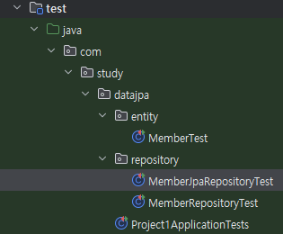
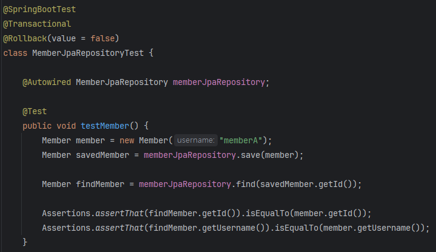

# JUnit - 25.10.24

# JUnit이 뭘까?

- JUnit은 자바 진형의 대표적인 단위 테스트(unit test) 프레임워크임.
- 한 줄로 “자바 코드가 올바르게 동작하는지 자동으로 검증해주는 **테스트 자동화 도구”**
- 현재는 JUnit 5 버전을 사용함.

## JUnit의 기본 구조는 어떻게 생겼을까?

- 우리가 흔히 만드는 Spring Boot 파일 구조에 test 폴더에 JUnit 테스트 코드 파일을 생성한 모습.

- 안에 테스트 코드는 실제로 이런식. (단축키 ctrl + shift + t)

# 자 그러면 이거 왜 쓸까?

- 메서드의 단위, 통합 테스트를 위해서 사용함. 위는 사실상 통합 테스트의 예시임. DB 등과 다 연결된 거니까
- 예를 들어, 내가 JPA를 사용해서 멤버를 저장하는 로직을 작성했다. 라고 하면
- 간단하게 test 코드를 작성해서 실제 로직이 정상적으로 DB에 반영 되는지, 정확한 쿼리가 날아 가는지 등등 로그를 통해서 확인할 수 있고, 리턴을 받아볼 수 있음.
- 단위 테스트는 조금 다른게, Mockito 라는 추가적인 프레임워크를 사용해서 가짜 객체를 이용해서 스프링, DB 등을 실행하지 않고 바로 테스트를 할 수 있다고 함. 이게 단위 테스트
- 또한, CI 파이프라인과 연동이 쉬워서, Github Action 등에서 테스트를 진행하고 실패하면 실패 처리하는 그런것도 좋다고 합니다~
- 아무튼, 결론적으로 이런 과정을 통해서 개발 후에 바로 메서드 검증을 효과적으로 해볼 수 있음!

| 이유                          | 설명                                                        |
| ----------------------------- | ----------------------------------------------------------- |
| ✅ **자동화된 검증**          | 매번 수동으로 실행하지 않아도 코드 수정 시 자동 테스트 가능 |
| ✅ **회귀 방지 (Regression)** | 코드 변경 시 기존 기능이 깨졌는지 바로 확인 가능            |
| ✅ **품질 보장**              | QA 이전 단계에서 개발자 수준에서 안정성 확보                |
| ✅ **리팩토링 용이**          | 테스트 코드가 있으면 리팩토링 시 안심하고 수정 가능         |
| ✅ **CI/CD 통합**             | Jenkins, GitHub Actions 등에서 테스트 자동 실행 가능        |

# 장단점

| 구분        | 설명                   |
| ----------- | ---------------------- |
| ✅ **장점** | - 자동화된 테스트 가능 |

- 코드 품질 및 안정성 향상
- 리팩토링 시 회귀 방지
- CI/CD 연동 쉬움 |
  | ❌ **단점** | - 초기 세팅과 Mocking 비용
- 비즈니스 로직보다 테스트 코드가 더 길어질 수 있음
- 테스트 유지보수 비용 증가 (특히 Mock 과다 시) |
