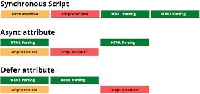

# 브라우저 동작 원리 - Part 3 (JavaScript 로딩)

---

JavaScript가 렌더링에 미치는 영향과 기본 최적화 방법에 대한 내용이다

## 정의

**JavaScript 로딩이 브라우저 렌더링을 차단하는 이유와 해결 방법**

- JavaScript는 DOM을 조작할 수 있어 HTML 파싱을 차단
- `<script>` 위치와 속성(defer, async)이 성능에 영향
- 백엔드 개발자도 HTML 응답 시 고려해야 할 기본 지식

## 파서 블로킹 (Parser Blocking)

**`<script>` 태그를 만나면 HTML 파싱이 중단되는 현상**

### 동작 과정

```html
<html>
  <head>
    <script src="app.js"></script>  <!-- 여기서 파싱 중단 -->
  </head>
  <body>
    <h1>제목</h1>  <!-- 스크립트 실행 후에야 파싱 -->
  </body>
</html>
```

```
HTML 파싱 → <script> 만남 → 파싱 중단 → 다운로드 → 실행 → 파싱 재개
```

**왜 중단하나?**
- JavaScript가 DOM을 수정할 수 있음 (`document.write()` 등)
- 순서 보장을 위해 실행 완료까지 대기

**문제점:**
- 다운로드/실행 시간 동안 화면 흰색
- 사용자 경험 저하

## defer vs async

**HTML 파싱을 차단하지 않는 두 가지 속성**

### defer

```html
<script defer src="app.js"></script>
```

- HTML 파싱과 **병렬**로 다운로드
- HTML 파싱 완료 후 실행
- 여러 스크립트는 **순서대로** 실행

**언제 사용?**
- 대부분의 경우 (기본 권장)
- DOM 조작이 필요한 스크립트

### async

```html
<script async src="analytics.js"></script>
```

- HTML 파싱과 **병렬**로 다운로드
- 다운로드 완료 즉시 실행 (파싱 잠시 중단)
- 순서 보장 안 됨

**언제 사용?**
- 독립적인 스크립트 (Google Analytics 등)
- 다른 코드와 의존성 없음

### 비교

| 속성 | 파싱 차단 | 실행 시점 | 순서 보장 |
|------|----------|----------|---------|
| 없음 | O | 즉시 | O |
| `defer` | X | 파싱 후 | O |
| `async` | 일시 중단 | 다운 즉시 | X |

**권장:**
```html
<body>
  <!-- defer 사용 또는 body 끝에 배치 -->
  <script defer src="app.js"></script>
</body>
```



## CSS 렌더링 블로킹

**CSS 로딩이 완료될 때까지 렌더링 대기**

```html
<head>
  <link rel="stylesheet" href="styles.css">
</head>
```

**왜 차단?**
- 스타일 없이 화면 그리면 깜빡임(FOUC) 발생
- 사용자 경험을 위해 CSS 완료까지 대기

**CSS + JavaScript 조합:**
```html
<head>
  <link rel="stylesheet" href="styles.css">
  <script src="app.js"></script>
</head>
```

```
CSS 다운 → CSSOM 생성 → JS 실행 → 파싱 재개
```

- JavaScript는 CSS 완료까지 대기
- `getComputedStyle()` 같은 API 때문

**기본 최적화:**
- CSS는 `<head>`에 (빠른 다운로드)
- JavaScript는 `<body>` 끝에 또는 `defer`

## 리소스 힌트 (기본)

**브라우저에게 미리 로딩 힌트 제공**

### preload

```html
<link rel="preload" href="/font.woff2" as="font" crossorigin>
```

- 현재 페이지에서 **필수** 리소스
- 우선순위 높게 다운로드

### dns-prefetch

```html
<link rel="dns-prefetch" href="//api.example.com">
```

- 외부 도메인 DNS 미리 조회
- 가벼운 최적화