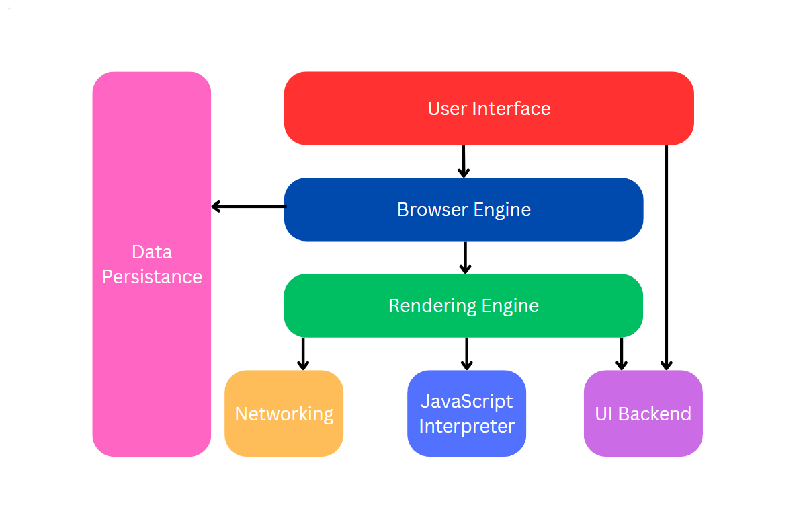
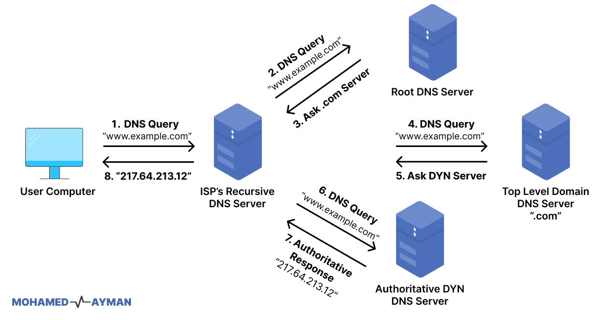
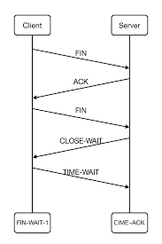
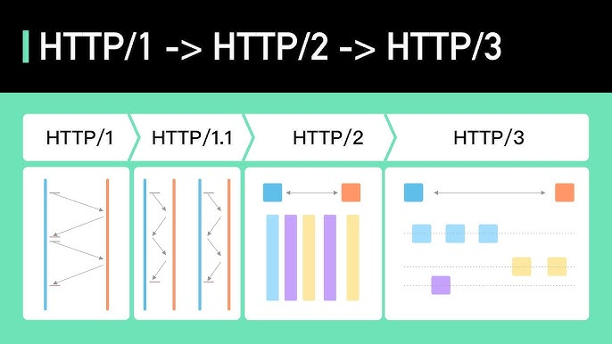
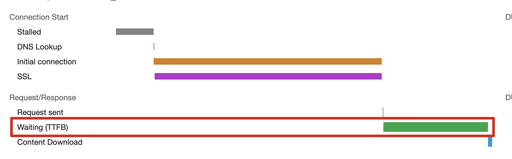

# 브라우저 동작 원리 - Part 1 (네트워킹)

---

URL을 입력했을 때 브라우저가 서버와 통신하는 과정에 대한 내용이다

## 정의

**브라우저가 서버로부터 웹 페이지 리소스를 요청하고 받아오는 전체 네트워크 통신 과정**

- URL 입력 → DNS 조회 → TCP 연결 → HTTP 요청/응답
- OSI 7계층 중 3계층(IP), 4계층(TCP), 7계층(HTTP) 활용
- 프론트엔드 성능의 출발점 (네트워크 최적화)

## 브라우저 구조

브라우저는 여러 컴포넌트가 협력하여 동작한다

### 주요 구성 요소

**렌더링 엔진**
- HTML, CSS를 파싱하여 화면에 표시
- Blink(Chrome), WebKit(Safari), Gecko(Firefox)

**자바스크립트 엔진**
- JavaScript 코드 해석 및 실행
- V8(Chrome), SpiderMonkey(Firefox), JavaScriptCore(Safari)

**네트워킹**
- HTTP 요청 처리, 캐시 관리

**자료 저장소**
- 쿠키, LocalStorage, SessionStorage, IndexedDB



## DNS 조회

**도메인 이름을 IP 주소로 변환하는 과정**

### 동작 방식

```
www.example.com → 93.184.216.34
```

**조회 순서 (캐시 우선)**
1. 브라우저 DNS 캐시
2. OS DNS 캐시
3. 라우터 캐시
4. ISP DNS 서버
5. Root DNS → TLD DNS → Authoritative DNS

**왜 캐시를 사용하는가?**
- DNS 조회는 보통 20~120ms 소요
- 같은 도메인 재방문 시 캐시에서 즉시 가져옴
- 네트워크 왕복 횟수 감소

### 개발 시 고려사항

**DNS Prefetch**

```html
<!-- 미리 DNS 조회 시작 --><link rel="dns-prefetch" href="//api.example.com"><link rel="dns-prefetch" href="//cdn.example.com">
```

- 사용자가 링크 클릭하기 전에 미리 DNS 조회
- 특히 외부 API, CDN 사용 시 유용



## TCP 연결

**3-way Handshake로 서버와 신뢰성 있는 연결 수립**

### 3-way Handshake

```
1. Client → Server: SYN (연결 요청)
2. Server → Client: SYN-ACK (연결 수락)
3. Client → Server: ACK (연결 확인)
```

- OSI 4계층(전송 계층) 프로토콜
- 양방향 통신 가능 상태 확인
- 패킷 손실 시 재전송 보장

### HTTPS의 추가 단계

**TLS Handshake**
- 서버 인증서 검증
- 암호화 알고리즘 협상
- 세션 키 교환
- 약 1~2 RTT(Round Trip Time) 추가 소요

**왜 HTTPS를 사용하는가?**
- 데이터 암호화 (중간자 공격 방지)
- 서버 신원 확인 (피싱 방지)
- 데이터 무결성 보장
- 구글 SEO 우대, 브라우저에서 HTTP는 “안전하지 않음” 표시



## HTTP 요청/응답

### HTTP 요청

**브라우저가 서버에 리소스 요청**

```
GET /api/users HTTP/1.1
Host: www.example.com
User-Agent: Mozilla/5.0
Accept: application/json
Cookie: session_id=abc123
Authorization: Bearer eyJhbGc...
```

**주요 구성 요소**
- **메서드**: GET(조회), POST(생성), PUT(수정), DELETE(삭제)
- **경로**: /api/users
- **헤더**: 메타데이터
- Cookie: 세션 정보
- Authorization: 인증 토큰
- Content-Type: 요청 데이터 형식

### HTTP 응답

**서버가 요청한 리소스 반환**

```
HTTP/1.1 200 OK
Content-Type: application/json
Set-Cookie: session_id=xyz789
Cache-Control: max-age=3600

{"users": [...]}
```

**상태 코드**
- **2xx**: 성공 (200 OK, 201 Created)
- **3xx**: 리다이렉트 (301 영구 이동, 302 임시 이동)
- **4xx**: 클라이언트 오류 (400 잘못된 요청, 401 인증 필요, 404 없음)
- **5xx**: 서버 오류 (500 내부 에러, 502 게이트웨이 에러, 503 서비스 불가)

**응답 헤더**
- **Content-Type**: 데이터 형식 (text/html, application/json)
- **Cache-Control**: 캐시 정책
- **Set-Cookie**: 쿠키 설정

## HTTP 버전별 차이

### HTTP/1.1

- **연결 재사용**: Keep-Alive로 TCP 연결 유지
- **파이프라이닝**: 여러 요청을 순차적으로 전송
- **단점**: HOL Blocking (앞 요청이 느리면 뒤 요청도 대기)

### HTTP/2

- **멀티플렉싱**: 하나의 연결로 여러 요청/응답 동시 처리
- **헤더 압축**: HPACK으로 중복 헤더 압축
- **서버 푸시**: 클라이언트 요청 전에 리소스 전송 가능
- **단점**: TCP HOL Blocking 여전히 존재

### HTTP/3

- **QUIC 프로토콜**: UDP 기반 (TCP 대신)
- **연결 설정 빠름**: 1 RTT로 연결 + 암호화
- **패킷 손실 영향 최소화**: 스트림별 독립 처리
- Chrome, Edge 등 주요 브라우저 지원



## 실무 활용

### Next.js에서의 HTTP 통신

**API Routes**

```jsx
// pages/api/users.jsexport default async function handler(req, res) {
  if (req.method === 'GET') {
    const users = await fetchUsers();    res.status(200).json(users);
}
```

**클라이언트 요청**

```jsx
// 서버 컴포넌트에서 직접 fetchasync function getUsers() {
  const res = await fetch('https://api.example.com/users', {
    cache: 'no-store' // SSR마다 새로 요청  });  return res.json();}
// 클라이언트 컴포넌트에서'use client'const { data } = useSWR('/api/users', fetcher);
```

### 네트워크 최적화 기법

**1. Connection Preconnect**

```html
<!-- DNS + TCP + TLS를 미리 수행 --><link rel="preconnect" href="https://api.example.com">
```

**2. 리소스 우선순위 제어**

```html
<!-- 중요한 리소스 먼저 로드 --><link rel="preload" href="/critical.css" as="style"><link rel="preload" href="/font.woff2" as="font" crossorigin>
```

**3. HTTP 캐싱 활용**

```jsx
// Next.js에서 캐시 제어fetch(url, {
  next: { revalidate: 3600 } // 1시간마다 재검증});
```

### 개발자 도구 활용

**Chrome DevTools - Network 탭**
- 각 리소스별 로딩 시간 확인
- Waterfall 차트로 병목 지점 파악
- 요청/응답 헤더 검사
- 느린 네트워크 시뮬레이션 (Throttling)

**확인할 주요 지표**
- **TTFB (Time To First Byte)**: 서버 응답 시간
- **Content Download**: 실제 데이터 다운로드 시간
- **Total**: 전체 요청 완료 시간



## 보안

### HTTPS 중간자 공격 (MITM)

- HTTP는 평문 전송 → 중간에서 데이터 가로채기 가능
- HTTPS는 암호화 → 중간에 가로채도 해독 불가
- 공용 Wi-Fi에서 특히 위험 → 항상 HTTPS 사용

### CORS (Cross-Origin Resource Sharing)

**다른 도메인의 리소스 접근 제한**

```jsx
// 브라우저가 자동으로 Preflight 요청 전송OPTIONS /api/data HTTP/1.1Origin: https://myapp.com
```

**서버 응답 (허용하는 경우)**

```
Access-Control-Allow-Origin: https://myapp.com
Access-Control-Allow-Methods: GET, POST
Access-Control-Allow-Headers: Content-Type
```

**왜 필요한가?**
- 악의적인 사이트가 다른 사이트의 API를 무단 호출하는 것 방지
- 같은 출처(Same-Origin)가 아니면 기본적으로 차단

**개발 시 주의사항**
- `Access-Control-Allow-Origin: *`는 개발 환경에서만 사용
- 프로덕션에서는 특정 도메인만 허용
- 쿠키를 포함한 요청은 `credentials: 'include'` 필요

---
### 추가질문

- Q1.) IndexedDB가 무엇인가?
  - A1.) 브라우저에 내장된 NoSQL 형태의 DB로, LocalStorage보다 큰 데이터를 비동기로 저장할 수 있다. 주로 PWA나 오프라인 기능이 있는 웹앱에서 사용한다.
