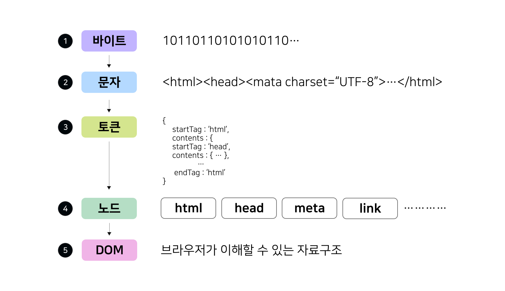
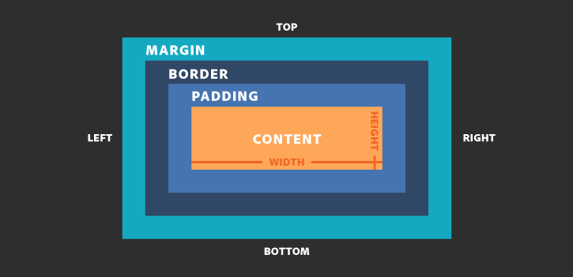

# 브라우저 동작 원리 - Part 2 (렌더링 파이프라인)

---

브라우저가 HTML, CSS를 받아서 화면에 그리는 과정에 대한 내용이다

## 정의

**브라우저가 서버로부터 받은 HTML, CSS를 파싱하여 화면에 픽셀로 렌더링하는 전체 과정**

- HTML/CSS 파싱 → 트리 구조 생성 → 레이아웃 계산 → 픽셀로 그리기
- Critical Rendering Path: 첫 화면을 빠르게 보여주기 위한 필수 단계
- 성능 최적화의 핵심 (FCP, LCP 개선)

## Critical Rendering Path

**초기 렌더링에 필요한 필수 단계**

```
HTML 파싱 → DOM 트리
CSS 파싱 → CSSOM 트리
DOM + CSSOM → 렌더 트리
렌더 트리 → 레이아웃 (Reflow)
레이아웃 → 페인트 (Paint)
페인트 → 컴포지트 (Composite)
```

**왜 중요한가?**
- 사용자가 화면을 보기까지의 시간 결정
- 각 단계 최적화 = 체감 성능 향상
- FCP, LCP 같은 성능 지표에 직접 영향


## HTML 파싱 → DOM 트리

**HTML 텍스트를 브라우저가 이해할 수 있는 트리 구조로 변환**

### 파싱 5단계

```html
<html>
  <body>
    <div class="container">
      <h1>제목</h1>
    </div>
  </body>
</html>
```

**바이트 → 문자 → 토큰 → 노드 → DOM 트리**
1. 바이트: 서버에서 받은 원시 데이터 (3C 68 74...)
2. 문자: 인코딩(UTF-8) 변환 (`<html><body>...`)
3. 토큰: 의미 단위로 분리 (StartTag: html, StartTag: body...)
4. 노드: 토큰을 객체로 변환
5. DOM 트리: 계층 구조 형성

**DOM 트리 구조**
```
Document
└─ html
   └─ body
      └─ div (class="container")
         └─ h1 ("제목")
```

### 특징

**점진적 파싱**
- HTML을 위에서 아래로 순차 처리
- 일부만 받아도 파싱 시작 가능

**파서 블로킹**
- `<script>` 태그 만나면 파싱 중단
- JavaScript가 DOM 조작 가능하기 때문
- `defer`, `async`로 해결



## CSS 파싱 → CSSOM 트리

**CSS를 트리 구조로 변환하여 스타일 규칙 적용**

### CSSOM 생성

```css
body { font-size: 16px; }
.container { max-width: 1200px; }
h1 { font-size: 32px; }
```

**트리 구조**
- 스타일 상속 적용 (부모 → 자식)
- 캐스케이딩 우선순위 계산
- 최종 Computed Style 생성

**우선순위**
```
!important > 인라인 > ID > Class > 태그
```

### CSS 렌더링 블로킹

**CSSOM 완성까지 렌더링 대기**
- 스타일 없이 화면 그리면 깜빡임(FOUC) 발생
- 해결: Critical CSS 인라인 삽입


## 렌더 트리 생성

**DOM + CSSOM 결합하여 화면에 보이는 요소만 구성**

### 포함 여부

**포함되지 않는 요소**
- `<head>`, `<script>`, `<meta>`
- `display: none`

**포함되는 요소**
- `visibility: hidden` (공간 차지)
- `opacity: 0` (공간 차지)

| 속성 | 렌더 트리 | 공간 차지 | 리플로우 |
|------|----------|----------|---------|
| `display: none` | 제외 | X | 발생 |
| `visibility: hidden` | 포함 | O | 발생 안 함 |


## 레이아웃 (Reflow)

**각 요소의 정확한 위치와 크기 계산**

### 계산 항목

- viewport 기준 상대 크기 계산 (%, vw, vh)
- Box Model 적용 (margin, padding, border)
- 부모-자식 간 상대 위치 계산

### 리플로우
- 이미 계산된 레이아웃에 변경이 생길 시 위치/크기를 재계산하는 과정

### 리플로우 발생 조건

```javascript
// 크기 변경
element.style.width = '500px';
element.style.padding = '20px';

// 위치 변경  
element.style.margin = '30px';

// 폰트 변경
element.style.fontSize = '20px';

// DOM 구조 변경
parent.appendChild(newElement);
```

**비용이 큼**
- 전체 렌더 트리 재계산
- 하위 요소 모두 영향
- 최소화 필요



## 페인팅 (Paint)

**계산된 레이아웃 정보를 바탕으로 픽셀 채우기**

### 페인팅 순서

1. 배경 (background-color, background-image)
2. 테두리 (border, border-radius)
3. 콘텐츠 (텍스트, 이미지)
4. 아웃라인 (outline)

### 레이어 분리

**새로운 레이어 생성 조건**
```css
transform: translateZ(0);
will-change: transform;
position: fixed;
```

**왜 레이어를 나누나?**
- 변경된 레이어만 다시 그림 (효율적)
- GPU 가속 활용
- 애니메이션 성능 향상

### 리페인트 발생 조건

```javascript
// 리페인트만 발생 (비용 작음)
element.style.color = 'red';
element.style.backgroundColor = 'blue';
```

**리플로우 vs 리페인트**
- **리플로우**: 레이아웃 재계산 + 리페인트 (비용 큼)
- **리페인트**: 픽셀만 다시 그림 (비용 작음)

## 컴포지팅 (Composite)

**여러 레이어를 합쳐서 최종 화면 생성**

### GPU 가속

```css
/* GPU 가속 O */
transform: translateX(100px);
will-change: transform;

/* GPU 가속 X */
left: 100px;  /* 리플로우 발생 */
```

**왜 transform이 빠른가?**
- 레이아웃 계산 불필요
- GPU가 레이어만 이동
- 별도 레이어에서 처리

### 합성 과정

1. 레이어 스택 생성 (z-index 순서)
2. opacity 적용
3. 최종 화면 생성

## 실무 활용

### Chrome DevTools

**Performance 탭**
- F12 → Performance → Record
- Parsing, Layout, Paint, Composite 시간 확인

**Lighthouse**
- Core Web Vitals 측정
- FCP < 1.8초, LCP < 2.5초, CLS < 0.1

### Next.js 최적화

**서버 사이드 렌더링**
```jsx
export default async function Page() {
  const data = await fetchData();
  return <h1>{data.title}</h1>;
}
```

- 서버에서 완성된 HTML 전송
- 파싱만 하면 됨 → FCP 빠름
- JavaScript 실행 전에도 화면 보임

**Streaming HTML**
```jsx
<Suspense fallback={<Loading />}>
  <SlowComponent />
</Suspense>
```

- 중요 콘텐츠 먼저 전송
- 느린 부분은 나중에 스트리밍

### 최적화 체크리스트

**1. Critical CSS 인라인**
```html
<style>
  /* 첫 화면 CSS만 */
</style>
```

**2. 이미지 최적화**
```jsx
<Image priority src="/hero.jpg" />
```

**3. 리소스 힌트**
```html
<link rel="preload" href="/font.woff2" as="font">
```

## 추가 질문
