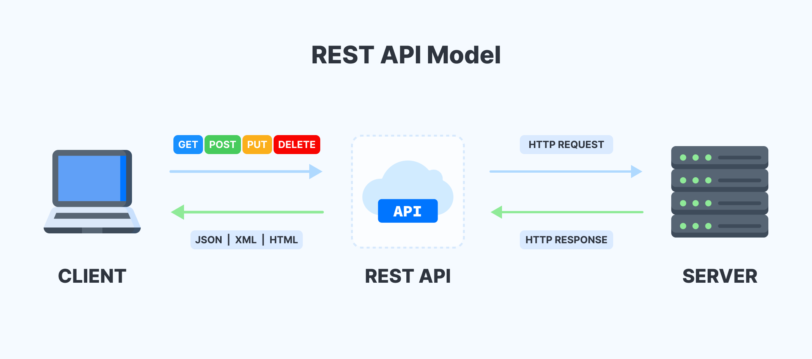

# REST API란?

---

> Representational State Transfer의 약자로 자원을 이름으로 구분하여 해당 자원의 상태를 주고받는 모든 것.

위 그림과 같이 HTTP URI를 통해 자원을 명시하고, HTTP Method를 통해 해당 자원에 대한 CRUD를 적용하는 것을 의미한다. 이에 따른 REST의 원칙은 아래와 같다.

## REST 원칙

- **Uniform Interface(인터페이스 일관성)**
  - HTTP 표준만 맞는다면, 어떤 기술도 가능한 Interface 스타일.
  - C, Java, Python, IOS 등 특정 언어나 기술에 종속 받지 않고, 모든 플랫폼에 사용이 가능한 구조여야 한다.
- **Stateless(무상태)**
  - 각 요청은 완전히 독립적이며, 요청 하나에 필요한 모든 정보가 들어 있어야 함.
  - 예를 들어, 클라이언트가 로그인하면 서버는 세션을 저장하지 않고
    → 토큰(JWT 등)을 클라이언트에 주고
    → 다음 요청마다 그 토큰을 함께 보내는 구조.
- **Cacheable(캐시 처리 가능)**
  - 클라이언트나 중간 서버가 응답 결과를 캐싱해서 같은 요청에 대해 더 빠르게 응답할 수 있도록 하는 것.
- **Client-Server(서버-클라이언트 구조)**
  - 클라이언트와 서버는 역할이 분리되어야 한다.
- **Layered System(계층화)**
  - 클라이언트는 중간 계층이 몇 개인지 모르게 설계되어야 함.
  - 중간에 로드밸런서, 어플리케이션 서버, DB 등 뭐가 있는지 몰라도 API만 호출하면 되도록 해야 한다.

## RESTful 하게 API를 디자인 한다는 것

REST 의 기본 원칙을 성실히 지킨 서비스 디자인은 “RESTful하다” 라고 표현할 수 있다.

1. **사용할 자원과 행위를 명시적이고 직관적으로 분리한다.**
   - URI에서 가리키는 자원은 **명사**로 표현되어야 한다.
   - **HTTP Method**(GET, POST, PUT, DELETE, PATCH)를 분명한 목적으로 사용한다.
2. **Message 는 Header 와 Body 를 명확하게 분리해서 사용한다.**
   - **Entity**에 대한 내용은 **body**에 담는다.
   - API 버전 정보와 응답 받을 MIME 타입 등은 **header** 에 담는다.
3. **API 버전을 관리한다.**
   - 환경은 항상 변하기 때문에 API의 버전이 변경될 수 있어야 한다.
   - 특정 API를 변경할 때는 반드시 **하위 호환성**을 보장해야 한다.
4. **서버와 클라이언트가 같은 방식을 사용해서 요청하도록 한다.**
   - 브라우저와 서버 간 통신에서 서로 같은 데이터 전송 객체(JSON, XML, TEXT)를 사용하도록 한다.

### 장점

- Open API를 제공하기 쉽다.
- 멀티플랫폼 지원 및 연동이 용이하다.
- 원하는 타입으로 데이터를 주고 받을 수 있다.
- 기존 웹 인프라(HTTP)를 그대로 사용할 수 있다.

### 단점

- 사용할 수 있는 Method가 한정적이다.
- 분산 환경에는 부적합하다.
- HTTP 통신 모델에서만 지원한다.

---

## 추가 질문

- 분산환경에서 부적합한 이유가 무엇인지

  > 분산 환경에서는 상태를 공유해야 할 때가 많지만, REST는 Stateless 특성 때문에 컨텍스트 공유가 어렵다.  
  > 분산 환경에서는 서비스 간 통신이 많기 때문에 비동기 메시징이 더 효율적이다.  
  > (예: Kafka, RabbitMQ, gRPC streaming 등)

- Message에서 Header에 주로 담는 정보는 어떤게 있는지
  > Authorization: 사용자 인증 (JWT, OAuth2 등)  
  > Content-Type: Body의 데이터 형식  
  > Accept: 클라이언트가 원하는 응답 데이터 형식  
  > Set-Cookie: 쿠키 설정  
  > Cache-Control: 캐싱 정책 제어
