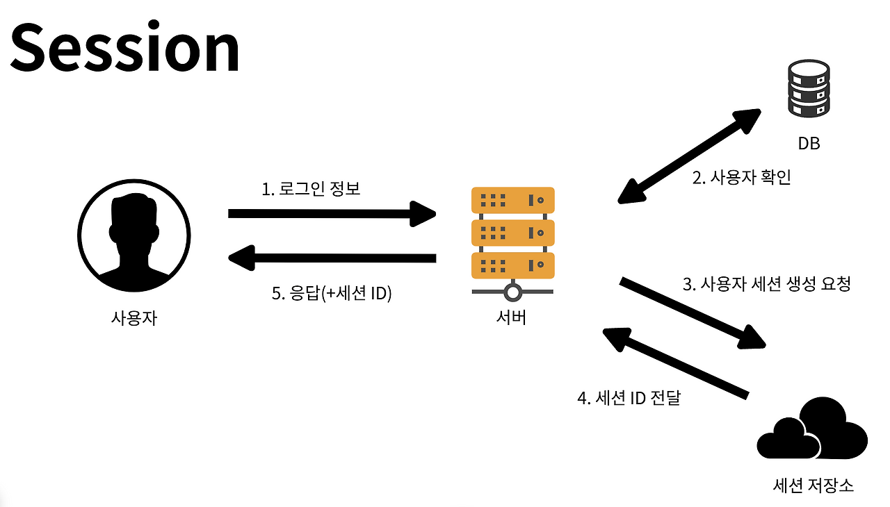
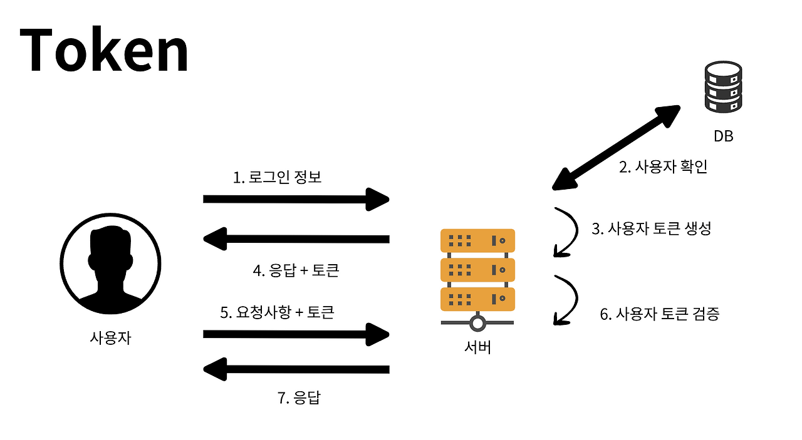

# 로그인 구현 방법 Session과 Token

---

# Session

> 클라이언트의 정보를 서버에 기억하고 유지하는 것.

즉, 사용자의 인증 정보를 서버에서 직접 관리하는 방식이다.
예를 들어, 사용자가 로그인 할 때 서버에 사용자 정보를 저장하고 이후 서비스 요청마다 세션 저장소에서 로그인 여부를 판단하는 방식이다.
서버에서 세션을 생성할 때 세션ID를 쿠키에 남겨두고 필요할 때 세션ID를 활용하게 된다.
세션ID는 주로 쿠키에 담아서 주고 받는다.
SSR 방식의 애플리케이션에 적합한 방식이다.

### 장점

- 개발자 입장에서 구현이 쉽다.
- 클라이언트는 세션ID만 가지고 서버에 접근할 수 있기 때문에 관리가 효율적이다.

### 단점

- 서버에서 클라이언트의 상태를 모두 관리하기 때문에 서버에 과부하가 걸릴 수 있다.
- 서버의 개수가 늘어난다면 모든 서버끼리 같은 세션을 공유해야 하므로 확장이 어렵다.

# Token

> 사용자가 인증된 후 서버가 발급하는 암호화된 문자열로, 클라이언트와 서버가 통신할 때 인증 정보를 보내는 방법이다. 대표적인 예는 JWT가 있다.

사용자가 로그인하면 인증 정보를 기반으로 토큰을 생성하여 클라이언트한테 전달한다.
이후 클라이언트는 HTTP 헤더에 해당 토큰을 포함하여 요청한다.
서버는 토큰 자체를 검증하여 사용자 인증 상태를 확인한다.
토큰에 사용자 인증 정보가 들어가 있으므로 서버는 사용자 정보를 따로 관리할 필요가 없다!
CSR 방식의 애플리케이션에 적합한 방식이다.

### 토큰의 저장

웹 서비스에서 토큰은 주로 Cookie 혹은 사용자 Local Storage에 저장한다.

- **Local Stroage**
  - 악성 스크립트를 삽입하는 XSS 공격에 취약하다.
- **Cookie**
  - 사용자 요청을 위조하는 CSRF 공격에 취약하다.
  - Same-Site 속성과 CSRF 토큰을 이용하여 예방할 수 있다.
  - HttpOnly 속성을 적용하여 XSS 공격을 막을 수 있지만, 사용자의 정보를 추출할 목적이 아니라 데이터 조작이 목적이라면 인가자체는 이루어짐

### 장점

- 세션에 비해 사용자 정보를 저장하는데 사용되는 리소스가 적다.
- Stateless한 특성 덕분에 서버 확장에 용이하다.

### 단점

- 세션ID와 다르게 토큰 자체의 데이터 길이가 길어서 요청이 많아지면 네트워크 부하를 초래한다.
- Token 자체는 조회가 가능하기 때문에 사용자의 중요한 정보를 담을 수 없다.
- 토큰은 만료될 때까지 계속 사용이 가능하기 때문에 탈취당하면 대처가 힘들다.

---

## 추가 질문

- Cookie에서 데이터 조작을 사용한 인가 시도 예시
  > 쿠키 정보를 읽지 않더라도 XSS로 브라우저에서 스크립트를 실행할 수 있으면, 쿠키를 담은 채 권한있는 요청을 보낼 수 있음
  > 예를 들어 은행 서비스에서 다른 사용자의 쿠키를 담아서 fetch로 송금하는 요청을 보낼 수 있음
- 지역변수 활용, JWT, Refresh Token
